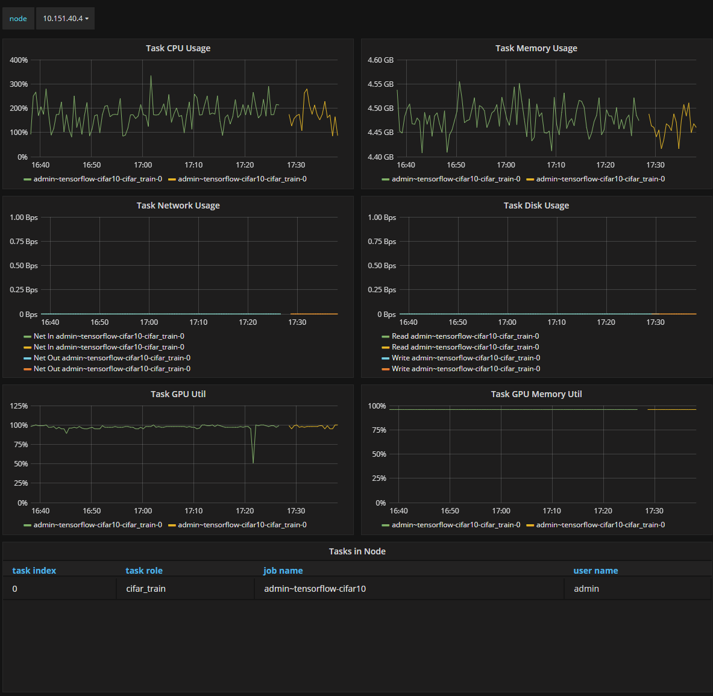
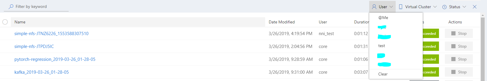
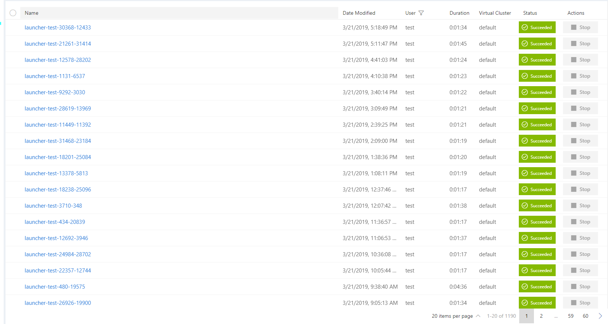
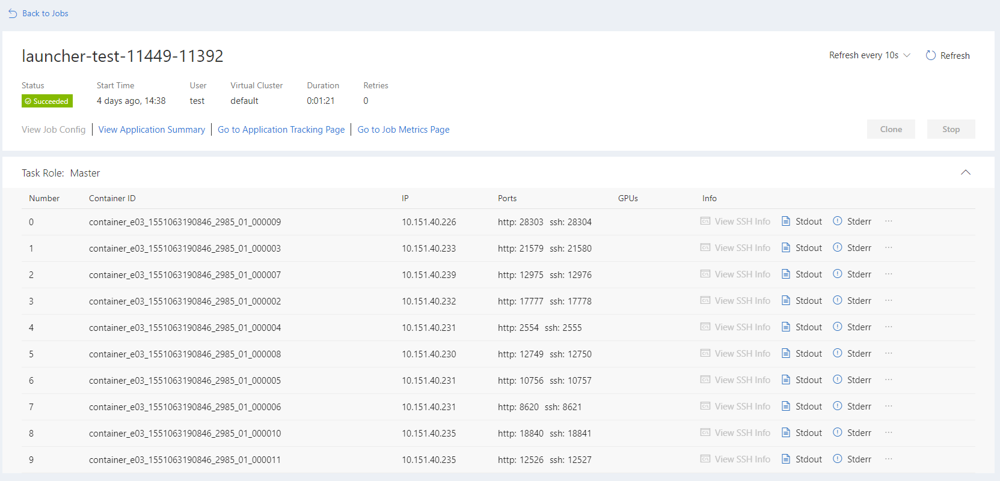

# Release v0.11.0 #

## New Features ##

* Support team wise NFS storage, including:
    - A NFS configuration plug-in and a commandline tool. [#2346](https://github.com/Microsoft/pai/pull/2346)
    - A simple NFS-job submit plug-in. [#2358](https://github.com/Microsoft/pai/pull/2358)
    
* New alerts for unhealthy GPUs, currently including following alerts [#2209](https://github.com/Microsoft/pai/pull/2209): 
    - gpu used by zombie container
    - gpu used by external process
    - gpu ecc error
    - gpu hangs
    - gpu memory leak
  
* Admin could know all running jobs on a node. [#2197](https://github.com/Microsoft/pai/pull/2197)

* User could filter jobs with more accurate labels.

* Basic supports for debugging, user could reserve environments after job completion. [#2272](https://github.com/Microsoft/pai/pull/2272)

## Improvements ##

### Service ###

* Webportal: 

    - New job list page:

    
    - New job detail page: 

* Alert-manager: 
Increase node memory and CPU threshold to reduce false alerts. [#2345](https://github.com/Microsoft/pai/pull/2345), [#2296](https://github.com/Microsoft/pai/pull/2296)

* Hadoop:
Persistent service log to host. [#2244](https://github.com/Microsoft/pai/pull/2244)

* Runtime:
Support samba shares in container. [#2318](https://github.com/Microsoft/pai/pull/2318)

### Documentation ###

* Add troubleshooting guide for jobs. [#2305](https://github.com/Microsoft/pai/pull/2305)
* Refine document for new user to submit job. [#2278](https://github.com/Microsoft/pai/pull/2278)

### Examples ###

* Remove TensorFlow mpi example which cannot be run currently. [#2337](https://github.com/Microsoft/pai/pull/2337)

### Others ###

* Operations:
Add a commandline tool to query unhealthy gpu information from prometheus. [#2319](https://github.com/Microsoft/pai/pull/2365)

## Notable fixes ##

* Hadoop: Scheduler may get stuck in a indefinite loop. [#2365](https://github.com/Microsoft/pai/pull/2365)
* Hadoop: Sometimes, hadoop-ai can't detect ecc error. [#2343](https://github.com/Microsoft/pai/pull/2343)
* Runtime: Users might see unallocated gpus. [#2352](https://github.com/Microsoft/pai/pull/2352)
* Runtime: Jobs might get a free retry when using exceed memory. [#1108](https://github.com/Microsoft/pai/pull/1108)
* Drivers: Fix IB installation bugs. [#2278](https://github.com/Microsoft/pai/pull/2278), [#2271](https://github.com/Microsoft/pai/pull/2271), [#2269](https://github.com/Microsoft/pai/pull/2269)

## Upgrading from Earlier Release ##

Please follow the [Upgrading to v0.11](./docs/upgrade/upgrade_to_v0.11.md) for detailed instructions.