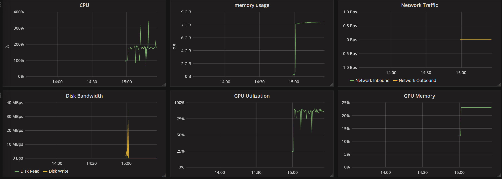

This folder provides the examples of submmitting jobs to OPEN PAI platform. 

The examples use VGG16 model on the CIFAR-10 task, trained with 
- Single CPU
- Single GPU (Tesla K80)
- 4 GPU (with tensorflow distributed training)
- 4 GPU (with horovod)

### TODO: record performance 
The performance of the tasks are shown in the table below:

|  mode | accuracy | run time |
| ------------- | ------------- | ------------- |
| single CPU  | 97.29% | 6h 3m | (batch_size 32)
| Single GPU  | 93.99% | 42m | (batch_size 256)
| Single GPU  | 97.44% | 48m | (batch_size 32)
| 4 GPU (with tensorflow distributed training) | 96.17% | 52m | (batch_size 32)
| 4 GPU (with tensorflow distributed training) | 93.99% | 24m | (batch_size 256)
| 4 GPU (with horovod) | 90.00% | 24m | (batch_size 32)
| 4 GPU (with horovod) | 90.00% | 22m | (batch_size 256)

The job level metrics is shown in 

