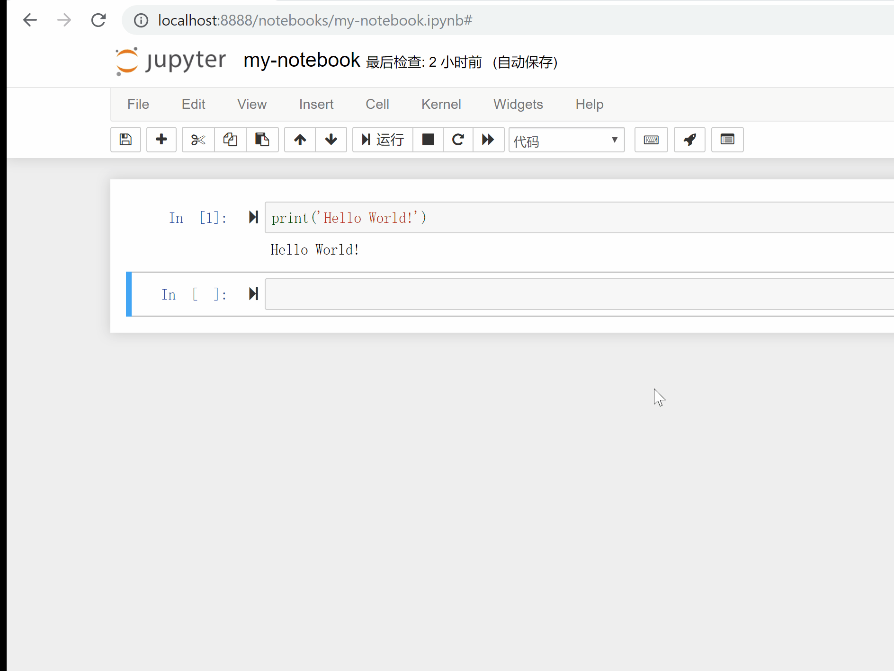
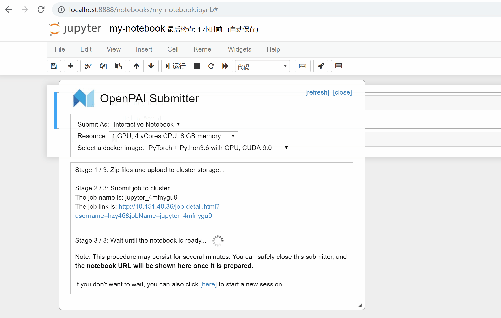
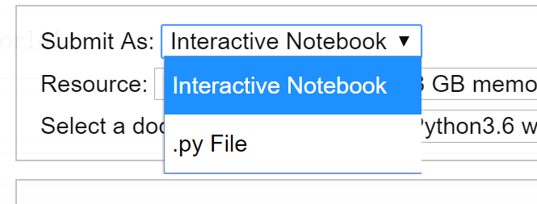
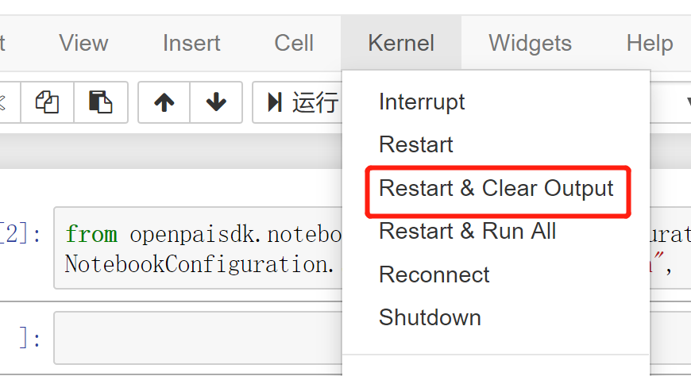
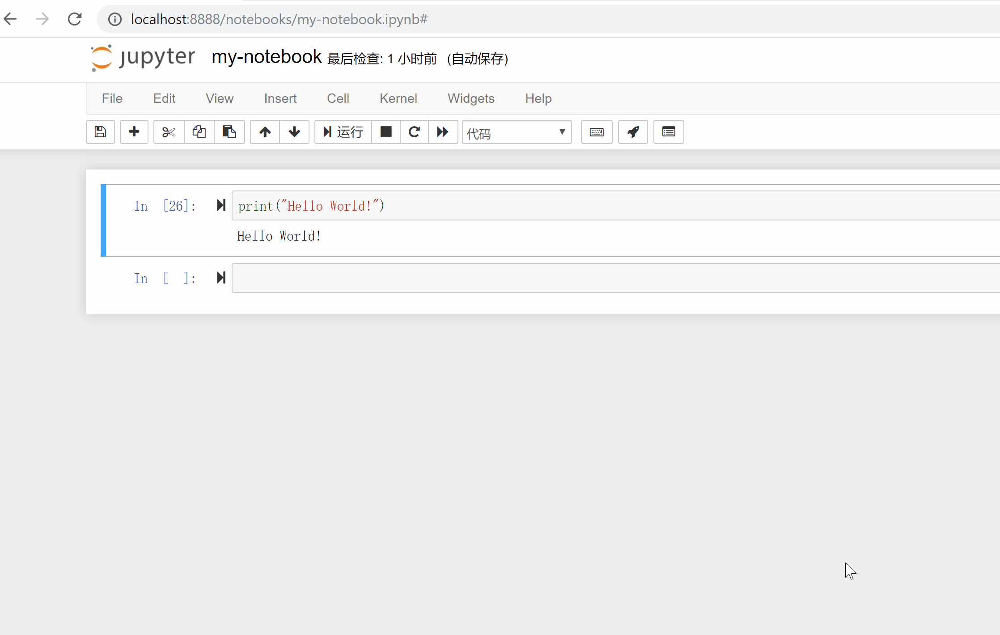

 # OpenPAI Submitter

***OpenPAI Submitter*** is a Jupyter Notebook extension, created for easy-to-use job submission and management on OpenPAI clusters. Users can submit Jupyter job in one click, and manage recent jobs by a flexible dialog.



## How to Install

This extension requires **Python 3+** and Jupyter Notebook to work. Make sure you are using Jupyter Notebook with a Python 3 kernel.

Please use the following commands to install this extension (Make sure you are in the correct `python` environment).

```bash
pip install --upgrade pip
git clone https://github.com/Microsoft/pai
cd pai/contrib/notebook-extension
python setup.py # add --user to avoid permission issues if necessary
```

This extension leverage the [`Python` SDK](https://github.com/microsoft/pai/tree/master/contrib/python-sdk) as the low level implementation. It will also be installed in above commands (use `-i` in of `setup.py` to avoid installing SDK).

Before starting, user needs to give the basic information of the clusters. If you log in to your cluster by user/password, you can use the following command to add your cluster. The <cluster-alias> is a cluster name chosen by you.
```bash
# for user/password authentication
opai cluster add --cluster-alias <cluster-alias> --pai-uri <pai-uri> --user <user> --password <password>
```
If you log in to your cluster by Azure AD authentication, the following command is for you to add the cluster:
```bash
# for Azure AD authentication
opai cluster add --cluster-alias <cluster-alias> --pai-uri <pai-uri> --user <user> --toke <token>
```

Now you can use the command `opai cluster list` to list all clusters.

The following command is used to delete one of your clusters:
```bash
# Delete a cluster by calling its alias.
opai cluster delete <cluster-alias>
```

If you want to update some settings of clusters (e.g. cluster alias, username or password), it is recommended to delete the old cluster by `opai cluster delete <cluster-alias>`, then use `opai cluster add` to re-add it with new settings. A more complex way is to edit the [YAML file](../python-sdk/#define-your-clusters) directly.

There are other ways to manage the clusters, see the [documentation of SDK](../python-sdk).

## Quick Start

Once installed, the extension will add two buttons on the notebook page, namely  and .

Button  is designed for job submission. You can click it and the detailed cluster information will be loaded. Then click ***Quick Submit***. The extension will do the following work for you:

- Pack all files in current folder as a .zip file, and upload it to the cluster by WebHDFS.
- Generate job settings automatically, then submit it.
- Wait until the notebook is ready.

The picture below shows the submission process:


You can safely close the page when the extension is waiting. Once the notebook is ready, the submitter will show up and give you the notebook URL:



**Note: The waiting process will take 5 to 10 minutes.** If you are not willing to wait, you could probably click the bottom link on the submitter to start a new session. The submitted job will not lose, you can click  to find it.

### Submit as Interactive Notebook v.s. Python Script v.s. Silent Notebbook

You can submit jobs in two ways:
- as an ***interactive notebook***
- as a ***Python Script (.py file)***
- as a ***silent notebook***

The interactive mode is a quick way for you to submit the notebook you work on locally to the cluster. The notebook will stay the same but have access to GPU resource on cluster. This mode is mainly designed for experimenting and debugging.

On the other hand, submitting the job as a .py file will firstly convert the notebook to a Python script, then execute the script directly. This mode is a good way for deployment and batch submitting.

If you submit a notebook as a silent notebook, you won't have an interactive notebook as in the interactive mode. Your notebook will be executed in the background. Once it is finished, you can get the result as a file. The difference between this mode and the python script mode is that, you can not see the output during the silent notebook is running, but you can get `matplotlib` plot or other graph of your notebook.



### Advanced job configuration

#### Setup frequently used `docker-images` and `resources`

As shown in above example figure, users could specify resources and docker image by selection in the panel. And further, you can add your frequently used docker images or resource combinations by:

```bash
opai set -g image-list+=<image-1> image-list+=<image-2> ...
opai set -g resource-list+="<#gpu>,<#cpu>,<#mem>" resource-list+="<#gpu>,<#cpu>,<#mem>" ...
```
Here `<#mem>` can be numbers in unit of `MBytes`, or a string like `32GB` (or `32g`).

For example, you can add `your.docker.image` and the resource spec `1 GPU, 4 vCores CPU, 3GB` by:

```bash
opai set -g image-list+=your.docker.image
opai set -g resource-list+="1,4,3gb"
```

After running the command, one should restart the notebook to make it work:




These settings are permanent since they are saved on disk. If you want to `update`, `delete`, or `change the order of` them, you can edit the file `~/.openpai/defaults.yaml` (For Windows, the path is `C:\Users\<Username>\.openpai\defaults.yaml`) directly. Also remember to restart the notebook kernel after editing.

#### Advanced configuration by `NotebookConfiguration`

In the submitting panel, user can change basic configuration of the job. However, for the users who want to change the advanced configuration, the extension would receive configuration from `NotebookConfiguration` in the notebook.

For example, after executing below codes in the notebook cell, the extension will configure the job resource specification to 2 GPUs, 16 CPU cores and 32 GB memory.
```python
from openpaisdk.notebook import NotebookConfiguration

NotebookConfiguration.set("mem", "512GB")
```

Execute below codes to have a quick look of all supported items in `NotebookConfiguration`.
```python
# print supported configuration items
NotebookConfiguration.print_supported_items()
```

### Quick Submit v.s. Download Config

Only the pre-defined resource and docker image settings are available, when you use the button *Quick Submit* to submit jobs. If you need different settings, you can click the button *Download Config* to get the job configuration file. Then import it on the web portal for further configuring.

## Job Management


Clicking  will open the *Recent Jobs* panel. **This panel records all jobs submitted by this extension on this machine** (If a job is submitted in a different way, it won't show up). The panel will show some basic information about your jobs. Also, it will show notebook URL **when the job is submitted as an interactive notebook, and the notebook is ready.** The panel will not show completed jobs by default, but you can use the upper-right toggle to find all jobs.

## How to Update or Uninstall

To update this extension, please use the following commands:
```bash
git clone https://github.com/Microsoft/pai
cd pai/contrib/notebook-extension
jupyter nbextension install openpai_submitter
jupyter nbextension enable openpai_submitter/main
```

To disable this extension, please use the following commands:
```bash
jupyter nbextension disable openpai_submitter/main
```

## Known Issues
- This extension is not compatible with *Variable Inspector*.
- This extension is not compatible with AdBlock.

## Feedback

Please use this [link](https://github.com/microsoft/pai/issues/new?title=[Jupyter%20Extension%20Feedback]) for feedbacks.
