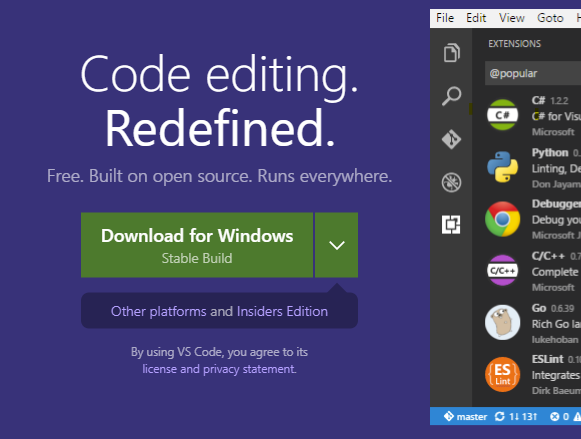
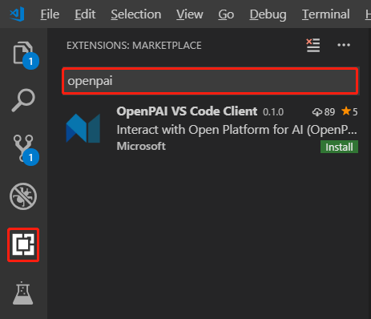

# OpenPAI VS Code Client

OpenPAI VS Code Client is the dedicated client tool for OpenPAI. It's an extension of [Visual Studio Code](https://code.visualstudio.com/). Visual Studio Code is a lightweight but powerful source code editor which runs on your desktop and is available for Windows, macOS and Linux.

With OpenPAI VS Code Client, you can submit jobs, simulate jobs locally, manage files, and etc. OpenPAI VS Code Client supports Windows, macOS, and Linux like Visual Studio Code.

## Installation

1. Install and launch [Visual Studio Code](https://code.visualstudio.com). Click green button to download and install Visual Studio Code if it's not installed yet.

    

1. Click the *Extensions* icon on left side, after Visual Studio Code launched. And input *openpai* to search OpenPAI VS Code Client.

    

1. Click the **Install** button, and wait installation completes.

## How-to

Learn how to [use OpenPAI VS Code Client](./README.md).
