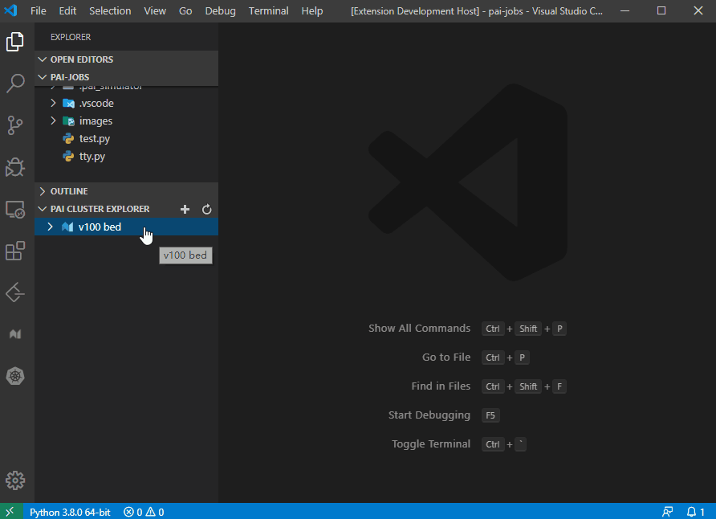
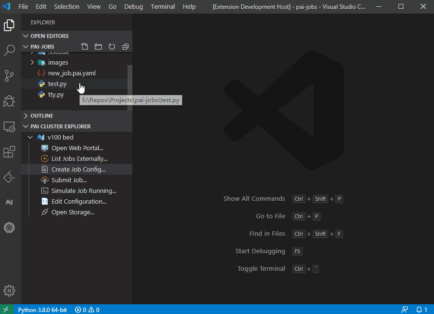
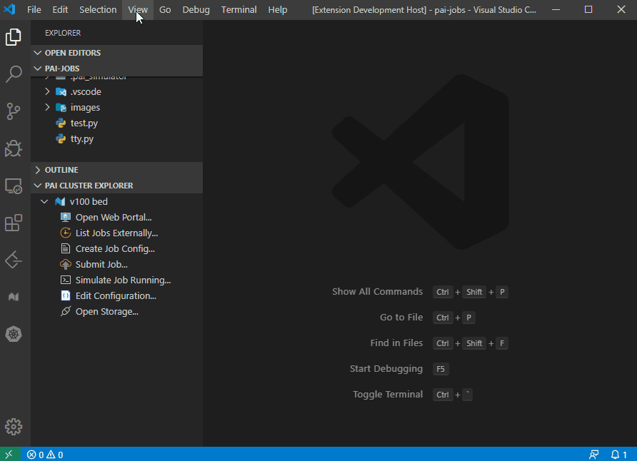
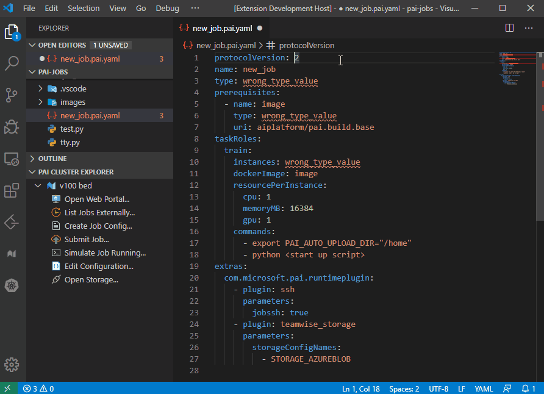
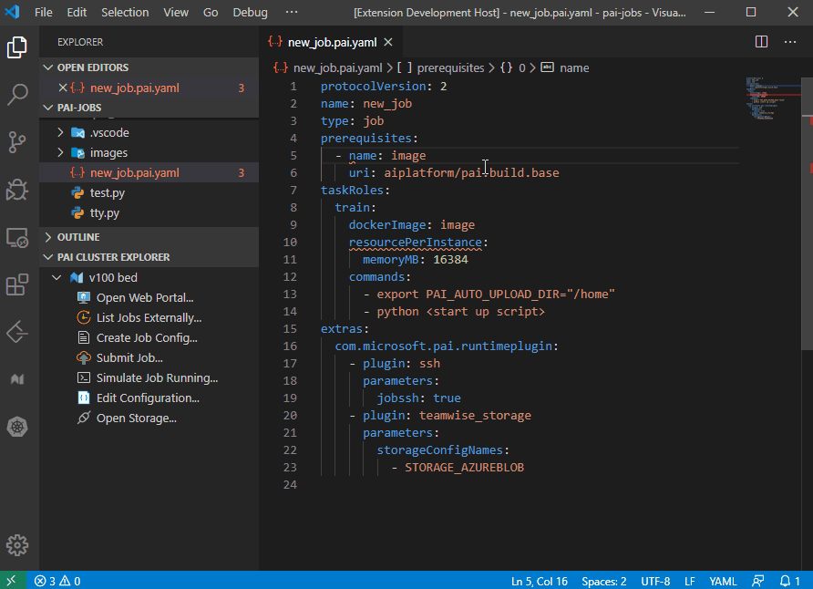
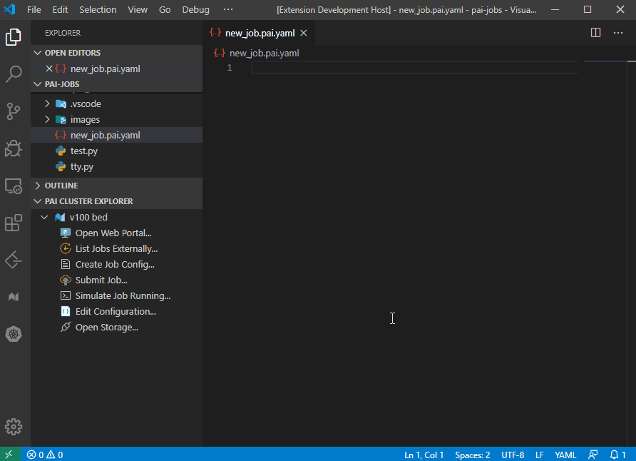
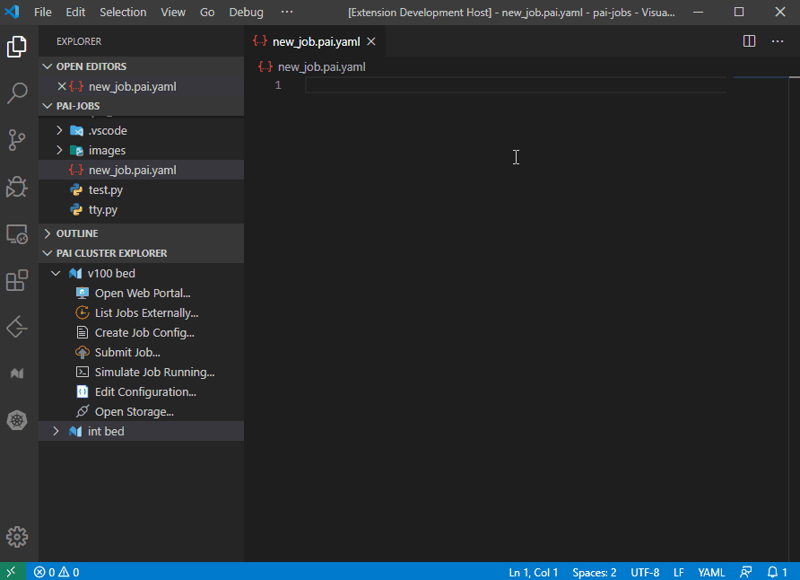
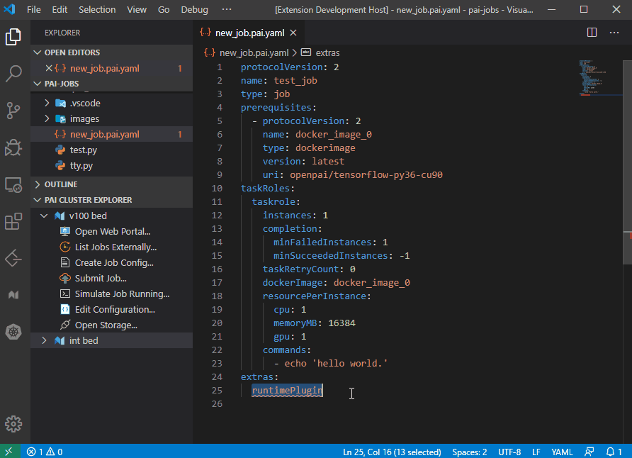
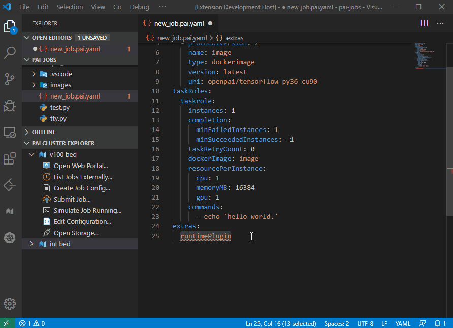

# OpenPAI job config file edit features

In OpenPAI, all jobs are represented by YAML, a markup language.  
Base on VSCode editor [IntelliSense](https://code.visualstudio.com/docs/editor/intellisense) and [YAML extension](https://marketplace.visualstudio.com/items?itemName=redhat.vscode-yaml), OpenPAI VS Code Client support some features to improve user experience for editing job config file.  
For more details about the protocol of OpenPAI job, please refer to [PAI Job Protocol](https://github.com/microsoft/pai/blob/master/docs/pai-job-protocol.yaml).

- [OpenPAI job config file edit features](#openpai-job-config-file-edit-features)
  - [Create job config file](#create-job-config-file)
    - [Create in PAI CLUSTER EXPLORER](#create-in-pai-cluster-explorer)
    - [Create in VSCode EXPLORER](#create-in-vscode-explorer)
    - [Create in command palette](#create-in-command-palette)
  - [YAML validation](#yaml-validation)
    - [Whitch YAML file is a PAI job config](#whitch-yaml-file-is-a-pai-job-config)
  - [Auto completion](#auto-completion)
    - [1. Property auto complete](#1-property-auto-complete)
    - [2. Code snippets](#2-code-snippets)
      - [Trigger by typing](#trigger-by-typing)
      - [Right click to insert snippet](#right-click-to-insert-snippet)
  - [Insert OpenPAI Runtime Plugin](#insert-openpai-runtime-plugin)
    - [Insert by code snippet](#insert-by-code-snippet)
    - [Right click to insert](#right-click-to-insert)
  - [Reference](#reference)

## Create job config file

User can create a simple job config YAML file by below ways:

### Create in PAI CLUSTER EXPLORER

  Double click `Create Job Config...` in `PAI CLUSTER EXPLORER`

  

### Create in VSCode EXPLORER

  Right click an existing python/cntk file in vscode EXPLORER and select `Create PAI Job Config V2`

  

### Create in command palette

  Press `Ctrl + Shift + P` or `View -> Command Palette...` and enter `PAI: Create PAI Job Config`

  

## YAML validation

Use [PAI Job Protocol](https://github.com/microsoft/pai/blob/master/docs/pai-job-protocol.yaml) to do the validation for job config file.

### Whitch YAML file is a PAI job config

There's two way to notice the client the YAML file is a PAI job config:

1. File name ends with `.pai.yaml`
2. Contains `protocolVersion: 2` in the YAML root section

The validation will detect errors during your editing, such as:

- Missing property
- Incorrect type
- Duplicate key



## Auto completion

To improve user experience in editing job config file, we provide some code auto completion and generation features:

### 1. Property auto complete

Base on VSCode editor [IntelliSense](https://code.visualstudio.com/docs/editor/intellisense) and [YAML extension](https://marketplace.visualstudio.com/items?itemName=redhat.vscode-yaml), user can get suggestions during editing job config.



### 2. Code snippets

We provide several code snippets for VSCode YAML editor, user can use it to form their job config easily.  
It could be trigger by typing or right click in the editor and select `OpenPAI: Insert job config`

#### Trigger by typing



#### Right click to insert snippet



## Insert OpenPAI Runtime Plugin

OpenPAI support some runtime plugins, such as SSH plugin, Storage plugin and Tensorboard plugin, user can config it in their job and setup the service.  
Here is an example of runtime plugin config:

```yaml
extras:
  com.microsoft.pai.runtimeplugin:
    - plugin: ssh
      parameters:
        jobssh: true
    - plugin: teamwise_storage
      parameters:
        storageConfigNames:
          - STORAGE_AZUREBLOB
    - plugin: tensorboard
      parameters:
        port: 11449
        logdir:
          path: /mnt/tensorboard
```

We provide several ways to help user insert the plugin config in YAML file.

### Insert by code snippet

The snippet `OpenPAI Runtime Plugin` will include `"com.microsoft.pai.runtimeplugin:"` line, and will ask user to select the first plugin type and generate it.  
Typing `"- plugin:"` will trigger `OpenPAI: Insert a runtime plugin config`, it will help user to add other plugins.



### Right click to insert

Right click the editor and select `OpenPAI: Insert job config`, and select `OpenPAI Runtime Plugin` or `OpenPAI Runtime Plugin Item` will help user generate their plugin config and insert it.



## Reference

[PAI Job Protocol](https://github.com/microsoft/pai/blob/master/docs/pai-job-protocol.yaml)  
[Submit Jobs on OpenPAI](https://github.com/microsoft/pai/blob/master/docs/user/job_submission.md#job-workflow)  
[Troubleshoot jobs](https://github.com/microsoft/pai/blob/master/docs/user/troubleshooting_job.md)
