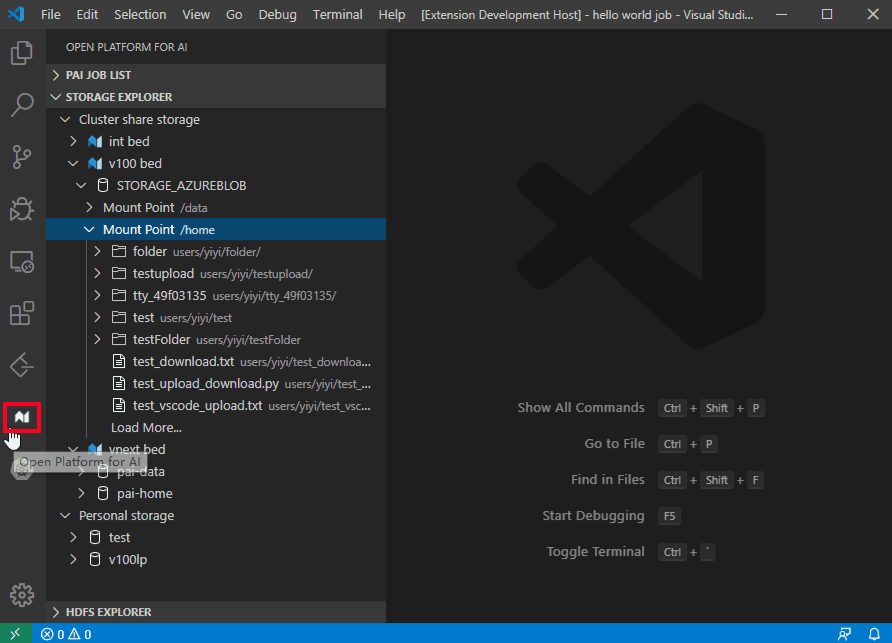
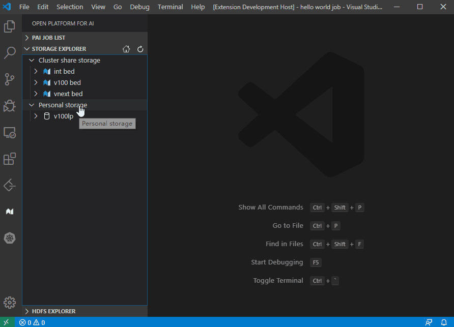
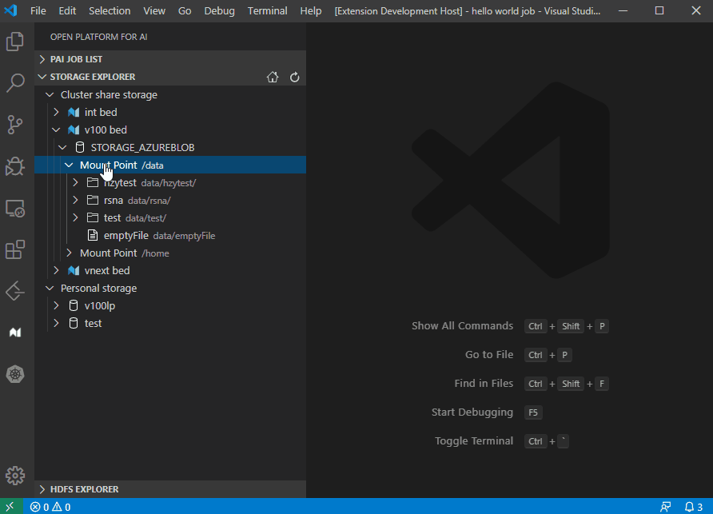
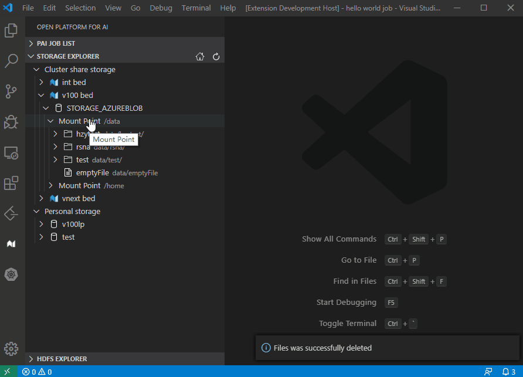
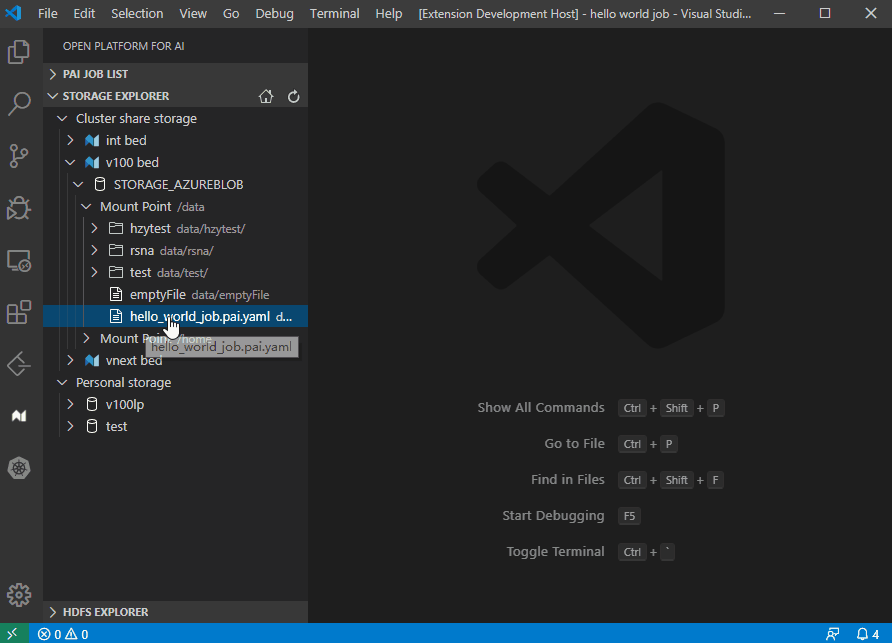
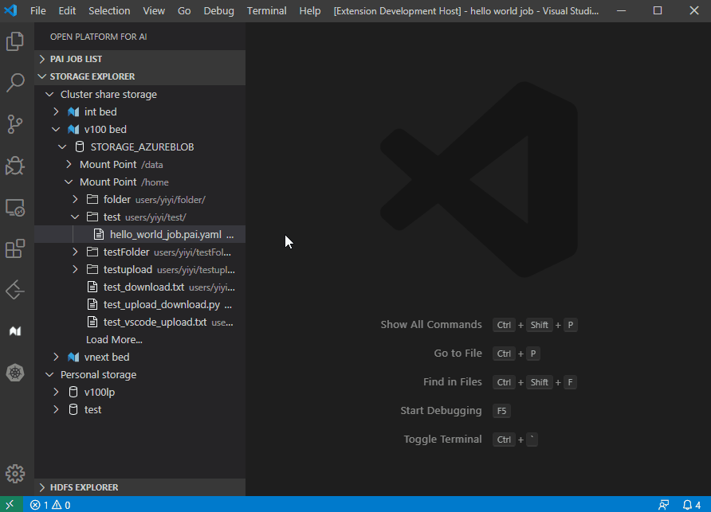
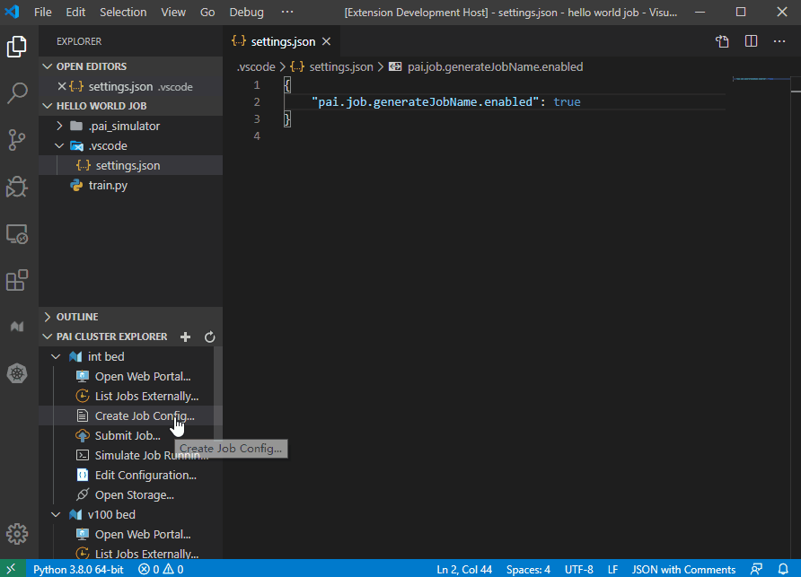

# Storage Explorer and Auto Upload

- [Storage Explorer and Auto Upload](#storage-explorer-and-auto-upload)
  - [Storage Explorer](#storage-explorer)
    - [Cluster Share Storage](#cluster-share-storage)
    - [Personal Storage](#personal-storage)
      - [Add a personal storage](#add-a-personal-storage)
      - [Config personal storage](#config-personal-storage)
    - [Storage Operations](#storage-operations)
      - [Create folder](#create-folder)
      - [File upload/download](#file-uploaddownload)
      - [Edit remote file](#edit-remote-file)
  - [Auto Upload](#auto-upload)
    - [Setup auto upload](#setup-auto-upload)
    - [Advance config](#advance-config)
  - [Reference](#reference)

## Storage Explorer

OpenPAI admin can define Team-wise storage through [Storage Plugin](https://github.com/microsoft/pai/tree/master/contrib/storage_plugin).  
`Storage Explorer` in OpenPAI VS Code Client provide a way to let user manage their data in teamwise storage easily.  
The explorer can be opened by the icon in activity bar:



There are two root nodes in the `Storage Explorer`, "Cluster share storage" and "Personal Storage".

### Cluster Share Storage

Under `Cluster share storage` node, is storage node, will display the sotrages that config by the cluster admin.  
And the children of the storage node is the mount points, whitch means it could be mount into the job container, the description of each mount point is the path in container.

### Personal Storage

For some cluster don't have teamwise storage, or users don't want to upload their data to cluster storag, we provide `Personal Storage` to support `Auto Upload` feature, and data management.  
Notice that the personal storage can't be mount into job container by the `Storage runtime plugin`, should access it in code or commands manully.

#### Add a personal storage

1. Right click the `Personal storage` node, and select `Add Personal Storage`.
2. Input your storage display name, and press `Enter`.
3. A storage config json file will be open, finish it and click `Finish` button at right bottom corner. Notice, it won't be effect, if you save and close the file directly. About how to config personal storage, please refer to next session.



#### Config personal storage

Here is a example about personal storage config:

```json
{
    // storage server display name
    "spn": "test",
    "type": "azureblob",

    // Azure blob
    "data": {
        "dataStore": "dataStore",
        "containerName": "test",
        "accountName": "test",
        "key": "key"
    },
    "extension": {}
}
```

The personal storage config is same as the teamwise storage server, please refer to [Team wise storage data structures](https://github.com/microsoft/pai/tree/master/contrib/storage_plugin#team-wise-storage-data-structures-).

### Storage Operations

Right click on the storage explorer, user can do some operation for the storages.

#### Create folder

Right click on `Mount Point` or folder, select `New folder` and input the folder name.



#### File upload/download

Upload:



Download:



#### Edit remote file

Double click file on `Storage Explorer`, will auto download and open it in VSCode editor, edit the file and save will ask to upload it to remote.



## Auto Upload

OpenPAI VS Code Client provide auto upload feature, could auto upload user's file to storage before submit job.

### Setup auto upload

The first time user click `Create Job Config...` or `Submit Job...`, the client will ask user to setup auto upload.

1. Click `Yes` when asking "Enable auto uploading of code?"
2. Select a cluster if you have multiple cluster.
3. Select a storage and mount point as the destiniation you want to upload.



### Advance config

You can change your auto upload config in `".vscode/settings.json"` file.  
Here is an example for the `settings.json`:

```json
{
    "pai.job.generateJobName.enabled": true,
    "pai.job.v2.upload": {
        "cluster_1": {
            "enable": true,
            "include": [
                "**/*.py",
                "**/*.txt"
            ],
            "exclude": [],
            "storageType": "cluster",
            "storageName": "confignfs",
            "storageMountPoint": "/home"
        },
        "cluster_2": {
            "enable": true,
            "include": [
                "**/*.py"
            ],
            "exclude": [],
            "storageType": "cluster",
            "storageName": "confignfs",
            "storageMountPoint": "/data"
        }
    }
}
```

The field `"pai.job.v2.upload"` is the auto upload config, contains objects as:

```json
"<cluster_name>": {
  "enable": true, // true means enable the auto upload
  "include": [    // filter files to upload
      "**/*.py"
  ],
  "exclude": [],  // filter files not to upload
  "storageType": "cluster",         // "cluster" or "personal"
  "storageName": "<storage_name>",  // storage name
  "storageMountPoint": "/home"      // storage mount point, ignore it if storageType is "personal"
}
```

By default the auto upload will only upload `".py"` files, user can change the `"include"` field and `"exclude"` field to setting the upload filter.

## Reference
[Storage Plugin](https://github.com/microsoft/pai/tree/master/contrib/storage_plugin)
