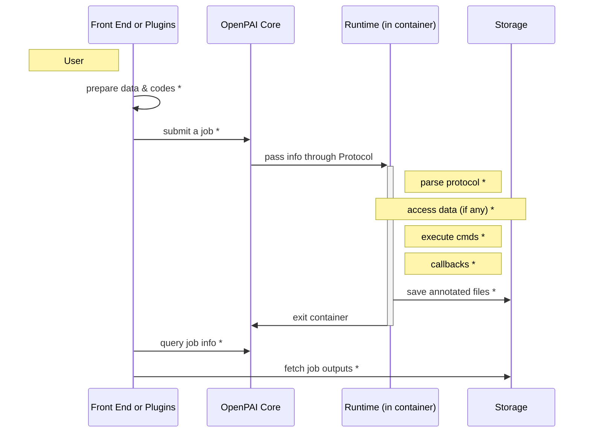

```mermaid
sequenceDiagram
    participant FE as Front End or Plugins
    participant Launcher as OpenPAI Core
    participant RT as Runtime (in container)
    Note left of FE: User
    FE->>FE: prepare data & codes *
    FE->>Launcher: submit a job *
    Launcher->>+RT: pass info through Protocol
    Note right of RT: parse protocol *
    Note over RT, Storage: access data (if any) *
    Note right of RT: execute cmds *
    Note right of RT: callbacks *
    RT->>Storage: save annotated files *
    RT->>-Launcher: exit container
    FE->>Launcher: query job info *
    FE->>Storage: fetch job outputs *
```