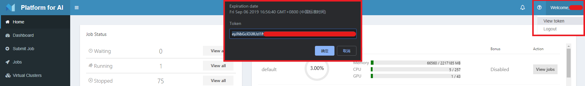

# Remote-dev-tool

## 1. Overview

**Remote-dev-tool** allows users to share a local folder and mount it in PAI's container.
It also supports to submit a job from local YAML.

Supported OS:
- Ubuntu 16.04
- Ubuntu 18.04
- Windows 10

***NOTICE: This tool relies on the network between the host and the PAI cluster. Please ensure network bandwidth and latency.***
***NOTICE: This is still an experiment solution and may be changed in a future release.***

## 2. Dependencies

- This subproject depends on [PAI's Python SDK](https://github.com/microsoft/pai/tree/master/contrib/python-sdk), please install and test the SDK first.

```sh
pip install -U "git+https://github.com/Microsoft/pai@master#egg=openpaisdk&subdirectory=contrib/python-sdk"
```

- The `remote-dev-tool.py` script requires python3, and we only tested it on `py3.5+` environment.

## 3. Usage

This section will give guidance about usage.

### 3.1 Preparation

First, please configure the vars in `.env.template` and rename it to `.env`.

```
[PAI_ENV]
username=                        # PAI cluster user name
toekn=                           # PAI cluster token
serverip=                        # PAI cluster ip
```

For example:
```
[PAI_ENV]
username=paiusr
token=eyJhbGciOiJIUzI1NiIsInR5cCI6IkpX
serverip=10.0.0.1
```

You can get your token from PAI's webportal after you log in.



### 3.2 Parameters

Please run **remote-dev-tool** with administrator privileges.

The **remote-dev-tool** has the following parameters:

```sh
usage: tool.py [-h] [-g job_name] [-c job_path] [-s share_path] [-v]

Remote Development Tool

optional arguments:
  -h, --help                             show this help message and exit
  -g job_name, --getssh job_name
                                         get ssh info
  -c job_path, --config job_path
                                         submit local job
  -s share_path, --share share_path
                                         share local folder
  -v, --verbose         
                                         verbose mode
```

For example:

```sh
# get ssh info and ssh into your cantainer
python3 remote-dev-tool.py -g JOB_NAME

# get ssh info, mount D:\share in your container, and ssh into it
python3 remote-dev-tool.py -g JOB_NAME -s D:\share

# submit local job and ssh into your cantainer
python3 remote-dev-tool.py -c job.yaml

# submit local job , mount D:\share in your container, and ssh into it
python3 remote-dev-tool.py -c job.yaml -s D:\share
```
