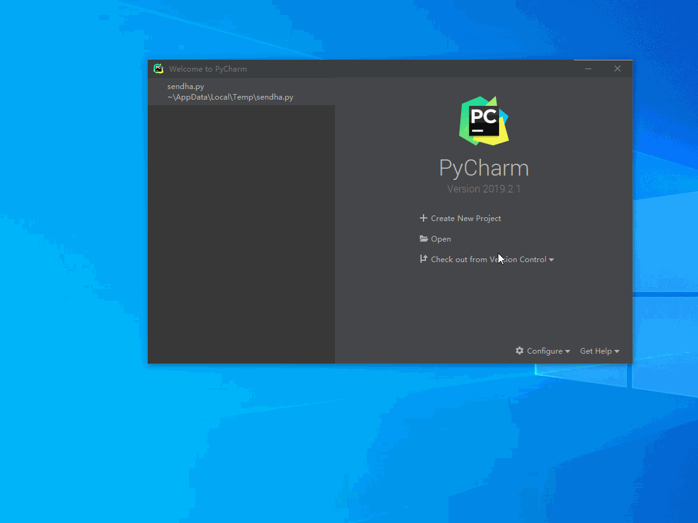

# Remote Development

## 1. Overview

Remote Development can allow users to develop locally with PAI's resources and improve users’ development experience.

The main process is to ask PAI for a container with resources and use local editors or IDEs to develop and debug in this container using ssh.

Support IDEs or editors:
- CLI
- Visual Studio Code
- PyCharm

Support OS:
- Ubuntu 16.04
- Ubuntu 18.04
- Windows 10

***NOTICE: This is still an experiment solution and may be changed in a future release.***

## 2. Directory Structure

```
remote-dev/
├── README.md
├── conf
│   ├── clusters.template        # PAI cluster template conf
│   └── job.template             # PAI template job
└── start.py                     # start script
```

## 3. Dependencies

- This subproject depends on [PAI's Python SDK](https://github.com/microsoft/pai/tree/master/contrib/python-sdk), please install and test the SDK first.

- The `start.py` script requires python3, and we only tested it on `py3.5+` environment and required the following modules:
    - requests
    - configparser
    - subprocess

## 3. Usage

This section will give guidance about usage.

### 3.1 Preparation

First, please configure the vars in `.env.template` and rename it to `.env`.

```
[PAI_ENV]
username=                        # PAI cluster user name
password=                        # PAI cluster password
serverip=                        # PAI cluster ip
```

After configuration, you should edit the job template file named `./conf/job.template`.

The original job template file is like:

```yaml
protocolVersion: 2
name: remote_dev_job_template
type: job
jobRetryCount: 0
prerequisites:
  - type: dockerimage
    uri: openpai/pai.example.tensorflow
    name: docker_image_0
taskRoles:
  Task_role_1:
    instances: 1
    completion:
      minFailedInstances: 1
      minSucceededInstances: 1
    dockerImage: docker_image_0
    resourcePerInstance:
      gpu: 0
      cpu: 1
      memoryMB: 2048
    commands:
      - '`#REMOTE_DEV_START`'
      - apt-get update
      - apt-get install -y nfs-common cifs-utils sshpass wget
      - umask 000
      - mkdir -p /root/workspace
      - mount.cifs //sharepath /root/workspace -o username=***,password=***
      - sleep 18000
      - '`#REMOTE_DEV_END`'
    taskRetryCount: 0
defaults:
  virtualCluster: default
```

Users should edit the resources in `resourcePerInstance`, and can also change the docker image in `resourcePerInstance`. Please make sure your customized docker image has openssh-server. Users can also change `commands` if they want to mount storage or install dependencies in the container.

We suppose that your training data is stored in a storage server and managed by PAI's [Team Wise Storage](https://github.com/microsoft/pai/tree/master/contrib/storage_plugin). You should change `commands` to mount your data server.

The life cycle of this container is 18000s (5 hours). Considering that this container is for development and debugging, it is not recommended to run for a long time. If you have a specific usage, you can change `sleep 18000` to `sleep infinity` and **don't forget to manually stop this job**.

For more details about the job template, please refer to [PAI Job Protocol](https://github.com/microsoft/pai/blob/master/docs/pai-job-protocol.yaml).

### 3.2 Ask PAI for Resources

After preparation, you can run `start.py` to ask PAI for a container with resources.

```sh
python3 start.py
```
It is important to note that it takes some time to wait for the job to run. You can check job status from PAI's web portal. If no error occurs, you will get ssh info like this:


The ssh info includes `SSH IP`, `SSH Port`, `SSH Key`, and `SSH CMD`. You can ssh into your container with the above `SSH CMD`. If you are using windows, your ssh key will be stored in `%UserProfile/.openpai/***.key`. If you are using ubuntu, your ssh key will be stored in `~/.openpai/***.key`. Please take care of these keys.

### 3.3 Configure Editors and IDEs

#### 3.3.1 CLI

For CLI usage, just ssh into your container and you can do anything you want. Your workspace will be mounted at `/root/workspace`.

#### 3.3.2 PyCharm Professional

For PyCharm Professional usage, you can configure PyCharm `Deployment` and `Project Interpreter` according to the following animation.



For more details, please refer to [PyCharm Remote Development](https://www.jetbrains.com/help/pycharm/remote-debugging-with-product.html).

### 3.3.3 Visual Studio Code

For VS Code usage, you can install a plugin named `Remote Development` and configure it according to the following animation.


For more details, please refer to [VS code Remote Development](https://www.jetbrains.com/help/pycharm/remote-debugging-with-product.html).

## 4. Advance

You can also deploy an NFS/SMB server on your host, and mount it in PAI's container by changing the `commands` of the job template.

In ubuntu, you can run a container with NFS4 server, and use `mount -t nfs4 <hostip>:<sharepath> <mountpoint>` to mount. And in windows, you can use built-in SMB, and use `mount -t cifs //<hostip>/<sharename> <mountpoint> -o vers=3.0,username=<username>,password=<password>,domain=<domain>` to mount.

## License

    MIT License

    Copyright (c) Microsoft Corporation. All rights reserved.

    Permission is hereby granted, free of charge, to any person obtaining a copy
    of this software and associated documentation files (the "Software"), to deal
    in the Software without restriction, including without limitation the rights
    to use, copy, modify, merge, publish, distribute, sublicense, and/or sell
    copies of the Software, and to permit persons to whom the Software is
    furnished to do so, subject to the following conditions:

    The above copyright notice and this permission notice shall be included in all
    copies or substantial portions of the Software.

    THE SOFTWARE IS PROVIDED "AS IS", WITHOUT WARRANTY OF ANY KIND, EXPRESS OR
    IMPLIED, INCLUDING BUT NOT LIMITED TO THE WARRANTIES OF MERCHANTABILITY,
    FITNESS FOR A PARTICULAR PURPOSE AND NONINFRINGEMENT. IN NO EVENT SHALL THE
    AUTHORS OR COPYRIGHT HOLDERS BE LIABLE FOR ANY CLAIM, DAMAGES OR OTHER
    LIABILITY, WHETHER IN AN ACTION OF CONTRACT, TORT OR OTHERWISE, ARISING FROM,
    OUT OF OR IN CONNECTION WITH THE SOFTWARE OR THE USE OR OTHER DEALINGS IN THE
    SOFTWARE