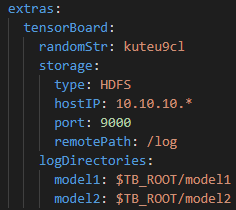

# Submit Job v2 Plugin

A web portal plugin to submit job v2 on OpenPAI.

## Usage

This plugin is used to submit PAI job v2 on web portal.

User can upload a job v2 yaml file from disk, choose a job v2 from marketplace, or use the submission form to fill in a job v2 config.

Please refer to [PAI protocol spec](../../docs/pai-job-protocol.yaml) for more details.

## TensorBoard

To enable TensorBoard, users should provide external storage such as PAI built-in HDFS or NFS. External storage can share logs from different containers on PAI. The mount point of external storage will be exported as an environment variable named `$TB_ROOT`. `$TB_ROOT` can be accessed in every container of the job so that users can use `$TB_ROOT` to refer to log directories in their training scripts. Users can also separate log folders as they want. Please refer to [TensorBoard](
https://github.com/tensorflow/tensorboard/blob/master/README.md#runs-comparing-different-executions-of-your-model) page for details. The TensorBoard config is stored in the extra field of job YAML with the following format.



## Build

```sh
git clone https://github.com/Microsoft/pai.git
cd pai/contrib/submit-job-v2
yarn install
yarn build
```

The built files will be located in `dist/`.

## Deployment

Put the built plugin files to a static file server that is accessible by the user.
Read [PLUGINS](../../docs/webportal/PLUGINS.md#publish) for details.

Append the following plugin configuration block to the `webportal.plugins` section of `service-configuration.yaml` file.

```yaml
webportal:
  plugins:
  - id: submit-job-v2
    title: Submit Job v2
    uri: # uri of dist/plugin.js
```

## Development

```sh
git clone https://github.com/Microsoft/pai.git
cd pai/contrib/submit-job-v2
yarn install
yarn start
```

Configure the plugin of webportal env file with the uri `http://localhost:9090/plugin.js`.

## License

[MIT License](../../LICENSE)
