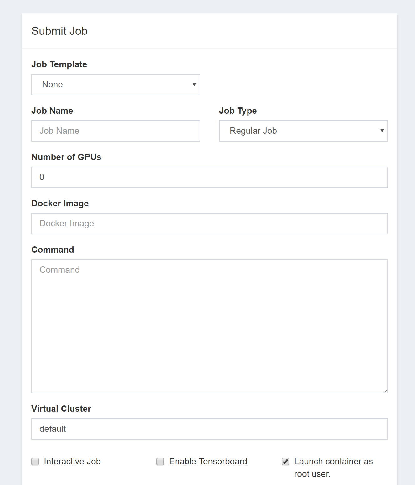
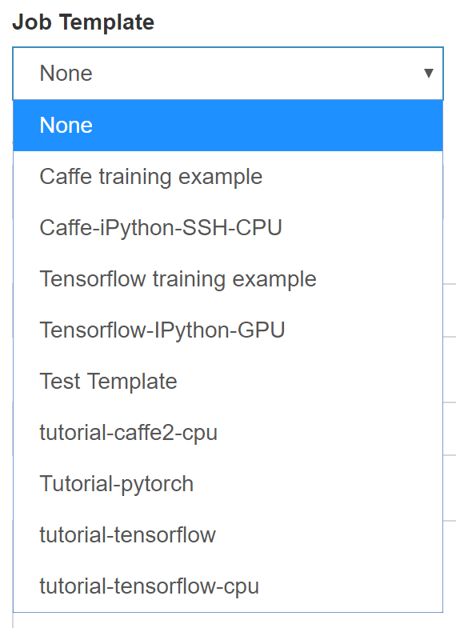
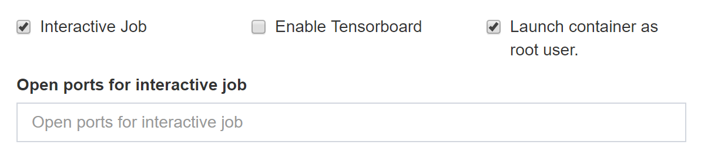
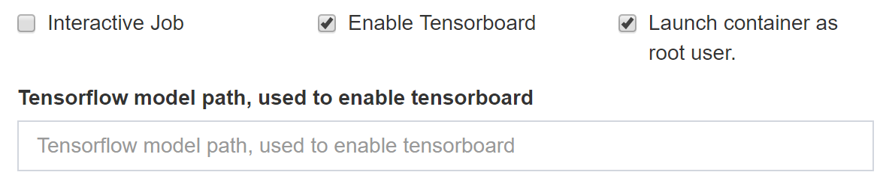
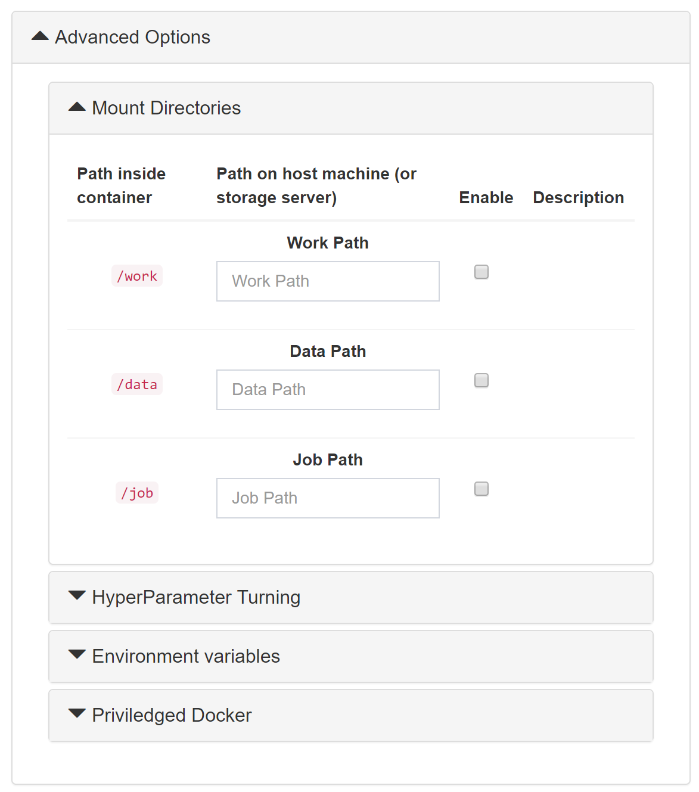
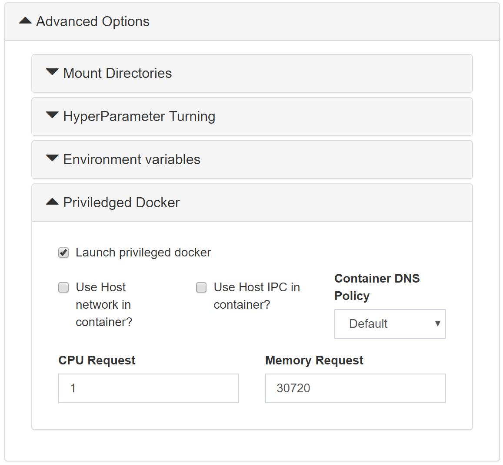
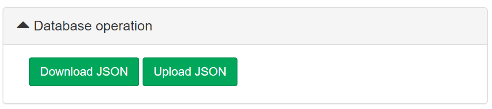

# Submit Simple Job

## Background

"Submit Simple Job" is released to be a [PAI web portal plugin](../../docs/webportal/PLUGINS.md) with a UI similar to [DLWorkspace](https://github.com/Microsoft/DLWorkspace) that makes DLWorkspace users familiar with OpenPAI quickly. It includes the following features:

- Caffe / Tensorflow / Pytorch job templates
- Multilined command support
- One-click tensorboard support
- Customize the running user (root / current user)
- NFS mount (Extra configuration needed)
- HyperParameter training

## User's Guide

### Entrance

The plugin could be accessed by the link in the "plugins" section of sidebar menu, with title customized by the system administrator. If you do not know which one is the plugin, ask your system administrator.

### Usage

#### Main Section



- **Job Template**: shortcut of customizing the job.
    
    

- **Job Name**: the name of the job, similar to PAI

- **Job Type**: WIP, now regular job only.

- **Number of GPUs**: setting how many GPUs used in *each* task.
- **Docker Image**: the base Docker image of the job, private docker registry is supported only if the system administrator is configured the authentication file.
- **Command**: the command to run the job, will be running in root if the followed "Launch container as root user" is checked.
- **Virtual Cluster**: which virtual cluster the job will running on.
- **Interactive Job**: checked if the job could publish network interfaces, and then the specific ports could be customized. 
- **Enable Tensorboard**: checked if a tensorboard task will be run. A model path could be customized. 
- **Launch container as root user**: if checked, the *Command* will be run in root user, otherwise it will be run in the current user.

#### Advanced Section

- **Mount Directories**: Mount NFS directories to the job container. This option could be displayed only if the NFS option of the plugin is fully configured. 
- **HyperParameter Training**: Enable hyper parameter training. 
- **Environment Variables**: Customize environment variables. 
- **Privileged Docker**: Customize CPU and memory requirements of the job, other options are under development. 

#### Database Operation



- Download JSON: export the current form to a JSON file.
- Upload JSON: import the JSON file exported from this plugin of DLWorkspace to the form.

## System Administrator's Guide

### Build

    npm install
    npm run build
    

The build file is located in `./dist/plugin.js`

### Deploy

Deploy the build file to any server accessible by web portal users. Write down the public URL of the file for configuration.

### Install

Config your `service-configuration.yaml` add/update the following fields to `webportal` section

```YAML
webportal:
  # ... other configs
  plugins:
  - title: Submit Simple Job
    uri: "[plugin public url]?nfs=[NFS host]:[NFS root]&auth-file=hdfs:[hdfs uri]"
```

### Configure

According to the YAML config in [Install section](#install), there are two config fields available, in query string syntax appended to the plugin file URL: **(Don't forget to do character encoding)**

- `nfs` the NFS host and root directory, in `[host]:[root]` format, for example `nfs=10.0.0.1%3A%2Fusers`.
- `auth-file` the docker registry authorization file path in HDFS, in `hdfs:[path]` format, for example `auth-file=hdfs%3A%2F%2F10.0.0.1%3A8020%2Fauth.txt`.

## Developer's Guide

### Contribute

Start the local web portal server with .env settings:

    WEBPORTAL_PLUGINS=[{"title":"Submit Simple Job", "uri": "/scripts/plugins/submit-simple-job.js"}]
    

And then run the builder within the plugin directory.

    npm install
    npm run watch
    

## License

    MIT License
    
    Copyright (c) Microsoft Corporation. All rights reserved.
    
    Permission is hereby granted, free of charge, to any person obtaining a copy
    of this software and associated documentation files (the "Software"), to deal
    in the Software without restriction, including without limitation the rights
    to use, copy, modify, merge, publish, distribute, sublicense, and/or sell
    copies of the Software, and to permit persons to whom the Software is
    furnished to do so, subject to the following conditions:
    
    The above copyright notice and this permission notice shall be included in all
    copies or substantial portions of the Software.
    
    THE SOFTWARE IS PROVIDED "AS IS", WITHOUT WARRANTY OF ANY KIND, EXPRESS OR
    IMPLIED, INCLUDING BUT NOT LIMITED TO THE WARRANTIES OF MERCHANTABILITY,
    FITNESS FOR A PARTICULAR PURPOSE AND NONINFRINGEMENT. IN NO EVENT SHALL THE
    AUTHORS OR COPYRIGHT HOLDERS BE LIABLE FOR ANY CLAIM, DAMAGES OR OTHER
    LIABILITY, WHETHER IN AN ACTION OF CONTRACT, TORT OR OTHERWISE, ARISING FROM,
    OUT OF OR IN CONNECTION WITH THE SOFTWARE OR THE USE OR OTHER DEALINGS IN THE
    SOFTWARE