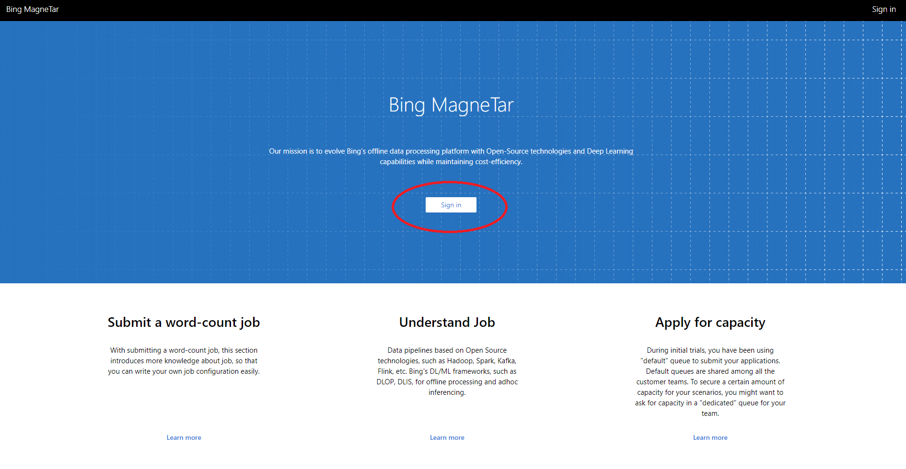
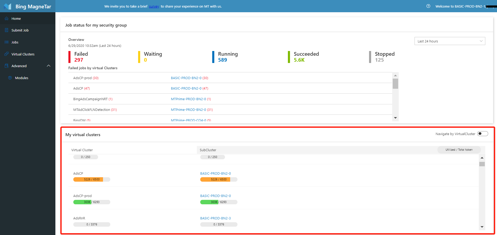
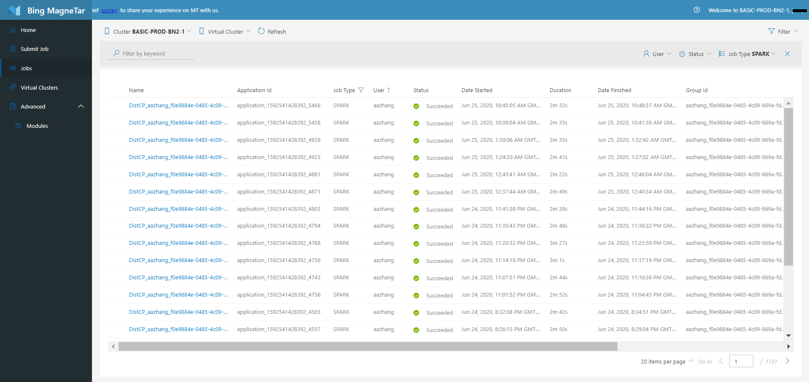
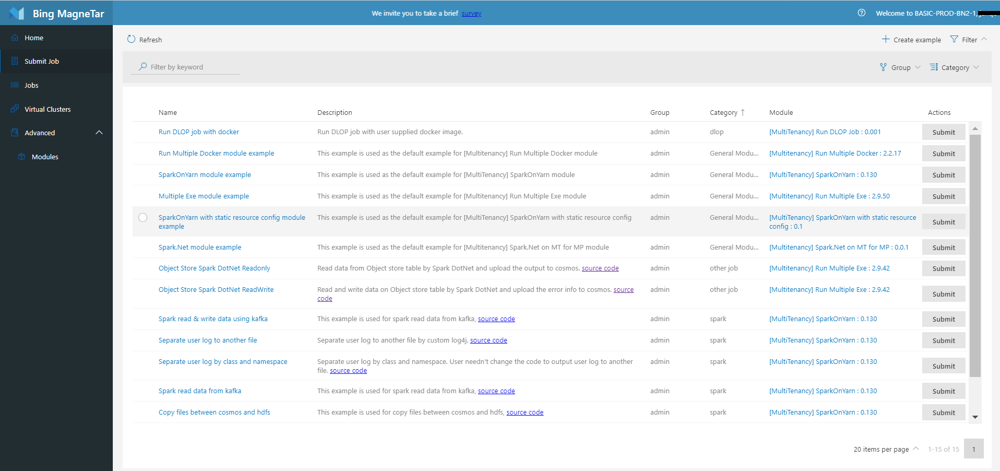
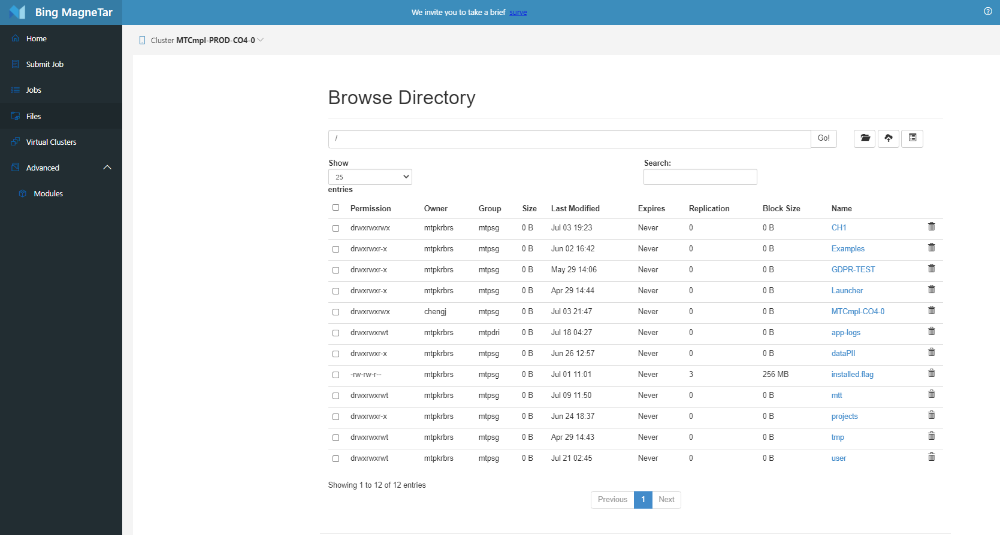

# How To Use MT Webportal

This document describes how to use MT web portal. 

## Overview
**MT Web portal** is a one-stop to integrate and visualize dev cycle tasks like:
* Job submission, monitoring and management
* Job debugging and optimization
* Virtual cluster monitoring and management
* Data management

### - Learn <a href="#HowTo"> how to </a>
  * [Submit a spark job example]
  * [Access jobs]
  * [Locate job logs]
  * [Debug jobs]
  * [Monitor Virtual Clusters]

<!-- variables which won't shows in the page -->

[Submit a spark job example]: ./SubmitExample.md
[Access Jobs]: ./Jobs.md
[Locate job logs]: ./LocateLog.md
[Debug jobs]: ./Debugbility.md
[Monitor Virtual Clusters]: ./VirtualCluster.md

## Navigate MT web portal

### - Log in

To start with, click **Sign in** to log in **Web portal** with your account 

. 

### - Choose a virtual cluster and sub-cluster - **Home** page
After login, choose a **sub-cluster** with which you'd like to manage jobs. Currently, you can only select one sub-cluster at a time.

### - My Job Overview - **Home** page
**Home** page provides overview of your jobs for all your virtual clusters.

### - View Jobs Details
In **Jobs** page, you can
  * View and look up jobs in selected sub cluster and virtual cluster
  * Click jobs to go to job detail page, which has
    * Job information overview
    * Debugging information in details 
For more info, please refer to [Jobs](./Jobs.md).

### - Share Your Job in MarketPlace
Here is the place where you can manage job modules and use them to submit job. Currently, you can submit examples in Marketplace. For more info please refer to [MarketPlace](./MarketPlace.md).

 

### - Manage files 

### - View Virtual Clusters
This is where virtual cluster management happens. Currently, it is for view only. All users authorized in the sub-clusters can view status and usage of virtual clusters in selected sub-cluster. For more info, please refer to [VirtualCluster](./VirtualCluster.md).

## Next:  How to
* [Submit a job]
* [Access jobs]
* [Locate job logs]
* [Debug jobs]
* [Monitor Virtual Clusters]

<!-- variables which won't shows in the page -->

[Submit a job]: ./SubmitExample.md
[Access Jobs]: ./Jobs.md
[Locate job logs]: ./LocateLog.md
[Debug jobs]: ./Debugbility.md
[Monitor Virtual Clusters]: ./VirtualCluster.md