# Optimize job with MT Web Portal
This article focuses on optimize Spark jobs with web portal.

Optimization info resides in job detail pages in **[Jobs](./Jobs.md)**. Following section will cover
* Optimization and debugging tabs
    * <a href="#JobGraph"> Job Graph </a> - visulized job execution
    * <a href="#vCore"> vCore Efficiency </a> - how many vCores have been request, located and used
    * <a href="#Runtime"> Runtime </a> - max, min and average of task metrics in each stage
    * <a href="#Executor"> Executors </a> - Executor scatter, executor details
    * <a href="#Diag"> Diagnostics </a> - Data skew and time skew 
    * <a href="#Stage"> Stages </a> - Stage metrics, task scatter, task and executor details per stage
    * <a href="#Err"> Errors </a> - grouped errors
    
   
* <a href="#Case"> Case study </a> 
  
Sometimes, even the job is completed successfully, there may still be some improvement spaces such that cluster resource may be better utilized or jobs may be run more smoothly. 
For users who have the intention to better utilize cluster resources, the <a href="#vCore"> vCore Efficiency </a> tab is the place to get resource application and utilization information. 
For users who want to improve job efficiency, there are several angles that they can try on.
1)	Spark job will be separated into multiple stages and run one by one, if a former stage takes too long time, it will stuck the process of later stages. <a href="#Runtime"> Runtime </a> tab gives an overview on the stage running time. Users can refer to this information to locate potential bottleneck stages.
2)	Tasks in spark platform are run in resource isolated executors. Tasks from different stages may share the same executor. Executor workload and resource information is under <a href="#Executor"> Executors </a>.
3)	Tasks in the same stage conduct the same computation, the difference is that for different tasks, the amount of data they will handle may be different. <a href="#Diag"> Diagnostics </a> tab help users to analyze if there are data skew cases where some tasks handled much more data than others in the same stage and time skew cases where some tasks cost much longer time than others in the same stage. By avoiding or eliminating such bottleneck, job efficiency could be improved.

## Job Graph tab
Job graph visulizes how job is executed, and how stages are interlinked. 
* Eeach column stands for a job; each block stands for a stage, with the following details
   * Stage ID
   * Description of stage
   * Total task number (including reattemtped ones)
   * Data read: sum of input and shuffle read sizes
   * Data write: sum of output and shuffle read sizes
   * Execution time: time between the first task attempt to the last task attempt
   * Row account: sum of niput, output, shuffle read and shuffle records
* Each stage is colored coded with status
* Stages can be filtered by job ID (all stages will be displayed as default)
* Scroll mouse to get a zoomed job graph
* Click through stage blocks to go to <a href="#Stage"> Stage tab </a> for stage details 
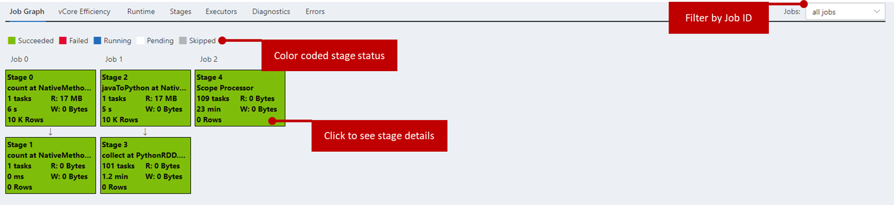

## vCore Efficiency tab
vCore efficiency shows how efficienctly your resources have been utilized. 
* vCore efficiency plotting provids counts of
   * Requested vCore
   * Allocated vCore
   * Used vCore 
* The higher the ratio of User vCore vs. Allocated vCore, the higher vCore efficiency you job has
* Hover mouse to see more details; click and drag using mouse to zoom out selected graph area; click legends to hide or unhide each curve 
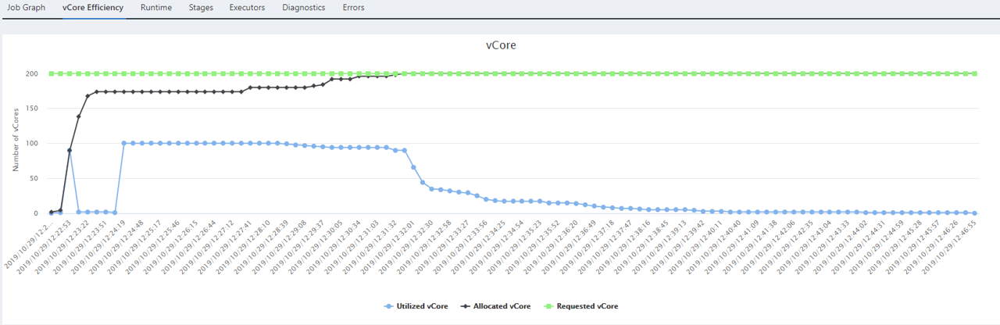

## Runtime tab
Runtime illustrates the following metrics for max, min and average of tasks in each stage. 
* Task metrics can be selected from drop down list
* Hover mouse to see more details; click and drag using mouse to zoom out selected graph area; click legends to hide or unhide each bar 
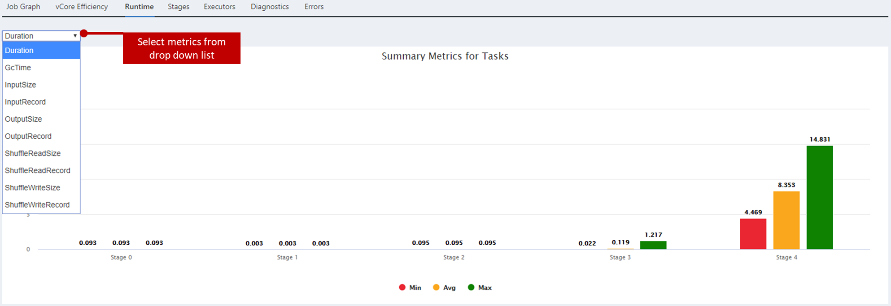

## Executors tab
Executor tab provides overview of executors in the application.
* Task scatter shows execution time vs. size of tasks in all executors. Hover mouse to see more details; click and drag using mouse to zoom out selected graph area. 
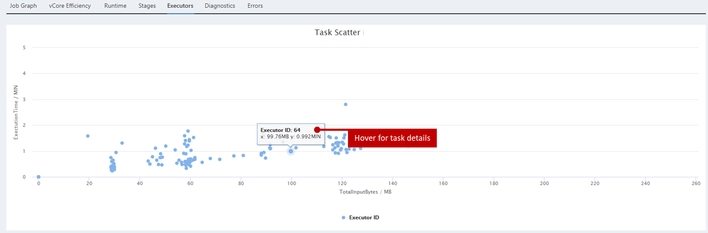
* Tables below list details of executors. 
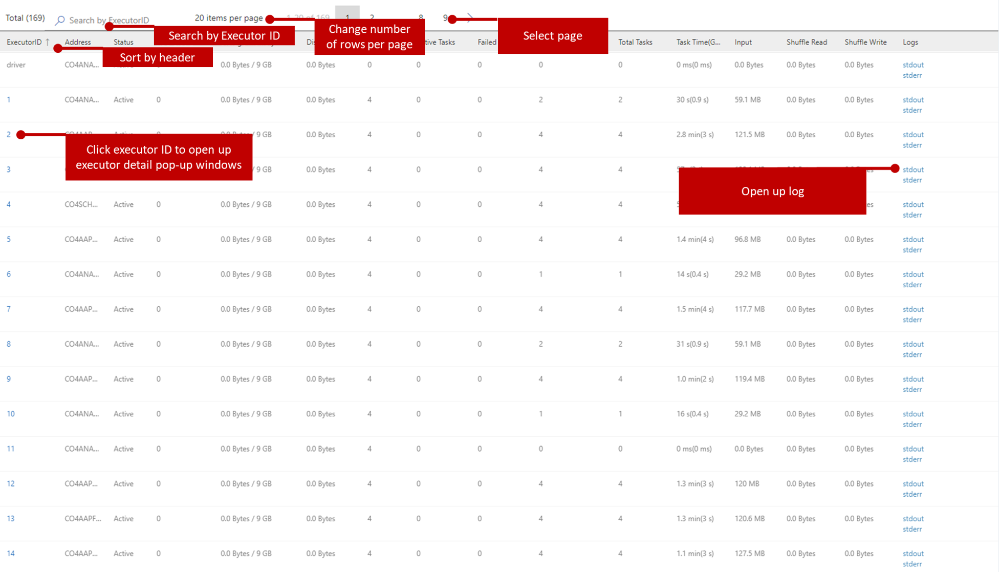

## Diagnostics tab
Diagnostics tab provides analysis for data skew and time skew. Definition of both can be adjusted. We wil provide suggestions later.
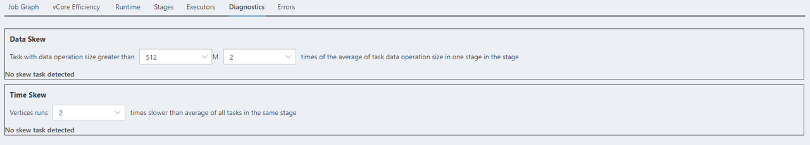

## Stages tab
In stage tab, 
* Select stage by stage ID
* Task statistics table in the stage is folded by default. Click to unfold the table 
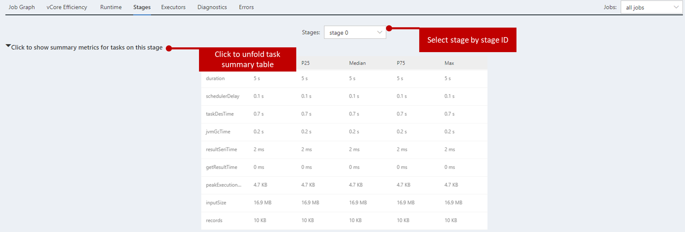
* Task scatter shows execution time vs. size of tasks in the stage. Hover mouse to see more details; click and drag using mouse to zoom out selected graph area; click legends to hide or unhide each curve 
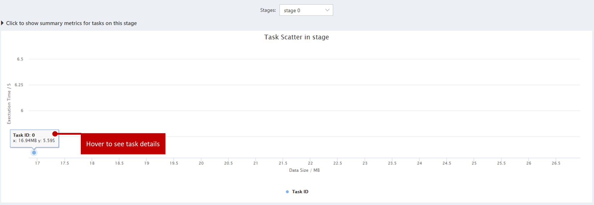
* Tables below list details of tasks in the stage. Errors occured in tasks are also listed here. 
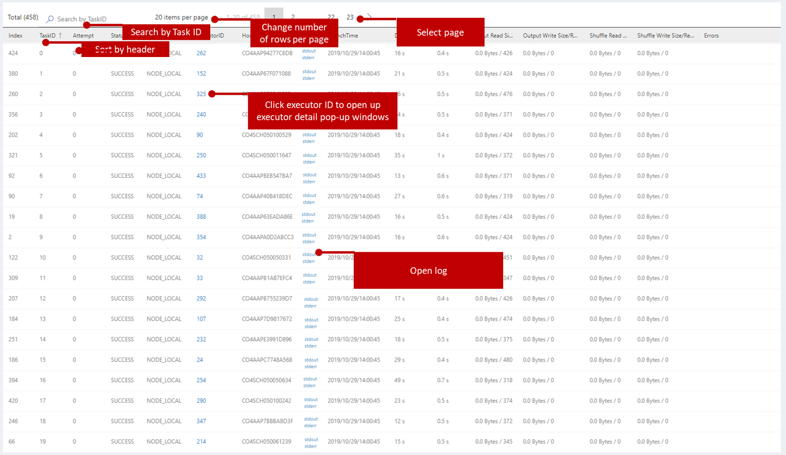
* In the executor detail pop-up window
   * Select executor by executo ID. Stdout and stderr logs are next to drop down list to be opened for view.  
   * Task scatter shows execution time vs. size of tasks in the executor. Hover mouse to see more details; click and drag using mouse to zoom out selected graph area. >
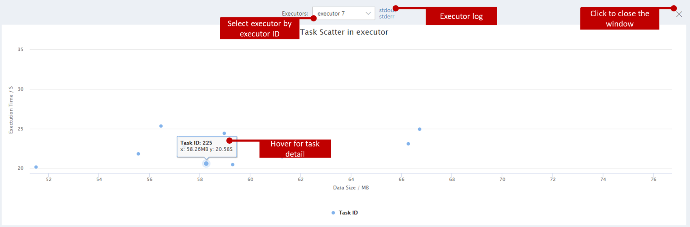
   * Executor vCore plotting shows number of vCores used in the executor. Hover mouse to see more details; click and drag using mouse to zoom out selected graph area; click legends to hide or unhide each curve 
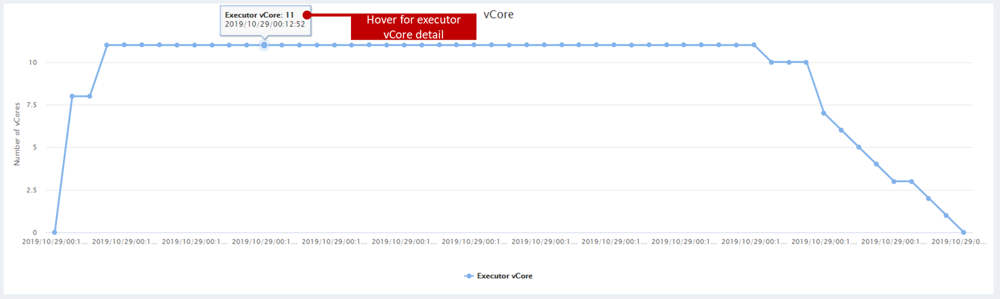
   * Task run time shows how tasks are executed in sequence in the executor. Hover mouse to see more details; click and drag using mouse to zoom out selected graph area.
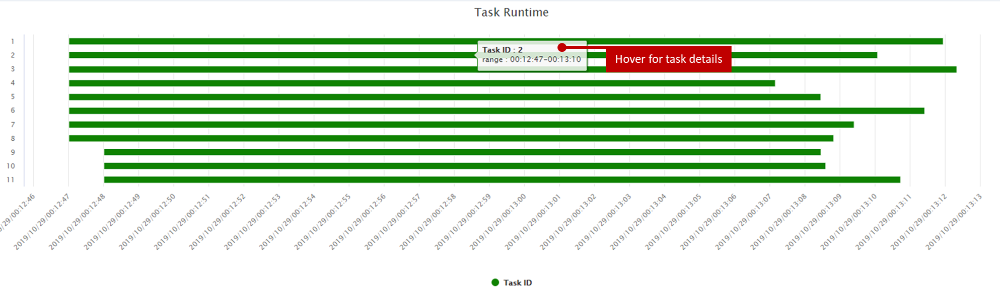

## Errors tab
Error tab aggregates tasks with similar error message. Errors are sorted by their number of occurrences. For each error, the table below it shows the tasks that raise this error. 
For each task, user can click its executor id to get its detailed information. 
User can also click the stdout and stderr to link to the corresponding output and error msg.
  

## Case study
(to be updated)