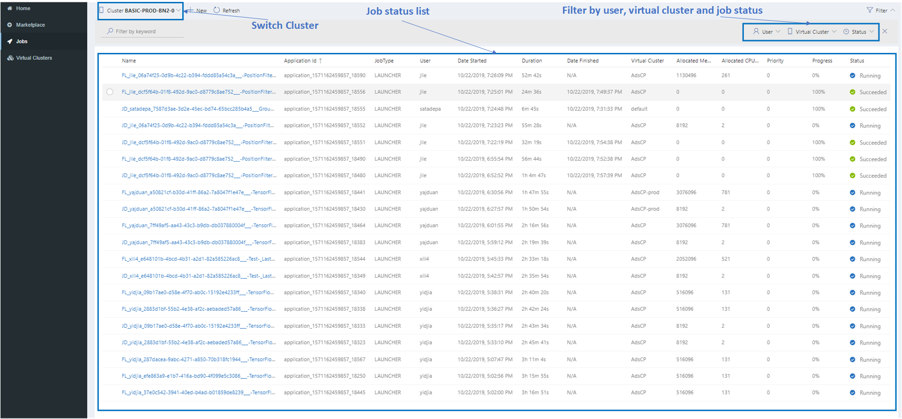
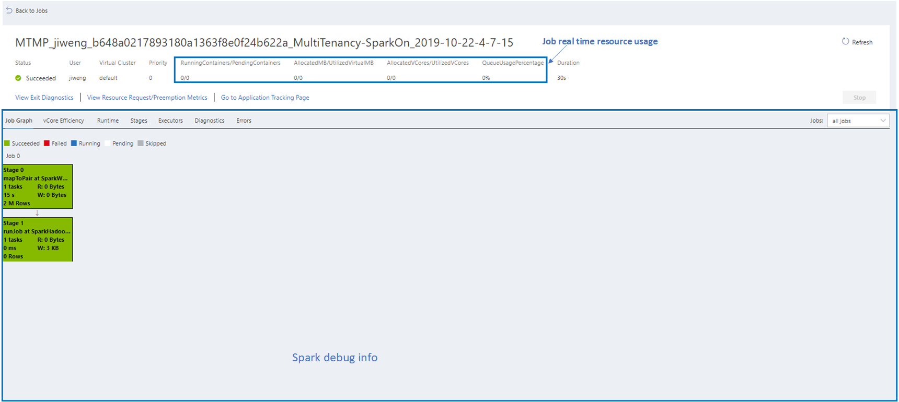
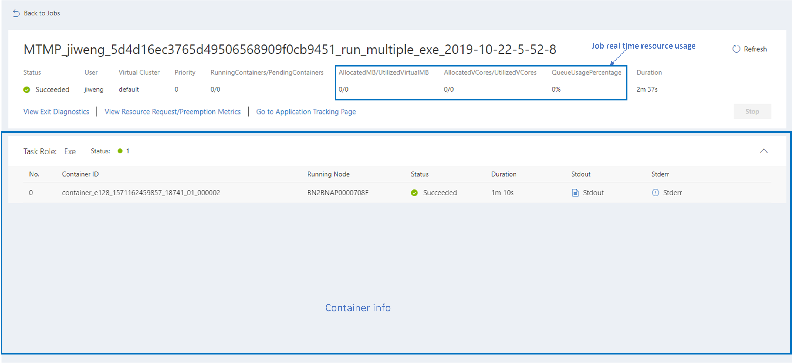

# Jobs
Before you get down to job details, **Homepage** helps to summarize a job overview for all your virtual clusters and sub clusters. You can go to the corresponding sub cluster and virtual cluser with failed jobs directly. 

Jobs page provides 
* job list for selected subclusters. You can 
   * view status of jobs
   * Look up jobs
* job details for selected jobs. You can 
   * monitor job status
   * det logs and other debugging information

## Job list

In the job list page, you can check job name, application id, job type, user, date started, duration, date finished, virtual cluster, allocated memoryMB, allocated CPU VCores, priority, progress, status info and so on.

You can also
* switch cluster
* search job by keywords in framename, alias, application ID etc. For users who use Aether moduels to submit jobs, you can look up job with Aether ID in runMultipleExe and runMultipleDocker modules.
* filter jobs by user name, virtual cluster and job status
* sort jobs by each column
 

### Job Detail Page
Clicking selected job in job list leads you to job detail page. Currently we have two types of detail page for user to monitor and debug jobs: spark job and launcher job. 

#### Spark job
For Spark job, you can see real-time resource usage and debugging info. For more info, please refer to [debug jobs](./Debugbility.md)).
 

#### Launcher job
For launcher job, you can see real-time resource usage and container info. You can open stdout and stderr logs for more info.
 