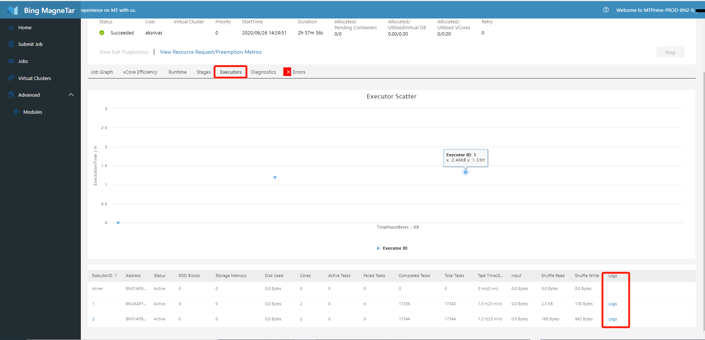
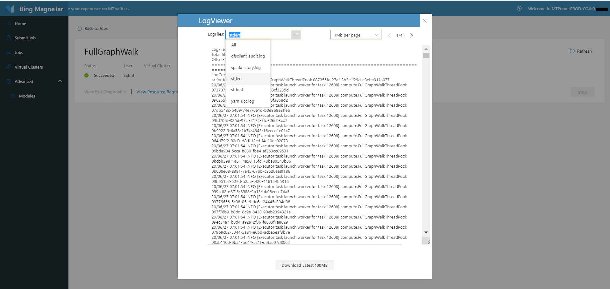

# Locate job logs with MT Web Portal
After job is located, click through to go to job detail page. For more info, please refer to [Jobs](./Jobs.md) page

Depending on the job types:

* For launcher jobs, **Logs** for each container is listed.

* For spark job, 
    * Go to **Executor** tab and look for **Logs** corresponding to each executor. 

    * Logs are also conveniently available in other tabs like task table in Stage tab, executor detail pop-up, and Diagnostics tab, in case you need log access when browsing to that point. 

No matter what type jobs are, clicking the 'Logs', you will see all of log files, including stdout, stderr and other user defined log files. For each file, you can view it in paging; and if you want to analyze logs locally, you can download them directly.
