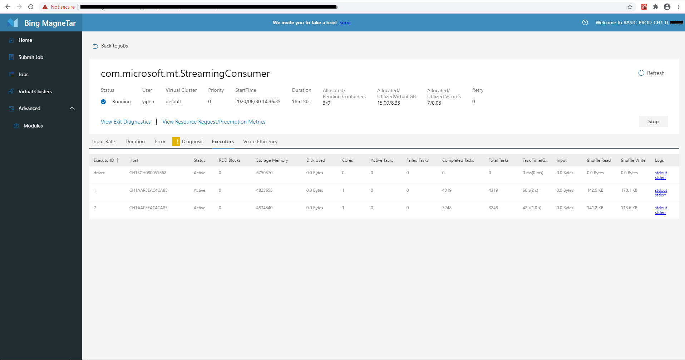

# Debug Streaming Job with MT Web Portal
This article focuses on debugging Spark streaming jobs with web portal. For Spark batch jobs, please see [Spark batch job debugging](./Debugbility.md).

Debugging and optimization info resides in job detail pages in **[Jobs](./Jobs.md)**.

As streaming jobs are long running jobs, data comming in micro batch will go through the same calculation steps. It's not efficient for Users to check each micro batch mannually, so we provide two level debugging information: application level and micro batch level.  
Application level debugging information focuses to 1) give users an overall appliction statistics; 2) help users to diagnose outlier and failed micro batches. Will cover below tabs:
* <a href="#Inputrate"> Input rate </a> - visulized input rate profile with latest 1000 micro batches
* <a href="#Duration"> Duration </a> - Scheduling delay, Procesing time and overall delay for latest 1000 micro batches
* <a href="#Errors"> Errors </a> - grouped common errors
* <a href="#Diagnosis"> Diagnosis </a> - micro batches with outlier duration and input records
* <a href="#Executors"> Executors </a> - Executor list
* <a href="#VCore"> VCore Efficiency </a> - how many vCores have been request, located and used

Micro batch level debugging information focuses to show detailed infor for a specific micro batch. Will cover:
* <a href="#JobGraph"> Job Graph </a> - visulized job execution graph
* <a href="#Stages"> Stages </a> - Stage metrics, task scatter, task and executor details per stage
* <a href="#Executors"> Executors </a> - Executors used by this micro batch
* <a href="#MetaData"> Meta Data </a> - input data for this micro batch

## Input rate
* Input rate for the latest 1000 micro batches are profied.  
* Users can easily see outlier micro batches from the graph.  
* P50 and P95 input rate are summarized. 
* Hover onto the graph, can see detailed data. 
* Click and drag using mouse to zoom out selected graph area. 
* Click one bar, can jump to the the corresponding 'micro batch level debug' page​. 

If input data is coming from Kafka, another graph will show the input records count for each micro batch. 
Similarly P50,P95 are counted; graph area can be zoomed in and out; clicking on one bar can jump to the corresponding micro batch debugging page.

## Duration

* Scheduling delay, processing time and total delay for the latest 1000 micro batches are profiled. From each figure, users can easily find out outliers. 
* P50 and P95 metrics are evaluated. 
* Hover onto the graph, can see detailed data. 
* Click and drag using mouse to zoom out selected graph area. 
* Click one bar, can jump to the the corresponding 'micro batch level debug' page​. 

## Errors
Error tab aggregates micro batches with similar error message. Errors are sorted by their number of occurrences. For each error, the table below it shows the micro batches that raise this error. 
For each micro batch, user can click it and direct to the micro batch view. 

## Diagnosis
Diagnosis tab provides analysis for duration and input data outliers. Definition of both can be adjusted. Under diagnosis tab, users can also filter micro batches by time range.

## VCore Efficiency
VCore efficiency shows how efficienctly your resources have been utilized. 
* vCore efficiency plotting provids counts of
   * Requested vCore
   * Allocated vCore
   * Used vCore 
* The higher the ratio of User vCore vs. Allocated vCore, the higher vCore efficiency you job has
* Hover mouse to see more details; click and drag using mouse to zoom out selected graph area; click legends to hide or unhide each curve 

## Job Graph
Similarly to batch jobs, job graph visulizes how job is executed, and how stages are interlinked.
* Each column stands for a job; each block stands for a stage
* Each stage is colored coded with status
* Stages can be filtered by job ID (all stages will be displayed as default)
* Click through stage blocks to go to <a href="#Stages"> Stages</a> for stage details 

## Stages
In stage tab, 
* Select stage by stage ID
* Task statistics table in the stage is folded by default. Click to unfold the table 

* Task scatter shows execution time vs. size of tasks in the stage. Hover mouse to see more details; click and drag using mouse to zoom out selected graph area; click legends to hide or unhide each curve 

* Tables below list details of tasks in the stage. Errors occured in tasks are also listed here. 

## Executors
Provides overview of executors in the application.

## Meta Data
Lists input data in this microbatch, including topic and partition id.
