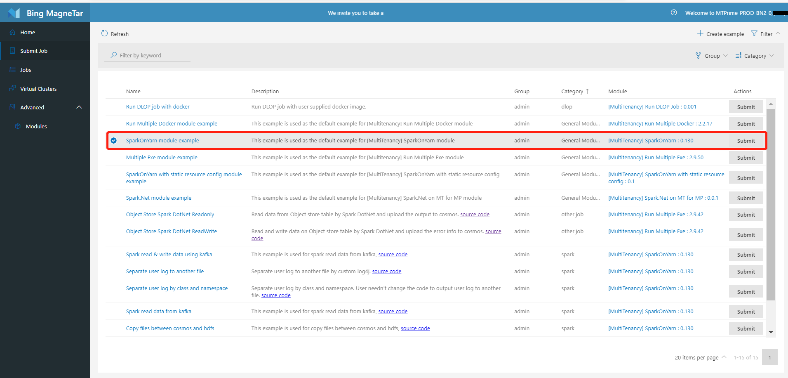
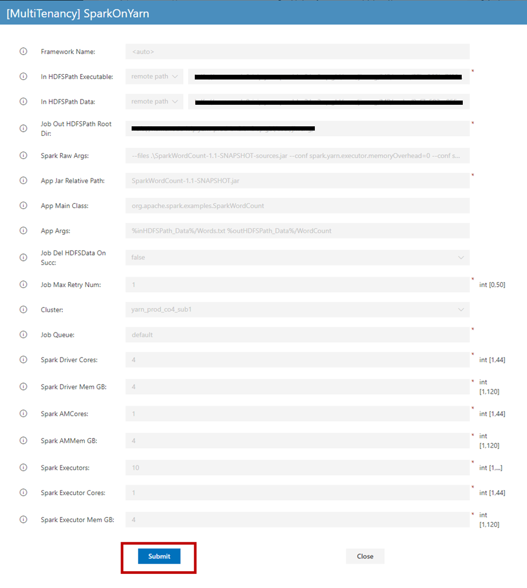
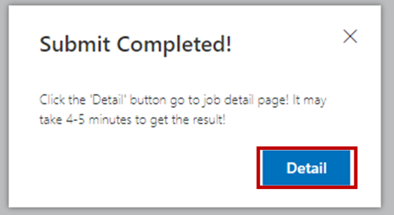
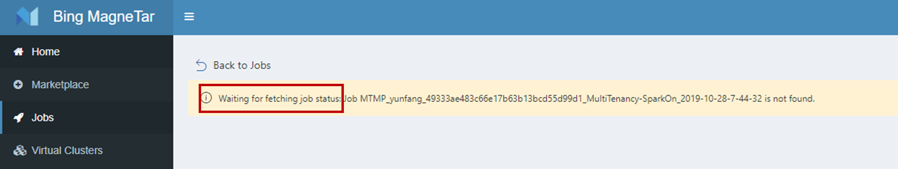
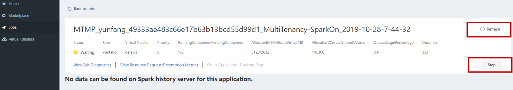
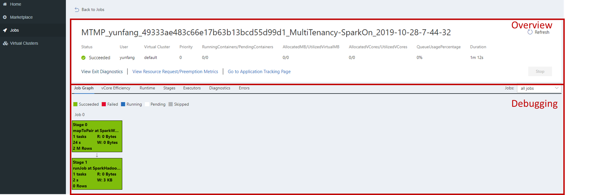

# Submit a spark job exmaple
This section walks you through Web Portal with a spark job example: from job submission, job and log look-up, to job debugging details. 

1. Log in **MT Web portal** with your corporate account.

2. Submit a job 
    
    In **Submit Job**, we provide a bunch of examples. These examples are mainly two kinds: **General module example** and **Scenario based example**. Gerenal module examples are the examples for modules, demo to users what parameters a module needs and what format they are required to submit jobs from modules. Scenario based examples are examples for specific scenarios, for example one example regarding to data processing, demos to users how to read data from cosmos and store them in HDFS. For scenario based examples, users can refer to the source code of the specific business logic.
    
    To submit your own jobs, please refer to [module selection](./jobSubmission.md) to select proper modules.

    + Choose one example, e.g. 'SparkOnYarn module example', click **Submit** for it 
      

    + In the pop-up, click **Submit** with all default values. 
        

    + The following pop-up shows job submission request has been sent, click the **Detail** to go to the job detail page. 
      

    + For more info of available modules, please refer to [Mareketplace](./MarketPlace.md).

3. View job status
    + Job submission normally takes 4-5 minutes. While job is being submitted, job detail page will display the following msg  
      

    + Job detail page is automatically refreshed during the process of job submission. The following snapshot indicates 
      * info achieved from resource manager shows job submission is successful and job is waiting to be run
      * info from spark history server is yet to be availabe.

    + At this point, you can: 
      * click **Refresh** to refresh job status
      * click **Stop** to stop the job  
      

4. Access job debugging details 
Once job completed running (successfully in this case), you now can view  
    + **Overview** section in the upper portion, with final info from resource manager
    + **Debugging** section in the lower portion, with final debugging info from spark history server 
        
Debugging section provides visualized info for debugging and optimization purpose. As beginners, you may want to check out the following selected tabs. For more debugging and optimization features, please refer to [debug jobs with Web Portal](./Debugbility.md) 

    + Job graph – visualized job execution 
For this particular spark app you submitted, there are two stages in total, and both have been executed successful. If there are failed stages,clicking the stage block takes you to Stage tab where has logs for you to debug along with more stage/task/executor details. 

    + vCore efficiency – how many vCores have been request, located and used 
It used xxx vCores, vCore efficiency is pretty high. Low vCore efficiency is one of the major causes of stuck jobs.

    + Executor – for logs, executor scatter and more 
Executor is another way to look up logs. In addtion to logs, it provides executor scatter to show how efficiently executors are running. Individual executor information is also available by clicking executor ID in the executor tables. 

5. Other ways to access your jobs and job details 
If you choose not to wait for job to be submitted, you can track down your submitted job:  
    + From my jobs in **Home** page
    + By searching for job you submitted in **Jobs** page, where you can search jobs by alias or keywords in application ID, framework name etc. 
