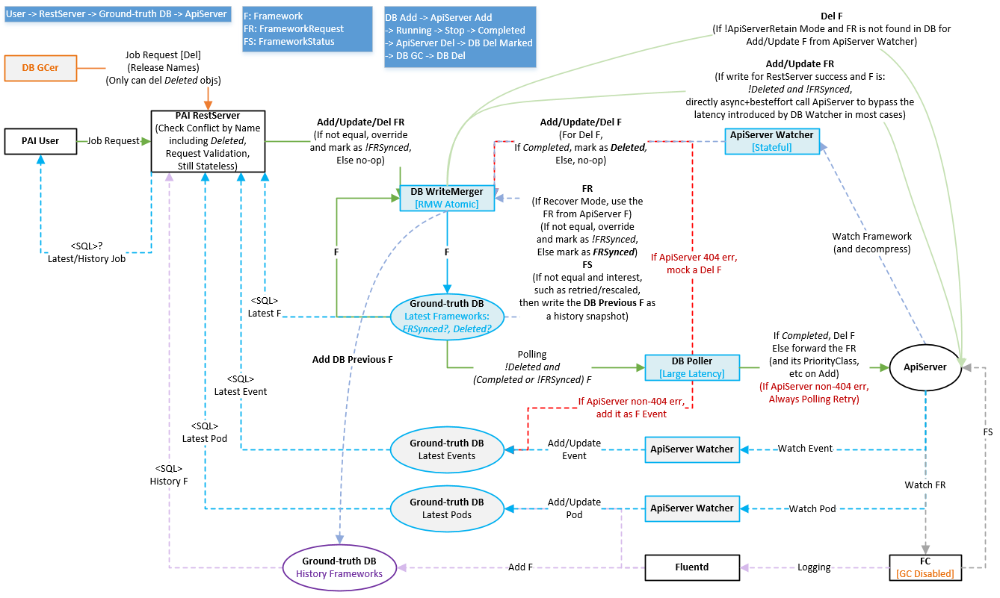

# Database Controller

Database Controller is designed to manage job status in database and API server. To be brief, we treat records in database as the ground truth, and synchronize them to the API server. 

Database Controller contains 3 main components: write merger, poller and watcher. Here is an example of job lifetime controlled by these 3 components:

1. User submits framework request to rest-server.
2. Rest-server forwards the request to write merger.
3. Write merger saves it to database, mark `synced=false`, and return.
4. User is notified the framework request is successfully created.
5. Poller finds the `synced=false` request, and synchronize it to the API server.
6. Now watcher finds the framework is created in API server. So it sends the event to write merger. 
7. Write merger receives the watched event, mark `synced=true`, and update job status according to the event.
8. The job finishes. Watcher sends this event to write merger.
9. Write merger receives the watched event, mark `completed=true`, and update job status according to the event.
10. Poller finds the `completed=true` request, delete it from API server.
11. Watcher sends the delete event to write merger.
12. Write merger receives the watched event, mark `deleted=true`.

## Development

**Environment:** Node.js 8.17.0, use `yarn install` to install all dependencies under `src/`. To set environmental variables, create a `.env` file under `src`.

**Lint:** Run `npm run lint -- --fix` under `src/` or `sdk/`.
