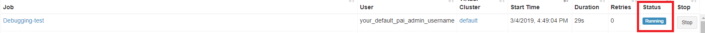
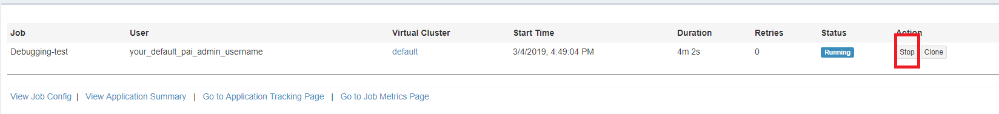

## Job Debugging

When user submit the job, set the following property in the jobEnv of jobConfig. If the job's user command fails, the container will be kept for 1 week. And user could debug the container after ssh to it. After debugging, user should manually stop it to recycle the system resources.

- 1 week is a default value. It could be configured by your cluster admin.


### Submit a debugging job 

#### ```Submit job through json file```

If you submit through a json file and you want to enable job debugging feature for this job, you should set following configuration in your job's json file.
```JSON
{
  "jobEnvs": {
    "isDebug": true
  }
}
```

#### ```Submit job through webportal```

If you submit through webportal and you want to enable job debugging feature for this job, you should set following configuration in ```jobEnvs```.


### Debugging your job, after job failure


If users' job is failed and the command exits with a none-zero code, the job's container will be reserved for job debugging.

In Webportal, the job's status is running. ```TODO: show the debugging job with a specify tag in webportal.```  



You will find the log following in your job.

```text
job has finished with exit code 2
=============================================================================
======   The job container failed, so it will be reserved for 1 week   ======
======          After debugging, please stop the job manually.         ======
=============================================================================
``` 


### Stop your job manually after debugging

You should manually stop the reserved job. Or the occupied resource won't be free. 




### Job failed due to system error

The job, which failed due to system error such as too high usage of file system, can't be reserved by OpenPAI. 