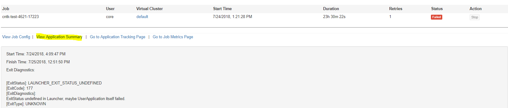
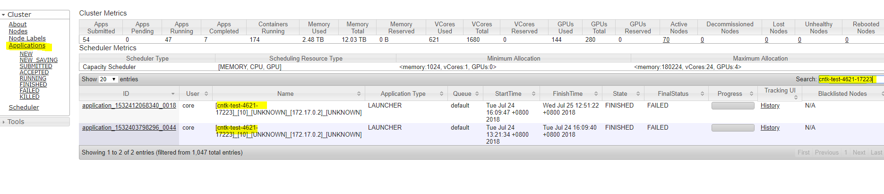
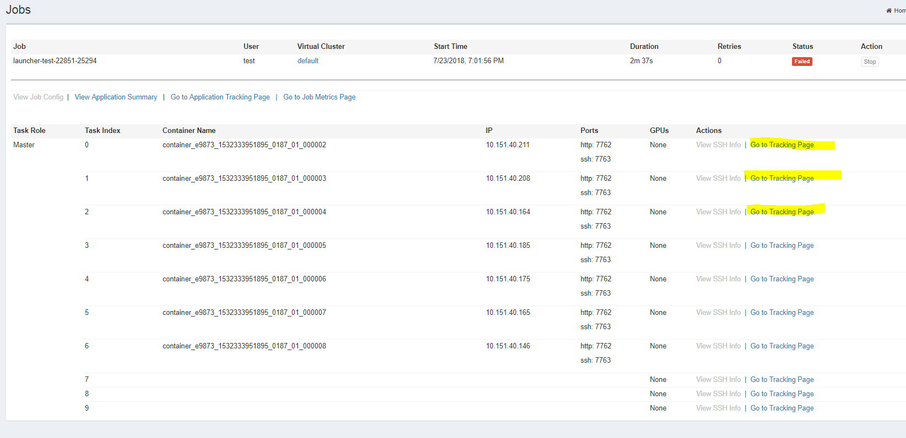

# How to diagnose job problems through logs  <a name="cluster_configuration"></a>

## Table of Contents
- [1 Diagnostic job failure reason](#job)
    - [1.1 View job's launcher AM log](#amlog)
    - [1.2 View job's each task container log](#tasklog)
    - [1.3 Job exitStatus Convention](#exit)
- [2 Diagnostic job retried many times reason](#retry)

## 1 Diagnose job failure reason  <a name="job"></a>

OpenPAI job is launched by [famework launcher](../subprojects/frameworklauncher/yarn/README.md), and each task container is managed by launcher application master.

LauncherAM will manage each job's tasks by customized feature requirement. You can refer to this document  [frameworklauncher architecture](../subprojects/frameworklauncher/yarn/doc/USERMANUAL.md#Architecture) to understand the relationship between them.

 When we diagnose job problems through logs, we shoud pay attention to job launcher AM log (get the main reason) or zoom in job task container log.

### 1.1 View job launcher AM log  <a name="amlog"></a>

Check the summary, and pay attention to the highlights.



Log example:

```
	Exit Diagnostics:
	[ExitStatus]: LAUNCHER_EXIT_STATUS_UNDEFINED
	[ExitCode]: 177
	[ExitDiagnostics]:
	ExitStatus undefined in Launcher, maybe UserApplication itself failed.
	[ExitType]: UNKNOWN
	________________________________________________________________________________________________________________________________________________________________________________________________________
	[ExitCustomizedDiagnostics]:
	[ExitCode]: 134
	[ExitDiagnostics]:
	Exception from container-launch.
	Container id: container_e9878_1532412068340_0018_01_000002
	Exit code: 134
	Exception message: Error: No such object: cntk-test-4621-17223-container_e9878_1532412068340_0018_01_000002
	
	Stack trace: ExitCodeException exitCode=134: Error: No such object: cntk-test-4621-17223-container_e9878_1532412068340_0018_01_000002
	
	at org.apache.hadoop.util.Shell.runCommand(Shell.java:545)
	at org.apache.hadoop.util.Shell.run(Shell.java:456)
	at org.apache.hadoop.util.Shell$ShellCommandExecutor.execute(Shell.java:722)
	at org.apache.hadoop.yarn.server.nodemanager.DefaultContainerExecutor.launchContainer(DefaultContainerExecutor.java:212)
	at org.apache.hadoop.yarn.server.nodemanager.containermanager.launcher.ContainerLaunch.call(ContainerLaunch.java:302)
	at org.apache.hadoop.yarn.server.nodemanager.containermanager.launcher.ContainerLaunch.call(ContainerLaunch.java:82)
	at java.util.concurrent.FutureTask.run(FutureTask.java:266)
	at java.util.concurrent.ThreadPoolExecutor.runWorker(ThreadPoolExecutor.java:1149)
	at java.util.concurrent.ThreadPoolExecutor$Worker.run(ThreadPoolExecutor.java:624)
	at java.lang.Thread.run(Thread.java:748)
	
	Shell output: [DEBUG] EXIT signal received in yarn container, exiting ...
	[DEBUG] cntk-test-4621-17223-container_e9878_1532412068340_0018_01_000002 does not exist.
	
	
	Container exited with a non-zero exit code 134
	
	________________________________________________________________________________________________________________________________________________________________________________________________________
	[ExitCustomizedDiagnostics]:
	
	[g2p_train]: [LastCompletedTask]: [TaskStatus]:
	{
	"taskIndex" : 0,
	"taskRoleName" : "g2p_train",
	"taskState" : "TASK_COMPLETED",
	"taskRetryPolicyState" : {
	"retriedCount" : 0,
	"succeededRetriedCount" : 0,
	"transientNormalRetriedCount" : 0,
	"transientConflictRetriedCount" : 0,
	"nonTransientRetriedCount" : 0,
	"unKnownRetriedCount" : 0
	},
	"taskCreatedTimestamp" : 1532419805920,
	"taskCompletedTimestamp" : 1532494535939,
	"taskServiceStatus" : {
	"serviceVersion" : 0
	},
	"containerId" : "container_e9878_1532412068340_0018_01_000002",
	"containerHost" : "10.151.40.165",
	"containerIp" : "10.151.40.165",
	"containerPorts" : "web:22787;grpc:22788;http:22789;ssh:22790;",
	"containerGpus" : 1,
	"containerLogHttpAddress" : "http://10.151.40.165:8042/node/containerlogs/container_e9878_1532412068340_0018_01_000002/core/",
	"containerConnectionLostCount" : 0,
	"containerIsDecommissioning" : null,
	"containerLaunchedTimestamp" : 1532419818661,
	"containerCompletedTimestamp" : 1532494535935,
	"containerExitCode" : 134,
	"containerExitDiagnostics" : "Exception from container-launch.\nContainer id: container_e9878_1532412068340_0018_01_000002\nExit code: 134\nException message: Error: No such object: cntk-test-4621-17223-container_e9878_1532412068340_0018_01_000002\n\nStack trace: ExitCodeException exitCode=134: Error: No such object: cntk-test-4621-17223-container_e9878_1532412068340_0018_01_000002\n\n\tat org.apache.hadoop.util.Shell.runCommand(Shell.java:545)\n\tat org.apache.hadoop.util.Shell.run(Shell.java:456)\n\tat org.apache.hadoop.util.Shell$ShellCommandExecutor.execute(Shell.java:722)\n\tat org.apache.hadoop.yarn.server.nodemanager.DefaultContainerExecutor.launchContainer(DefaultContainerExecutor.java:212)\n\tat org.apache.hadoop.yarn.server.nodemanager.containermanager.launcher.ContainerLaunch.call(ContainerLaunch.java:302)\n\tat org.apache.hadoop.yarn.server.nodemanager.containermanager.launcher.ContainerLaunch.call(ContainerLaunch.java:82)\n\tat java.util.concurrent.FutureTask.run(FutureTask.java:266)\n\tat java.util.concurrent.ThreadPoolExecutor.runWorker(ThreadPoolExecutor.java:1149)\n\tat java.util.concurrent.ThreadPoolExecutor$Worker.run(ThreadPoolExecutor.java:624)\n\tat java.lang.Thread.run(Thread.java:748)\n\nShell output: [DEBUG] EXIT signal received in yarn container, exiting ...\n[DEBUG] cntk-test-4621-17223-container_e9878_1532412068340_0018_01_000002 does not exist.\n\n\nContainer exited with a non-zero exit code 134\n",
	"containerExitType" : "UNKNOWN"
	}
	[g2p_train]: [LastCompletedTask]: [ContainerLocations]:
	ContainerLogHttpAddress: http://10.151.40.165:8042/node/containerlogs/container_e9878_1532412068340_0018_01_000002/core/
	AppCacheNetworkPath: 10.151.40.165:/var/lib/hadoopdata/nm-local-dir/usercache/core/appcache/application_1532412068340_0018
	ContainerLogNetworkPath: 10.151.40.165:/var/lib/yarn/userlogs/application_1532412068340_0018/container_e9878_1532412068340_0018_01_000002
	________________________________________________________________________________________________________________________________________________________________________________________________________
	[ApplicationCompletionReason]: [g2p_train]: FailedTaskCount 1 has reached MinFailedTaskCount 1.

```

Please pay attention to these lines to diagnostic job failure reason

| line head | above example log info | 
| --- | --- | 
| [ExitDiagnostics] | ExitStatus undefined in Launcher, maybe UserApplication itself failed.| 
| [ExitCode] | 134| 
| Exception message | No such object: cntk-test-4621-17223-container_e9878_1532412068340_0018_01_000002. | 
| Shell output | [DEBUG] EXIT signal received in yarn container, exiting ...[DEBUG] cntk-test-4621-17223-container_e9878_1532412068340_0018_01_000002 does not exist.| 
|ContainerLogHttpAddress| ```http://10.151.40.165:8042/node/containerlogs/container_e9878_1532412068340_0018_01_000002/core/ ```|
|AppCacheNetworkPath|10.151.40.165:/var/lib/hadoopdata/nm-local-dir/usercache/core/appcache/application_1532412068340_0018|
|ContainerLogNetworkPath|10.151.40.165:/var/lib/yarn/userlogs/application_1532412068340_0018/container_e9878_1532412068340_0018_01_000002|
|[ApplicationCompletionReason]| [g2p_train]: FailedTaskCount 1 has reached MinFailedTaskCount 1.|

we could get information:
1.  UserApplication itself failed.
2.  cntk-test-4621-17223-container_e9878_1532412068340_0018_01_000002 does not exist is the reason.
3.  Then we could visit ```http://10.151.40.165:8042/node/containerlogs/container_e9878_1532412068340_0018_01_000002/core/``` at step 1.2 to detect task failure reason.


### 1.2 View job each task container log  <a name="tasklog"></a>

- Check the failed task log who triggered the whole attempt failed, i.e. 

ContainerLogHttpAddress: 

```http://10.151.40.165:8042/node/containerlogs/container_e9878_1532412068340_0018_01_000002/core/```

- Or check other tasks logs:
 


### 1.3 Job exitStatus Convention <a name="exit"></a>

You can check all the defined ExitStatus by: ExitType, ExitDiagnostics from framework launcher [USERMANUAL.md](../subprojects/frameworklauncher/yarn/doc/USERMANUAL.md#ExitStatus_Convention)

## 2 Diagnostic job retried many times reason  <a name="retry"></a>

If the Framework retried many times, check other attempts by searching the FrameworkName in the YARN Web:

- Visit YARN URL: ```http://master_ip/yarn/``` or ```http://master_ip:8088```
- Seach by the job name key words



- Click the ID or History key word to redirect to the job am log pages. Then user could refer section 1 to diagnostic job history retry failure reason.

#### Note:
- History job number limit: Currently, OpenPAI's yarn only store 1000 jobs' logs. User maybe can not find some old job's logs. For example, frequently retried job logs.
- Job container log rotation: In order to prevent the historical log from being too large, OpenPAI configure the [docker log rotation](https://docs.docker.com/config/containers/logging/json-file/) by file [docker-daemon.json](../deployment/k8sPaiLibrary/template/docker-daemon.json.template). 
	The default configuration:
	- "max-size": "100m": The maximum size of the log before it is rolled. A positive integer plus a modifier representing the unit of measure (k, m, or g). Defaults to -1 (unlimited)., 
	- "max-file": "10": The maximum number of log files that can be present. If rolling the logs creates excess files, the oldest file is removed. Only effective when max-size is also set. A positive integer. Defaults to 1.
