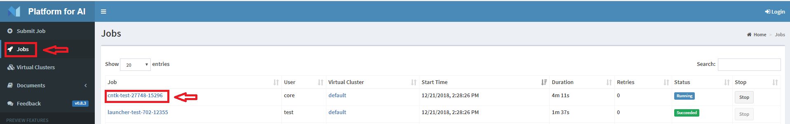
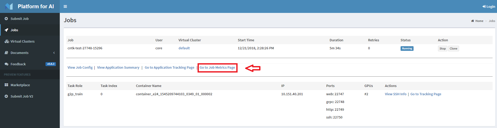
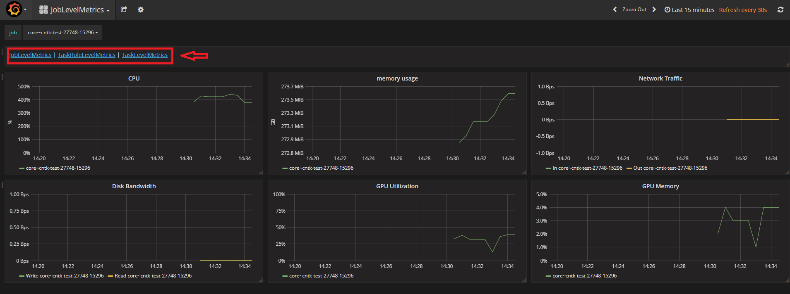
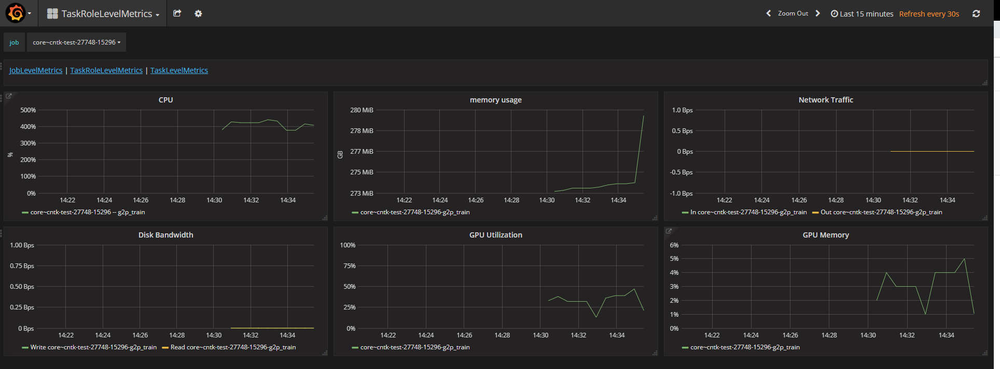
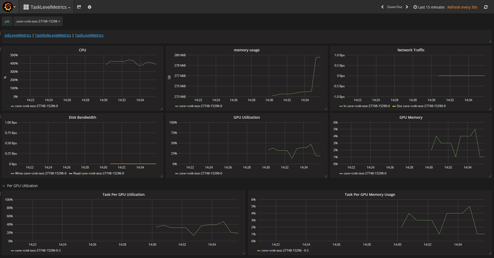

# Diagnostic job performance 

Users can view the resource cost and bottlenecks of various metrics of the job by following the steps below. 

1. At OpenPAI home page, click the top left corner "job" button, then click your "job name":

2. Click "Go to Job Metrics Page":

3. The current page is job level monitoring. Users can zoom in to see task role and task level monitoring by clicking on the red frame in the picture

4. Task role level metrics

5. Task level metrics

