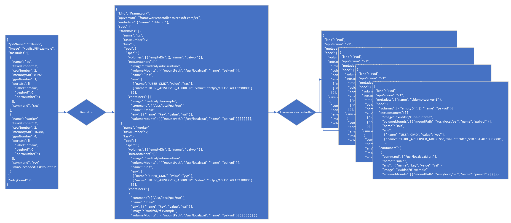
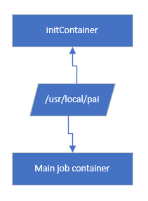

# Runtime

## Background

We have implemented rest-lite & kube-runtime as proof of concept to demostrate pure k8s along with framework controller can run distributed training jobs. Before this, there are only pai v1 job spec, so rest-lite only support pai v1 job spec.

Here is distributed job that can run with new runtime:

``` yaml
{
  "jobName": "tfDemo",
  "image": "xudifsd/tf-example",

  "taskRoles": [
    {
      "name": "ps",
      "taskNumber": 2,
      "cpuNumber": 2,
      "memoryMB": 8192,
      "gpuNumber": 1,
      "portList": [{
          "label": "main",
          "beginAt": 0,
          "portNumber": 1
      }],
      "command": "python /example/mnist_replica.py --job_name=ps --task_index=$PAI_CURRENT_TASK_ROLE_CURRENT_TASK_INDEX --ps_hosts=$PAI_HOST_IP_ps_0:$PAI_PORT_LIST_ps_0_main,$PAI_HOST_IP_ps_1:$PAI_PORT_LIST_ps_1_main --worker_hosts=$PAI_HOST_IP_worker_0:$PAI_PORT_LIST_worker_0_main,$PAI_HOST_IP_worker_1:$PAI_PORT_LIST_worker_1_main"
    },
    {
      "name": "worker",
      "taskNumber": 2,
      "cpuNumber": 2,
      "memoryMB": 16384,
      "gpuNumber": 4,
      "portList": [{
          "label": "main",
          "beginAt": 0,
          "portNumber": 1
      }],
      "command": "python /example/mnist_replica.py --job_name=worker --task_index=$PAI_CURRENT_TASK_ROLE_CURRENT_TASK_INDEX --ps_hosts=$PAI_HOST_IP_ps_0:$PAI_PORT_LIST_ps_0_main,$PAI_HOST_IP_ps_1:$PAI_PORT_LIST_ps_1_main --worker_hosts=$PAI_HOST_IP_worker_0:$PAI_PORT_LIST_worker_0_main,$PAI_HOST_IP_worker_1:$PAI_PORT_LIST_worker_1_main",
      "minSucceededTaskCount": 2
    }
  ],
  "jobEnvs": {"PAI_SSH_PUB_KEY": "ssh-rsa AAAAB3NzaC1yc2EAAAADAQABAAACAQCg1sYNwNJqyS2e1dtn60ZdWyEHalbVXOSXZ4ViUqweb2pJmdA+8wEoc8OaiWJwoDWhCClZU2D3zp0dvW1WBFUZbeqTOC90M3Da0hbeg4U/mB62A017GBRy1yPxkyySxOV6p9PmGy+Kx8eZQq3XeK0zFpsHAdOeBHdIGEQUmv+RQb7R+X0GU8KPtdy6FCxe5BjlxS0pOfnu8PrlmeXQPS+n+dbDRLvYSVERR27xBSR/BAyOFC/WT3PuNpeERI1jBIMhOXoxTIKWORuw/xtE5gzhswStHKvm6RyxwSyKhV5iBAl4Ma/GGgGlzkRh/FriNq0/THs9MI10QT2q1s7MdmJqmRz+dUAY/c8gdb5f5/t3YXoLE/MI0t5rjVEg/Qk1PQNd1UL8gTUQY5KE0tJCcGXtosVxzq37g6CGeB9GxL+y+SaZmMBLikwpnoH1VnUT8hdbRaiklD77BhLQbL7MOw4Otefg7OmK8CgAbm2nmP1B57MDSVYNHX92vpF1P/Tk+8qgm/EdRbSekY6lj98Ybeh+d12wsTVQExk1L2lYk+5elm5CoH3Y+q8gpSu9dahTb5Rt2m02z38zAUrdSrbFTL6GAQNiikfP/82ft+kZb/aq140MAG5eaJvPSvDOVo3etN/aIA+ZSbikfCK4ZP7zyRgMk/NSIDqVALAWwIPYZlcwYQ== xudifsd@gmail.com"},
  "retryCount": 0
}
```

And here is dockfile for building the image of `xudifsd/tf-example`:

``` Dockerfile
From tensorflow/tensorflow:latest-gpu

WORKDIR /example

RUN apt-get update && \
        apt-get install -y wget && \
        wget https://raw.githubusercontent.com/tensorflow/tensorflow/master/tensorflow/tools/dist_test/python/mnist_replica.py
```

## How to setup cluster

1. Deploy k8s using paictl. If you have a k8s deployed by previous version's pai, you should check if all nodes have nvidia-container-runtime installed.
2. Config `drivers.set-nvidia-runtime` to be true, and start drivers service in pai.
3. Deploy nvidia-device-plugin using `kubectl create -f https://raw.githubusercontent.com/NVIDIA/k8s-device-plugin/v1.9/nvidia-device-plugin.yml`, notice if the version matches your k8s version.
4. Deploy [framework controller](https://github.com/microsoft/frameworkcontroller/tree/master/example/run).
5. Deploy [rest-lite](https://github.com/microsoft/pai/blob/ee050287c952ca8fa71befb1937a2346e223515d/src/rest-lite/src/deploy.yaml), k8s_api parameter should change, fs_uri parameter is only for `PAI_DATA_DIR` and `PAI_CODE_DIR` legacy environment.
6. rest-lite will by default listen at 5000 port, you can create new job by posting to `/api/v1/user/<username>/jobs/<job_name>`, current username is for environment, no verification on this field, and job_name is ignored.

## How it works

### rest-lite



Rest-lite will accept user's job spec and transform it into a framework controller spec and then post to k8s. The framework controller will receive this spec and create several pods according to it.

During the transformation from job spec to framework controller spec, the rest-lite will do port allocation, current allocation only generate random port numbers, and ensure it do not conflict in the same pod. Pods from the same task role share same ports. After port allocation, rest-lite will generate environment variables for each task role.

Currently, for ssh funcationality, the rest-lite will add ssh port requirement before transforming, this mimic behaviour of old pai: not requiring user to specify ssh port requirement to access container using ssh.

### kube-runtime



The goal of kube-runtime is to control the environment of job container, when I say environment I mean:

* start time should be synchronized with other task in same job
* environment variables
* daemon processes that facilitate job, e.g. sshd
* where stdout/stderr of user command goes to

As we see in framework controller spec, every pod has initContainer and another main job container, they share same volume, and job container hardcoded start command to be `/usr/local/pai/run`, this is how initContainer control environment of job container.

When initContainer start, it will do following setup:

1. call scripts in `prep` to do daemon process specific prepration, for example, copy sshd binary to shared volume in case user's image do not have sshd
2. call frameworkbarrier to do inter-pod synchronization and pod discovery, and generate dynamic environment variables for job container to source
3. generate user specified command to script

The frameworkbarrier is a tool provided by framework controller for gang scheduling and pod discovery.

After all this done, the initContainer finished, and k8s will start job container with command `/usr/local/pai/run`.

This `/usr/local/pai/run` script act as init process, it will inherit environment variables from initContainer by sourcing environment files generated in initContainer and start all daemon processes ini `init` directory, when all finished, init process will start script generated by step 3 in initContainer which is user specified command.

Current `prep` for sshd does nothing, it should copy sshd binary to shared volume for `init` script to run.

ssh implementation is a little different from current pai. It accept user's public key, and add that key to authorized keys during setup, so user can ssh into container with corresponding private key without having to download private key as in pai.

## Spec

### Environment variables

Some values for environment variables are known before job being scheduled, like the job name, role_name etc. so they are considered as static and are prefilled in rest-lite. Other values can be only know after scheduling, these dynamic values are filled by kube-runtime.

| Environment Variable Name          | Description                              | Generated by                           |
| :--------------------------------- | :--------------------------------------- |:---------------------------------------|
| `PAI_JOB_NAME`                     | The name of job this task belongs to     | rest-lite |
| `PAI_DEFAULT_FS_URI`               | Cluster specific variable, usually `hdfs://ip`| rest-lite |
| `PAI_TASK_ROLE_COUNT`              | How many task roles this job has         | rest-lite |
| `PAI_TASK_ROLE_LIST`               | Comma separated role name                | rest-lite |
| `PAI_TASK_ROLE_TASK_COUNT_$role`   | How many task this take role has         | rest-lite |
| `PAI_PORT_LIST_$role_$taskIdx_$portLabel` | comma separated port labeled as `$portLabel` requested by `$role`:`$taskIdx` | rest-lite |
| `PAI_RESOURCE_$role`               | Resource requirement for the task role in `cpu_count:xxx,memMB:xxx,shmMB:xxx,gpu_count:xxx` format | rest-lite |
| `PAI_MIN_FAILED_INSTANCE_$role`    | taskRole.minFailedTaskCount value        | rest-lite |
| `PAI_MIN_SUCCEEDED_INSTANCE_$role` | taskRole.minSucceededTaskCount value     | rest-lite |
| `PAI_CURRENT_TASK_ROLE_NAME`       | role name of current task                | rest-lite |
| `PAI_CURRENT_TASK_ROLE_CURRENT_TASK_INDEX` | task index of current task       | kube-runtime |
| `PAI_HOST_IP_$role_$taskIdx`       | Host IP of task `$role`:`$taskIdx`       | kube-runtime |

Legacy environment variables

| Environment Variable Name          | Description                              | Generated by                           |
| :--------------------------------- | :--------------------------------------- |:---------------------------------------|
| `PAI_DATA_DIR` | data dir | rest-lite |
| `PAI_OUTPUT_DIR` | data dir | rest-lite |
| `PAI_CODE_DIR` | data dir | rest-lite |
| `PAI_CURRENT_TASK_ROLE_TASK_COUNT` | task count of this task role | rest-lite |
| `PAI_CURRENT_TASK_ROLE_CPU_COUNT` | resource requirement of this task role | rest-lite |
| `PAI_CURRENT_TASK_ROLE_MEM_MB` | resource requirement of this task role | rest-lite |
| `PAI_CURRENT_TASK_ROLE_SHM_MB` | resource requirement of this task role | rest-lite |
| `PAI_CURRENT_TASK_ROLE_GPU_COUNT` | resource requirement of this task role | rest-lite |
| `PAI_CURRENT_TASK_ROLE_MIN_FAILED_TASK_COUNT` | min failed task count of this task role | rest-lite |
| `PAI_CURRENT_TASK_ROLE_MIN_SUCCEEDED_TASK_COUNT` | min succeeded task count of this task role | rest-lite |
| `PAI_CURRENT_CONTAINER_PORT` | container port, allocated to http port label | rest-lite |
| `PAI_CONTAINER_SSH_PORT` | container port, allocated to ssh port label | rest-lite |
| `PAI_TASK_ROLE_INDEX`              | Index of the task role this task belongs to | kube-runtime |
| `PAI_HOST_IP_$role_$roleIdx` | Host IP of each tasks | kube-runtime |
| `PAI_TASK_ROLE_$role_HOST_LIST` | List of Host IP of this task role | kube-runtime |
| `PAI_$role_$roleIdx_$portLabel_PORT` | Port from `$role` `$roleIdx` and `$portLabel` | kube-runtime |

### Contracts in rest-lite & kube-runtime

* rest-lite will pass user specified cmd as environment variable `USER_CMD` to kube-runtime.
* rest-lite will pass kube-api server address as environment variable `KUBE_APISERVER_ADDRESS` to kube-runtime for service discovery.
* kube-runtime defined its entrypoint in its Dockerfile, so rest-lite do not have to add start command for kube-runtime image.
* init container & job container share a volume mounted in `/usr/local/pai`.
* start command for job container will be hard-coded `/usr/local/pai/run`

## Future Improvement

* Make deployment more smooth
* Integrate rest-lite with rest-server, either by implement rest-lite functionality in rest-server or redirect job spec to rest-lite
* Implement delete/clone/stop job
* Better job log display, currently we only mount host path into job container and redirect user's output to there, and user have to ssh into host to see their logs, we could implement either:
  * Start an nginx process in every node to server user's log
  * Start fluentd in runtime daemon process to collect user's log