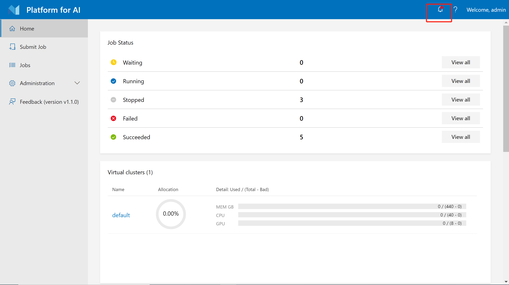

# Alerting and Troubleshooting

OpenPAI uses [Prometheus](https://prometheus.io/) to monitor the system. You can view the monitoring information [on webportal](./basic-management-operations.md#management-on-webportal). For alerting, OpenPAI uses [alert manager](https://prometheus.io/docs/alerting/latest/alertmanager/), but it is not set up in default installation. This document describes how to set up alert manager, and how to deal with some common alerts. It also includes some other troubleshooting cases in practice.

## Set Up Alert Manager

OpenPAI's alert manager is set to send alerting e-mails when alert happens. To begin with, you should get an SMTP account to send these e-mails.

After getting an SMTP account, how to set up the alert manager in PAI? Please read the document about [service management and paictl](./basic-management-operations.md#pai-service-management-and-paictl) first, and start a dev box container. Then, in the dev box container, pull the configuration by:

```bash
./paictl config pull -o /cluster-configuration
```

Uncomment the alert manager section in `/cluster-configuration/services-configuration.yaml`, and set your SMTP account and the receiver's e-mail address. Here is an example:

```bash
alert-manager:
  port: 9093
  receiver: <receiver-email-address>
  smtp_auth_password: <smtp-password>
  smtp_auth_username: <smtp-username>
  smtp_from: <smtp-email-address>
  smtp_url: <smtp-server>:<smtp-port>
```

Configuration `port` stands for the port of alert manager. In most cases, you don't need to change it. Configuration `receiver` is usually set to be the administrator's e-mail address to receive alerting e-mails.

Save the configuration file, and start alert manager by:

```bash
./paictl.py service start -n alert-manager
./paictl.py config push -p /cluster-configuration -m service
./paictl.py service start -n alert-manager
```

After alert manager is successfully started, the receiver's e-mail address will receive alerting e-mails from the SMTP account. Also, you can view the alerting information on Webportal (in the top-right corner):

   


## Troubleshooting

### PaiServicePodNotReady Alert

This is a kind of alert from alert manager, and usually caused by container being killed by operator or OOM killer. To check if it was killed by OOM killer, you can check node's free memory via Prometheus:

  1. visit Prometheus web page, it is usually `http://<your-pai-master-ip>:9091`.
  2. Enter query `node_memory_MemFree_bytes`.
  3. If free memory drop to near 0, the container should be killed by OOM killer
  4. You can double check this by logging into node and run command `dmesg` and looking for phase `oom`.

Solutions:

  1. Force remove unhealth containers with this command in terminal:
  `kubectl delete pod pod-name --grace-period=0 --force`
  2. Recreate pod in Kubernetes, this operation may block indefinitly because dockerd may not functioning correctly after OOM. If recreate blocked too long, you can log into the node and restart dockerd via `/etc/init.d/docker restart`.

### NodeNotReady Alert

This is a kind of alert from alert manager, and is reported by watchdog service. Watchdog gets such metrics from Kubernetes API. Example metrics is like:

```
pai_node_count{disk_pressure="false",instance="10.0.0.1:9101",job="pai_serivce_exporter",memory_pressure="false",name="10.0.0.2",out_of_disk="false",pai_service_name="watchdog",ready="true",scraped_from="watchdog-5ddd945975-kwhpr"}
```

The name label indicate what node this metric represents.

If the node's ready label has value "unknown", this means the node may disconnect from Kubernetes master, this may due to several reasons:

  - Node is down
  - Kubelet is down
  - Network partition between node and Kubernetes master

You can first try to log into the node. If you can not, and have no ping response, the node may be down, and you should boot it up.

If you can log in to the node, you should check if the kubelet is up and running, execute `sudo docker ps` command in the node, normally the kubelet container will be listed. The output should like:

```
  a66a171434cc  gcr.io/google_containers/hyperkube:v1.9.9   "/hyperkube kubele..."   2 weeks ago      Up 2 weeks     kubelet
```

After this step, you should check the log of kubelet, to see if it can access Kubernetes API. If you see something like:

```
  E0410 04:24:30.663050    2491 kubelet_node_status.go:386] Error updating node status, will retry: error getting node "10.0.0.1": Get http://10.0.1.2:8080/api/v1/nodes/10.0.0.1: net/http: request canceled while waiting for connection (Client.Timeout exceeded while awaiting headers)
```

This means the node can not report its status to Kubernetes, and hence the Kubernetes will post unknown status, and this triggered the alert.

You should check what caused this connectivity problem.

### NodeFilesystemUsage Alert

This is a kind of alert from alert manager, and is used to monitor disk space of each server. If usage of disk space is greater than 80%, this alert will be triggered. OpenPAI has two services may use a lot of disk space. They are storage manager and docker image cache. If there is other usage of OpenPAI servers, they should be checked to avoid the disk usage is caused by outside of OpenPAI.

Solutions:

  1. Check user file on the NFS storage server launched by storage manager. If you didn't set up a storage manager, ignore this step.
  2. Check the docker cache. The docker may use too many disk space for caching, it's worth to have a check.

### NVIDIA GPU is Not Detected

If you cannot use GPU in your job, please check the following items on the corresponding worker node:

 1. The NVIDIA drivers should be installed correctly. Use `nvidia-smi` to confirm.
 2. [nvidia-container-runtime](https://github.com/NVIDIA/nvidia-container-runtime) is installed, and configured as the default runtime of docker. Use `docker info -f "{{json .DefaultRuntime}}"` to confirm.

If the GPU number shown in webportal is wrong, check the [hivedscheduler and VC configuration](./how-to-set-up-virtual-clusters.md).

### Node is De-allocated and doesn't Appear in Kubernetes System when it Comes Back

Working nodes can be de-allocated if you are using a cloud service and set up PAI on low-priority machines. Usually, if the node is lost temporarily, you can wait until the node comes back. It doesn't need any special care. 

However, some cloud service providers not only de-allocate nodes, but also remove all disk contents on the certain nodes. Thus the node cannot connect to Kubernetes automatically when it comes back. If it is your case, we recommend you to set up a crontab job on the dev box node to bring back these nodes periodically.

In [How to Add and Remove Nodes](how-to-add-and-remove-nodes.md), we have described how to add a node. The crontab job doesn't need to do all of these things. It only needs to add the node to the Kubernetes. It figures out which nodes have come back but are still considered `NotReady` in Kubernetes, then, run the following command to bring it back:

```bash
ansible-playbook -i inventory/mycluster/hosts.yml upgrade-cluster.yml --become --become-user=root  --limit=${limit_list} -e "@inventory/mycluster/openpai.yml"
```

`${limit_list}` stands for the names of these de-allocated nodes. For example, if the crontab job finds node `a` and node `b` are available now, but they are still in `NotReady` status in Kuberentes, then it can set `limit_list=a,b`.