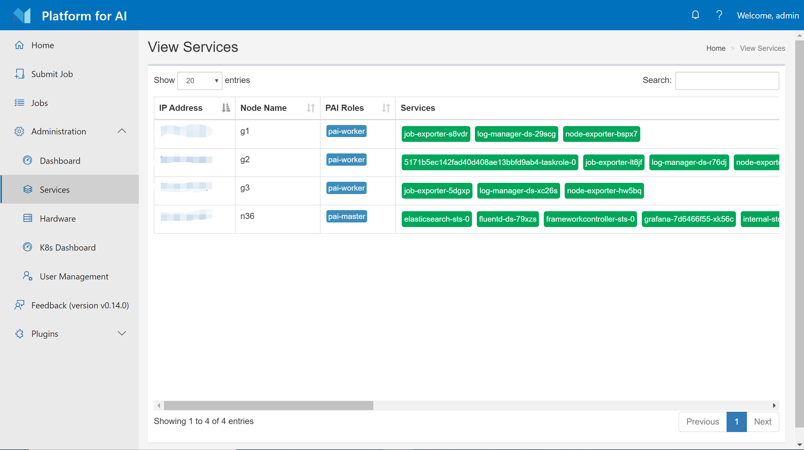
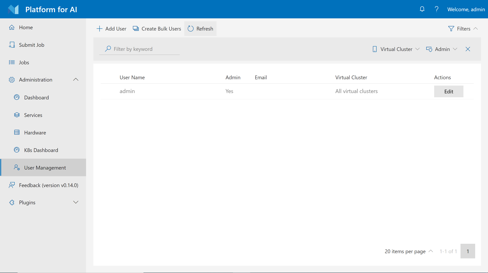
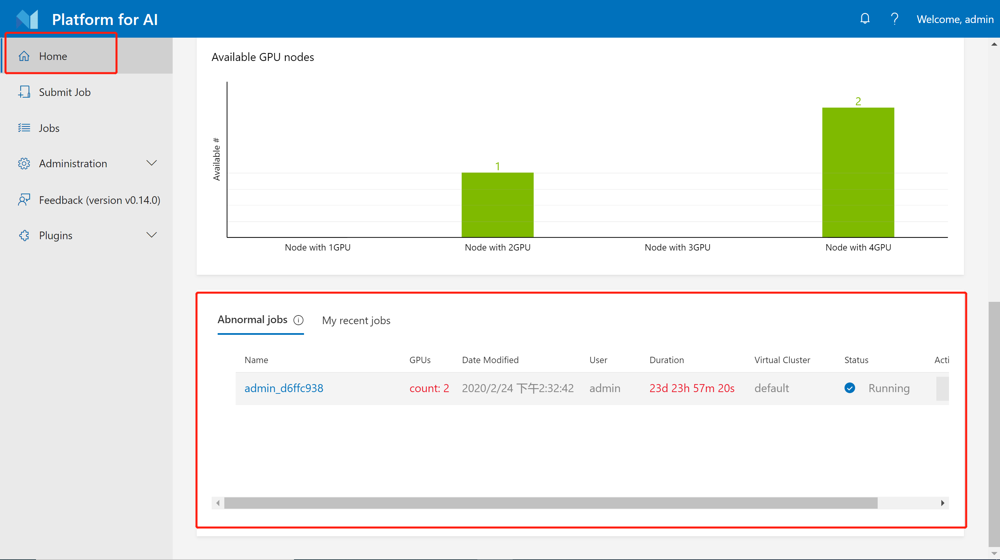
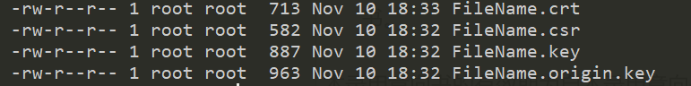

# Basic Management Operations

## Management on Webportal

The webportal provides some basic administration functions. If you log in to it as an administrator, you will find several buttons about administration on the left sidebar, as shown in the following image.

    

Most of these functions are easy to understand. We will go through them quickly in this section.

### Hardware Utilization Page

The hardware page shows the CPU, GPU, memory, disk, network utilization of each node in your cluster. The utilization is shown in different color basically. If you hover your mouse on these colored circles, exact utilization percentage will be shown.

   

### Services Page

The services page shows OpenPAI services deployed in Kubernetes. These services are daemonset, deployment, or stateful sets.

   


### User Management

The user management page lets you create, modify, and delete users. Users have two types: non-admin users and admin users. You can choose which type to create. This page only shows up when OpenPAI is deployed in basic authentication mode, which is the default mode. If your cluster uses [AAD](./how-to-manage-users-and-groups.md#users-and-groups-in-aad-mode) to manage users, this page won't be available to you.

   


### Abnormal Jobs

On the homepage, there is an `abnormal jobs` section for administrators. A job is treated as an abnormal job if it runs more than 5 days or GPU usage is lower than 10%. You can choose to stop some abnormal jobs if you desire so.

   

### Access Kubernetes Dashboard

There is a shortcut to k8s dashboard on the webportal. However, it needs special authentication for security issues.

   

To use it, you should first set up `https` access (Using `http://<ip>` won't work) for OpenPAI. Please refer to [here](#how-to-set-up-https). Then, on the dev box machine, follow the steps below:

**Step 1.** Save following yaml text as `admin-user.yaml`

```yaml
apiVersion: v1
kind: ServiceAccount
metadata:
  name: admin-user
  namespace: kube-system
---
apiVersion: rbac.authorization.k8s.io/v1
kind: ClusterRoleBinding
metadata:
  name: admin-user
roleRef:
  apiGroup: rbac.authorization.k8s.io
  kind: ClusterRole
  name: cluster-admin
subjects:
- kind: ServiceAccount
  name: admin-user
  namespace: kube-system
```

**Step 2.** Run `kubectl apply -f admin-user.yaml`

**Step 3.** Run `kubectl -n kube-system describe secret $(kubectl -n kube-system get secret | grep admin-user | awk '{print $1}')`. It will print the token which can be used to login k8s-dashboard.

## PAI Service Management and Paictl

Generally speaking, PAI services are daemon sets, deployments or stateful sets created by PAI system, running on Kubernetes. You can find them on the [k8s dashboard](#access-kubernetes-dashboard) and [services page](#services-page). For example, `webportal` is a PAI service which provides front-end interface, and `rest-server` is another one for back-end APIs. These services are all configurable. If you have followed the [installation-guide](./installation-guide.md), you can find two files, `layout.yaml` and `services-configuration.yaml`, in folder `~/pai-deploy/cluster-cfg` on the dev box machine. These two files are the default service configuration.

`paictl` is a CLI tool which helps you manage cluster configuration and PAI services. To use it, we recommend you to leverage our dev box docker image to avoid environment-related problems. First, go to the dev box machine, launch the dev box docker by:

```bash
sudo docker run -itd \
        -e COLUMNS=$COLUMNS -e LINES=$LINES -e TERM=$TERM \
        -v /var/run/docker.sock:/var/run/docker.sock \
        --pid=host \
        --privileged=true \
        --net=host \
        --name=dev-box \
        openpai/dev-box:<openpai version tag>
```

You should replace the `<openpai version tag>` with your current OpenPAI version, e.g. `v1.0.0`.

To use `paictl`, go into the container by:

```bash
sudo docker exec -it dev-box bash
```

Then, you should manually configure `kubeconfig` in the dev box container. During installation, we have put the correct `kubeconfig` file in `~/pai-deploy/kube/config` on the dev box machine. Please copy its content to `~/.kube/config` in the dev box container:

```bash
# in the dev box container
mkdir -p ~/.kube
# please copy the content in `~/pai-deploy/kube/config` on the dev box machine to `~/.kube/config` here
vim ~/.kube/config
```

Go to folder `/pai`, try to retrieve your cluster id:

```bash
cd /pai
./paictl.py config get-id
```

If the command prints your cluster id, you can confirm the `paictl` tool works fine.

Here are some basic usage examples of `paictl`:

```bash
# get cluster id
./paictl.py config get-id

# pull service config to a certain folder
# the configuration containers two files: layout.yaml and services-configuration.yaml
# if <config-folder> already has these files, they will be overrided
./paictl.py config pull -o <config-folder>

# push service config to the cluster
# only pushed config is effective
./paictl.py config push -p <config-folder> -m service

# stop all PAI services
./paictl.py service stop

# start all PAI services
./paictl.py service start

# stop several PAI services
./paictl.py service stop -n <service-name-1> <service-name-2>

# start several PAI services
./paictl.py service start -n <service-name-1> <service-name-2>
```

If you want to change configuration of some services, please follow the steps of `service stop`, `config push` and `service start`.

For example, if you want to customize webportal, you should modify the `webportal` section in `services-configuration.yaml`. Then use the following command to push the configuration and restart webportal:

```bash
./paictl.py service stop -n webportal
./paictl.py config push -p <config-folder> -m service
./paictl.py service start -n webportal
```

Another example is to restart the whole cluster:

```bash
# restart cluster
./paictl.py service stop
./paictl.py service start
```

You can use `exit` to leave the dev-box container, and use `sudo docker exec -it dev-box bash` to re-enter it if you desire so. If you don't need it any more, use `sudo docker stop dev-box` and `sudo docker rm dev-box` to delete the docker container.

## How To Set Up HTTPS

To configure https certificate for pylon, you need to obtain a digital certificate first, and then save the digital certificate-related files in the dev-box container. In the dev-box container, you can find the configuration file `services-configuration.yaml`, and then you need to add the file path of the saved digital certificate into the `services-configuration.yaml` file. You can choose a self-signed certificate or a certificate issued by a CA. Next, we will first demonstrate the configuration process of a self-signed certificate. The configuration processes for the two types of certificates are similar.

### Configure A Self-Signed Certificate


#### 1. Enter the dev-box container

You need to use [`paictl`](#pai-service-management-and-paictl) to enter the container in the following way:

```bash
sudo docker exec -it dev-box bash
```

#### 2. Create a folder in the dev-box container
When you enter the container, you need to create a folder and generate a self-signed certificate in this folder. You can create an `ssl` folder in the `home` folder.

``` bash
mkdir /home/ssl
cd  /home/ssl
```
#### 3. Generate RSA private key with openssl

``` bash
openssl genrsa -des3 -out FileName.key 1024
```
In this step, a password will be asked. The following commands you enter will use the `FileName` parameter multiple times. You can choose a suitable file name to replace `FileName`.


#### 4. Generate certificate request

```bash
SUBJECT="/C=US/ST=Washington/CN=FileName"
openssl req -new -subj $SUBJECT -key FileName.key -out FileName.csr
```

#### 5. Generate certificate

```bash
mv FileName.key FileName.origin.key
openssl rsa -in FileName.origin.key -out FileName.key
openssl x509 -req -days 3650 -in FileName.csr -signkey FileName.key -out FileName.crt
```

#### 6. Final result

In the current directory, you will find 4 files:

<div  align="center">

</div>

#### 7. Configure services-configuration.yaml


If you are configuring PAI service for the first time, `services-configuration.yaml` may not exist in the dev-box container. You should follow the procedure below to change the configuration file and make it effective. Then, stop the pylon service, pull the OpenPAI configuration file `services-configuration.yaml` to the local, change the configuration file, upload the configuration file, and restart the pylon service. The commands you need are:
```bash
./paictl.py service stop -n pylon
./paictl.py config pull -o <config-folder>
vim <config-folder>/services-configuration.yaml
./paictl.py config push -p <config-folder> -m service
./paictl.py service start -n pylon
```


If you already have `services-configuration.yaml` in your container, you can omit the process of pulling the file. Please note that the master_ip in the configuration file is the IP of your master machine, not the IP of your dev box machine. Please configure the yaml file in the following format:
```
pylon:
    port: 80
    uri: "http://master_ip:80"
    ssl:
      crt_name: xxxxxx
      crt_path: /path/to/xxxxxx
      key_name: yyyyyy
      key_path: /path/to/yyyyyy
```
With the example we just gave, the configuration file content should be:
```
pylon:
    port: 80
    uri: "http://master_ip:80"
    ssl:
      crt_name: FileName.crt
      crt_path: /home/ssl/FileName.crt
      key_name: FileName.key
      key_path: /home/ssl/FileName.key
```
Restart the pylon service, and you will be able to access OpenPAI via https.

#### Configure CA certificate
##### 1. Save the CA certificate in the dev-box container
To configure a CA certificate, you first need to apply for and export it. You will eventually get a crt file and a key file. Please save these two files in the dev-box container. As shown in the following picture, the two files are saved in `/home/ssl`.

<div  align="center">

</div>

##### 2. Configure services-configuration.yaml
In this step, you can configure the `services-configuration.yaml` in accordance with the Step 7 in the process of `Configure a self-signed certificate`. For example:

```
pylon:
    port: 80
    uri: "http://master_ip:80"
    ssl:
      crt_name: n32.openpai.org_chain.crt
      crt_path: /home/ssl/n32.openpai.org_chain.crt
      key_name: n32.openpai.org_key.key
      key_path: /home/ssl/n32.openpai.org_key.key
```
