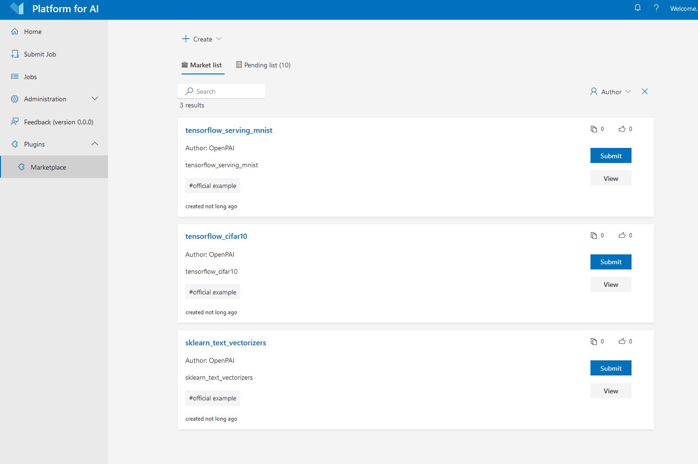

# How to Customize Cluster by Plugins

1. [Installation Guide](./installation-guide.md)
2. [Installation FAQs and Troubleshooting](./installation-faqs-and-troubleshooting.md)
3. [Basic Management Operations](./basic-management-operations.md)
4. [How to Manage Users and Groups](./how-to-manage-users-and-groups.md)
5. [How to Set Up Storage](./how-to-set-up-storage.md)
6. [How to Set Up Virtual Clusters](./how-to-set-up-virtual-clusters.md)
7. [How to Add and Remove Nodes](./how-to-add-and-remove-nodes.md)
8. [How to use CPU Nodes](./how-to-use-cpu-nodes.md)
9. [How to Customize Cluster by Plugins](./how-to-customize-cluster-by-plugins.md) (this document)
    - [How to Install a Webportal Plugin](#how-to-install-a-webportal-plugin)
    - [Deploy Openpaimarketplace as Webportal Plugin](#deploy-openpaimarketplace-as-webportal-plugin)
10. [Troubleshooting](./troubleshooting.md)
11. [How to Uninstall OpenPAI](./how-to-uninstall-openpai.md)
12. [Upgrade Guide](./upgrade-guide.md)

## How to Install a Webportal Plugin

Webportal plugin provides a way to add custom web pages to the OpenPAI webportal. It can communicate with other PAI services, like the rest-server. It could provide customized solutions to different requirements.

As an administrator, you can configure the web portal plugins in the `webportal.plugins` field of `services-configuration.yaml` (If you don't know what `services-configuration.yaml` is, please refer to [PAI Service Management and Paictl](./basic-management-operations.md#pai-service-management-and-paictl)):

```yaml
webportal:
  server-port: 9286

  plugins:
  - title: Marketplace
    uri: /scripts/plugins/marketplace.bundle.js
    config:
      repo: Microsoft/pai
```


- The `title` field is the title of the web portal plugin listed in the menu, it could be customized by administrators for the same plugin with different configurations.
- The `uri` field is the entry file of the web portal plugin, usually previded by the plugin developer. It may be an absolute URL or a root-relative URL, as the different deploy type of the web portal plugin.
- The `config` field is a key-value dictionary to configure the web portal plugin, available configs are listed in web portal plugin's specific document.

After modifying the configuration, push it to the cluster and restart webportal by:

```bash
./paictl.py service stop -n webportal
./paictl.py config push -p <config-folder> -m service
./paictl.py service start -n webportal
```

## Deploy Openpaimarketplace as webportal plugin

[Openpaimarketplace](https://github.com/microsoft/openpaimarketplace) is a place which stores examples and job templates of openpai. Users could use openpaimarketplace to share their jobs or run-and-learn others' sharing job.

To deploy openpaimarketplace, please refer to [the project doc](https://github.com/microsoft/openpaimarketplace) about how to deploy the marketplace service and webportal plugin.

After deployment, follow the [previous part](#how-to-install-a-webportal-plugin) to change the webportal configuration with marketplace plugin url and restart webportal. Then you could use marketplace from the sidebar.

    
