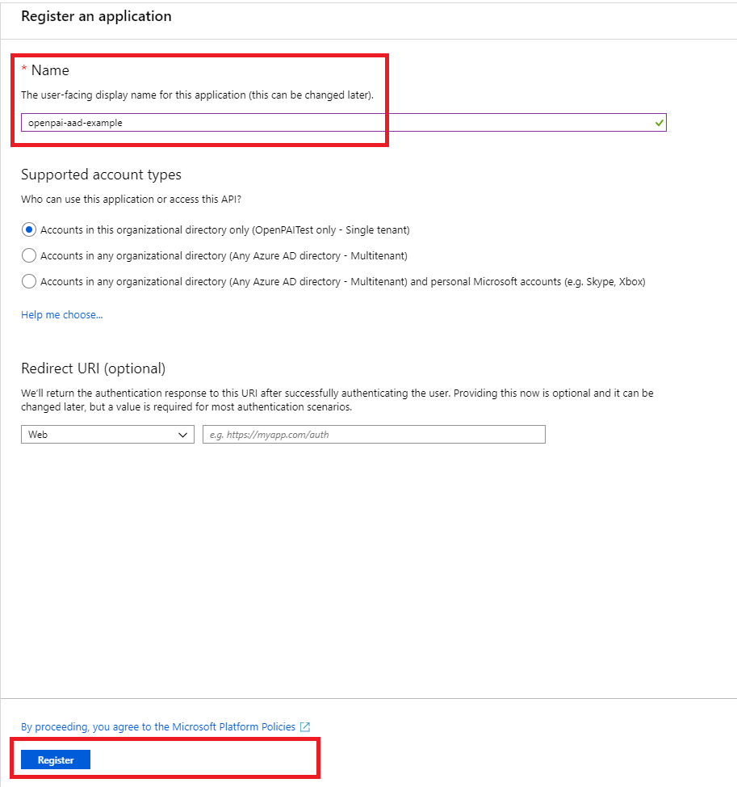
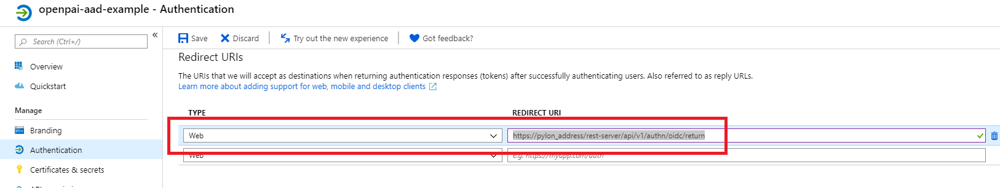
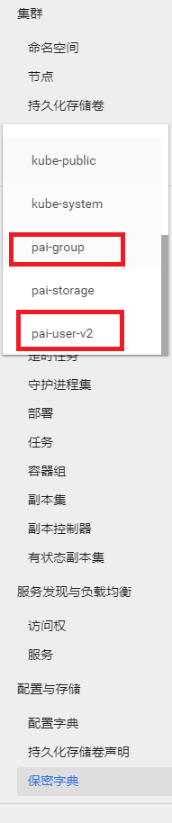
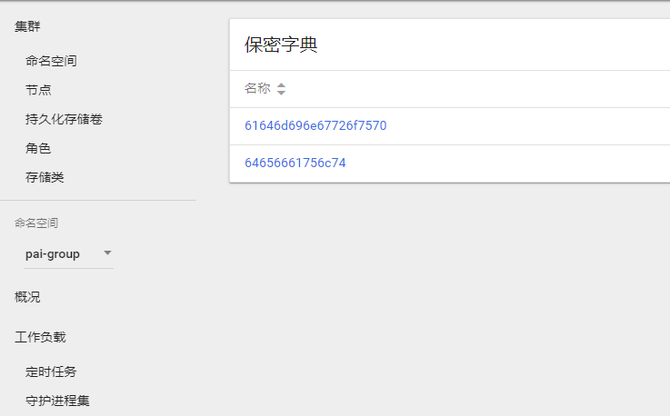
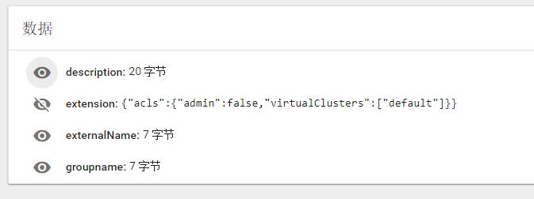
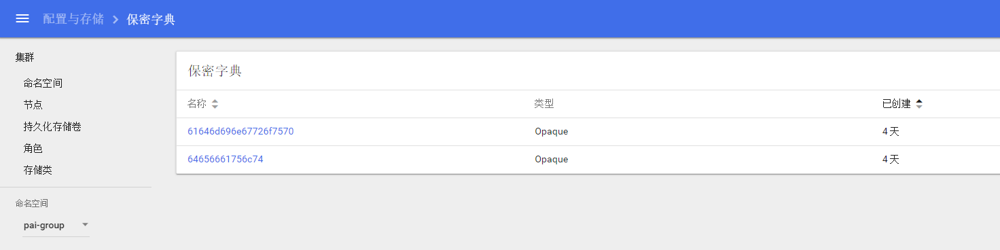

# How to Manage Users and Groups

## Users and Groups in Basic Authentication Mode

OpenPAI is deployed in basic authentication mode by default. Groups in basic authentication mode are bound to virtual clusters (please refer to [how to set up virtual clusters](./how-to-set-up-virtual-clusters.md) to configure virtual clusters). Two groups, `default` and `admingroup` will be created once OpenPAI is deployed. All users belong to `default` group, and have access to the `default` virtual cluster. All administrators belong to `admingroup`, and have access to all virtual clusters. If there is another virtual cluster named `test-vc`, and an administrator grants it to a user, the user will be in group `test-vc` and have access to the corresponding virtual cluster.

For example, if you create an admin user [on the webportal](./basic-management-operations.md#user-management), he will be in `default` and `admingroup`. A non-admin user will be only in `default` group once created. If administrator gives the non-admin user access to `new-vc`, he will be in `default` and `new-vc` group.

A user can see his groups in the profile page. First click `View my profile` in the right-top corner.

   

Then, the groups will be shown on that page (refer to the red box in the following picture):

   


## Users and Groups in AAD Mode

OpenPAI can be configured to use Azure Active Directory (AAD) for user authentication instead of the default basic authentication. In AAD mode, you can sign in to an OpenPAI cluster by using your AAD authentication token.

### How to Set Up AAD

In this section, we will cover how to set up the integration step by step.

#### Note

Previous user data in webportal is required to be mapping/migrate to AAD. Once the integration is enabled, instead of using basic user authentication, OpenPAI will switch to use (and only use) AAD as user authentication mechanism. To set up AAD, please follow the instructions [here](./basic-management-operations.md#how-to-set-up-https) to set up HTTPS access for OpenPAI first.


#### [Rest-server] Configuration AAD

##### 1. Create Azure Active Directory

- Login into the Azure Web portal
- Azure Acive Directory -> App registrations -> New registration

<div  align="center">

</div>

- Set a name for your APP, and then finish the registration

<div  align="center">

</div>

- Find the app registered just now

<div  align="center">

</div>

- Open the app -> Authentication, and then configure the redirect URIs for OpenPAI. The redirect URIs should be ```https://pylon_address/rest-server/api/v1/authn/oidc/return```

<div  align="center">

</div>

- open the app -> Certificates & secrets, and then create a new client secret. Mark the secret value as ```${secret_value}```

<div  align="center">

</div>

<div  align="center">

</div>

<div  align="center">

</div>

- open the app -> API permissions, pls add the permission in the picture following. If the azure active directly is created by yourself and you will manage the group and user info by yourself, you could grant the permission by yourself. Or you should apply the permission through your aad's admin.

<div  align="center">

</div>

- open the app -> quickstart, then get the following value:
    - Application (client) ID, mark it as ```${app_id}```
    - Directory (tenant) ID, mark it as ```${tenant_id}```
    - In the endpoints' view, you will find the OpenID Connect metadata document and mark it as ```${well_known}```

<div  align="center">

</div>

##### Configure authentication part in services-configuration.yaml

Add the following configuration to your `services-configuration.yaml`. 

```yaml
authentication:
  OIDC: true
  OIDC-type: AAD
  AAD:
   wellKnownURL: ${well_known}
   tenantID: ${tenant_id}
   clientID: ${app_id}
   clientSecret: ${secret_value}
   nonceLifetime: null
   nonceMaxAmount: 10
   clockSkew: null

  group-manager:
    group-data-source: ms-graph

    # Admin group name and its user list
    admin-group:
      # The group named showed in OpenPAI system.
      groupname: admingroup
      description: "admin's group"
      # The group alias (groupname) in Azure Active directory
      externalName: "team_alias_a"

    # Group for default vc.
    # For yarn default queue hack.
    default-group:
      # The group named showed in OpenPAI system.
      groupname: default
      description: "group for default vc"
      # The group alias (groupname) in Azure Active directory
      externalName: "team_alias_b"

    # If you cluster you have configured several yarn vc, except default vc (it has been created in the default-group), you should configure group for each vc in the following list
    grouplist:
    # The group named showed in OpenPAI system.
    - groupname: forexample1
      description: forexample1
    # The group alias (groupname) in Azure Active directory
      externalName: "team_alias_c"
    # The group named showed in OpenPAI system.
    - groupname: forexample2
      description: forexample2
    # The group alias (groupname) in Azure Active directory
      externalName: "team_alias_d"
```

##### Clean Previous Data

Please clean all users' data. Because in this mode, user's permission will be managed by azure active directory. The local data is useless.

```bash 
./paictl.py service delete -n rest-server
```

##### After all the steps above, push the configuration, and restart all OpenPAI services.

```bash
./paictl.py service stop
./paictl.py config push -p <config-folder> -m service
./paictl.py service start
```

#### Validation

##### Start Service stage

After start rest-server, please ensure that the following task is successfully executed.

- namespace named ```pai-group``` and ```pai-user-v2```are created

<div  align="center">

</div>

- The group in your configuration is created, in the secret of ```pai-group``` namespace.

<div  align="center">

</div>

- Every group have an `acls` in extension field.

<div  align="center">


</div>

- Please Login through OpenPAI's webportal, then please check whether your user's data is created in the secret of ```pai-user-v2``` namespace.

<div  align="center">

</div>

- please check the created user data. There should be an empty extension and a non-empty grouplist.

<div  align="center">

</div>

- please submit a test job in default vc, and then submit the same job to another vc.

- please check whether admin user can access to the administration tab.

<div  align="center">

</div>

- please create a vc, then check whether a corresponding group is created.

<div  align="center">

</div>

<div  align="center">

</div>

- After creating the new vc, please check whether the new vc is available for admin at home page.

<div  align="center">

</div>

- Delete the test vc, then please check whether the corresponding group is deleted.

<div  align="center">

</div>

- After deleting the vc, please check whether the group is removed from `pai-group` secrets.

<div  align="center">

</div>

##### If test failed

Please try to delete the rest-server, and then try to start it again. If fail again, please provide detail information and create issue ticket in github.
