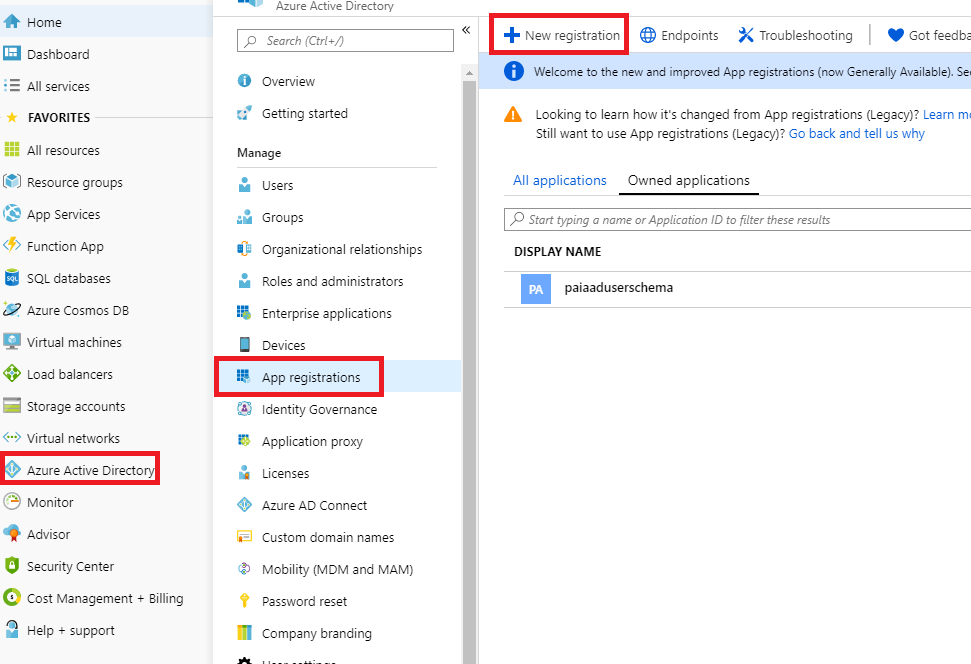

# How to Manage Users and Groups

OpenPAI supports 2 authentication modes to manager users and groups: 

- Basic Authentication Mode
- AAD mode

## Basic Authentication Mode

OpenPAI is deployed in basic authentication mode by default.
Groups in basic authentication mode are bounded to virtual clusters (please refer to [how to set up virtual clusters](./how-to-set-up-virtual-clusters.md) to configure virtual clusters).
Two groups, `default` and `admingroup` will be created once OpenPAI is deployed. All users belong to `default` group and have access to the `default` virtual cluster. All administrators belong to `admingroup`, and have access to all virtual clusters. If there is another virtual cluster named `test-vc`, and an administrator grants it to a user, the user will be in group `test-vc` and have access to the corresponding virtual cluster.

For example, if you create an admin user [on the webportal](./basic-management-operations.md#user-management), he will be in `default` and `admingroup`. A non-admin user will be only in `default` group once created. If administrator gives the non-admin user access to `new-vc`, he will be in `default` and `new-vc` group.

A user can see his groups on the profile page. First click `View my profile` in the right-top corner.

   

Then, the groups will be shown on that page (refer to the red box in the following picture):

   


For user management, please go to Administration -> User Management.

## AAD Mode

[Azure Active Directory (AAD)](https://docs.microsoft.com/en-us/azure/active-directory/fundamentals/active-directory-whatis) is Microsoft’s cloud-based identity and access management service.
OpenPAI can be configured to use AAD for user authentication.
In AAD mode, you can sign in to an OpenPAI cluster by using your AAD authentication token.

In this section, we will cover how to set up the integration step by step.

### Preparation

- Previous user data in webportal is required to be mapping/migrate to AAD. Once the integration is enabled, instead of using basic user authentication, OpenPAI will switch to use (and only use) AAD as the user authentication mechanism. 
- To set up AAD, please follow the instructions [here](./basic-management-operations.md#how-to-set-up-https) to set up HTTPS access for OpenPAI first.

### Configuration AAD

- Login into the [Azure Web portal](https://ms.portal.azure.com/), select Azure Acive Directory -> App registrations -> New registration
  <div align="center">
  
  </div>
- Set a name for your APP, and then finish the registration
  <div align="center">
  
  </div>
- Find the app registered just now and open it
  <div align="center">
  
  </div>
- Authentication: configure the redirect URIs for OpenPAI. The redirect URIs should be `https:/pylon_address/rest-server/api/v1/authn/oidc/return`
<div align="center">

</div>
- Certificates & secrets: create a new client secret. Mark the secret value as `${secret_value`. 
**Copy the new client secret value. You won't be able to retrieve it after you perform anotheroperation or leave this blade.** 
  <div align="center">
  
  </div>
  <div align="center">
  
  </div>
  <div align="center">
  
  </div>
- API permissions: add the permission as shown in the picture following.
If the Azure active directory is created by yourself and you will manage the group and userinfo by yourself, you could grant the permission by yourself. Or you should apply the permission through your AAD's admin.
  <div align="center">
  
  </div>
  - Quickstart: get the following value:
      - Application (client) ID, mark it as `${app_id}`
      - Directory (tenant) ID, mark it as `${tenant_id}`
      - In the endpoints' view, you will find the OpenID Connect metadata document and mark it as   `${well_known}`
  <div align="center">
  
  </div>

### Configure Services

Add the following configuration to your `services-configuration.yaml`. 

```yaml
authentication:
  OIDC: true
  OIDC-type: AAD
  AAD:
   wellKnownURL: ${well_known}
   tenantID: ${tenant_id}
   clientID: ${app_id}
   clientSecret: ${secret_value}
   nonceLifetime: null
   nonceMaxAmount: 10
   clockSkew: null

  group-manager:
    group-data-source: ms-graph

    # Admin group name and its user list
    admin-group:
      # The group name showed in the OpenPAI system.
      groupname: admingroup
      description: "admin's group"
      # The group alias (groupname) in Azure Active directory
      externalName: "team_alias_a"

    # Group for default vc.
    default-group:
      groupname: default
      description: "group for default vc"
      externalName: "team_alias_b"
    # If you cluster you have configured several other VCs, except default VC (it has been created in the default-group), you should configure group for each VC in the following list
    grouplist:
    - groupname: forexample1
      description: forexample1
      externalName: "team_alias_c"
    - groupname: forexample2
      description: forexample2
      externalName: "team_alias_d"
```

### Clean Previous Data

Please clean all users' data. Because in this mode, the user's permission will be managed by the Azure active directory. The local data is useless.

```bash 
./paictl.py service delete -n rest-server
```

### Restart All OpenPAI Services

After all the steps above, push the configuration and restart all OpenPAI services:

```bash
./paictl.py service stop
./paictl.py config push -p <config-folder> -m service
./paictl.py service start
```

### Validation

After starting the rest-server, please ensure that the following tasks are successfully executed.

- The namespaces named `pai-group` and `pai-user-v2`are created
  <div align="center">
  
  </div>

- The group in your configuration is created, in the secret of `pai-group` namespace.
  <div align="center">
  
  </div>

- Every group has an `acls` in the extension field.
  <div align="center">
  
  
  </div>

- Please login through OpenPAI's webportal, then please check whether your user's data is created in the secret of `pai-user-v2` namespace.
  <div align="center">
  
  </div>

- Check the created user data. There should be an empty extension and a non-empty group list.
  <div align="center">
  
  </div>

- Submit a test job in default VC, and then submit the same job to another VC.

- The admin users can access the administration tab.
  <div align="center">
  
  </div>

- Create a new VC, a corresponding group should be created.
  <div align="center">
  
  </div>

  <div align="center">
  
  </div>

- The new VC created should be available for the admin on the home page.
  <div align="center">
  
  </div>

- Delete the test VC, the corresponding group should be deleted.
  <div align="center">
  
  </div>

- After deleting the VC, the corresponding group should be removed from `pai-group` secrets.
  <div align="center">
  
  </div>

### Troubleshooting

If the test failed, please delete the rest-server, and then start it again.
If it fails again, please provide detailed information and [create an issue in Github](https://github.com/microsoft/pai/issues/new/choose).
