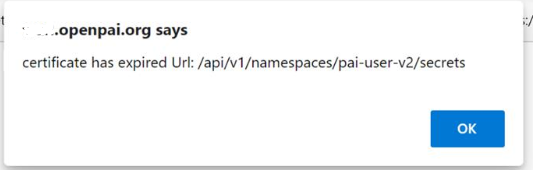

# How to renew kubernetes certs

The k8s API server's cert will expire every year, and will cause OpenPAI cluster not available.
For more details, please refer to [Certificate Management with kubeadm](https://kubernetes.io/docs/tasks/administer-cluster/kubeadm/kubeadm-certs/).

## The alert from cert expiration checker

If the admin setup the [cert expiration checker](./how-to-use-alert-system.md#Cluster-k8s-cert-expiration-checker) in alert manager, the admin email receiver will got the alert email before the cert expired.
If the cert already expired, the user will got the error in web portal:


## Generate the new certificates and tokens

### Generate the new certs on master node

On the master node use the following commands generate the new certificates:

```bash
# On master - See https://kubernetes.io/docs/setup/certificates/#all-certificates
sudo kubeadm alpha certs renew apiserver
sudo kubeadm alpha certs renew apiserver-etcd-client
sudo kubeadm alpha certs renew apiserver-kubelet-client
sudo kubeadm alpha certs renew front-proxy-client
```

### Generate new kube-configs with embedded certificates

On the master node use the following commands generate the new kube-configs:

```bash
sudo kubeadm alpha kubeconfig user --org system:masters --client-name kubernetes-admin  > admin.conf
sudo kubeadm alpha kubeconfig user --client-name system:kube-controller-manager > controller-manager.conf
sudo kubeadm alpha kubeconfig user --org system:nodes --client-name system:node:$(hostname) > kubelet.conf
sudo kubeadm alpha kubeconfig user --client-name system:kube-scheduler > scheduler.conf

# chown and chmod so they match existing files
sudo chown root:root {admin,controller-manager,kubelet,scheduler}.conf
sudo chmod 600 {admin,controller-manager,kubelet,scheduler}.conf

# Move to replace existing kubeconfigs
sudo mv admin.conf /etc/kubernetes/
sudo mv controller-manager.conf /etc/kubernetes/
sudo mv kubelet.conf /etc/kubernetes/
sudo mv scheduler.conf /etc/kubernetes/

# Restart the master components
sudo kill -s SIGHUP $(pidof kube-apiserver)
sudo kill -s SIGHUP $(pidof kube-controller-manager)
sudo kill -s SIGHUP $(pidof kube-scheduler)

# Verify master component certificates - should all be 1 year in the future
# Cert from api-server
echo -n | openssl s_client -connect localhost:6443 2>&1 | sed -ne '/-BEGIN CERTIFICATE-/,/-END CERTIFICATE-/p' | openssl x509 -text -noout | grep Not
# Cert from controller manager
echo -n | openssl s_client -connect localhost:10257 2>&1 | sed -ne '/-BEGIN CERTIFICATE-/,/-END CERTIFICATE-/p' | openssl x509 -text -noout | grep Not
# Cert from scheduler
echo -n | openssl s_client -connect localhost:10259 2>&1 | sed -ne '/-BEGIN CERTIFICATE-/,/-END CERTIFICATE-/p' | openssl x509 -text -noout | grep Not
```

### Generate new kubelet certicates

On the master node use the following commands generate the new kubelet.conf file:

```bash
sudo kubeadm alpha kubeconfig user --org system:nodes --client-name system:node:$(hostname) > kubelet.conf
sudo chown root:root kubelet.conf
sudo chmod 600 kubelet.conf

# Stop kubelet
sudo systemctl stop kubelet
# Delete files
sudo rm /var/lib/kubelet/pki/*
# Copy file
sudo mv kubelet.conf /etc/kubernetes/
# Restart
sudo systemctl start kubelet
# Uncordon
kubectl uncordon $(hostname)

# Check kubelet
echo -n | openssl s_client -connect localhost:10250 2>&1 | sed -ne '/-BEGIN CERTIFICATE-/,/-END CERTIFICATE-/p' | openssl x509 -text -noout | grep Not
```

### Generate a new token for the worker node kubelets

On the master node use the following commands generate the new token:

```bash
sudo kubeadm token create
```

### Update certs in worker nodes

Use a playbook to do update the certs in batch. Create a file named `renew-worker-certs.yaml` and replace `<The generated token in above step>`:

```yaml
---
- hosts: all
  tasks:
    - name: join k8s
      shell: |
        systemctl stop kubelet
        rm /etc/kubernetes/kubelet.conf
        rm /var/lib/kubelet/pki/*
        sed -i "s/token: .*/token: <The generated token in above step>/" /etc/kubernetes/bootstrap-kubelet.conf
        systemctl start kubelet
```

If you don't have the `hosts.yml` file, please run the commands in OpenPAI source code to generate one:

```bash
contrib/kubespray/script/k8s_generator.py -l layout.yaml -c config.yaml -o <output_folder>
```

And run the following commands:

```bash
ansible-playbook -i hosts.yml --limit '!master-node' --become --become-user root renew-worker-cert.yaml
```

### Remove token after all workers have been updated

The token will expire in 24h if we don't do this step.

```bash
sudo kubeadm token delete TOKEN-FROM-CREATION-ON-MASTER
```
