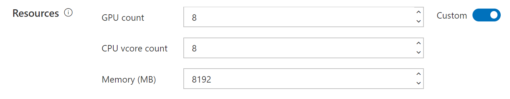

# How to use CPU Nodes

## How to Add CPU Nodes and Set Up CPU-only VC

In current release, support for CPU nodes is limited. The [installation guide](./installation-guide.md) won't work if you only have CPU worker nodes. However, after you set up the cluster with GPU worker nodes, you can add CPU worker nodes and CPU-only virtual cluster. This section is a detailed guide.

Please follow [How to Add and Remove Nodes](./how-to-add-and-remove-nodes.md) to add your CPU node.

## Submit CPU-only Jobs

If you want to submit a CPU-only job, please submit it directly to the CPU-only VC. A special requirement is that, you should use exactly the same GPU number as the CPU number you want. For example, if you want to use 8 CPUs, you should set 8 GPUs and 8 CPUs as follows:

This requirement may be fixed in the future.