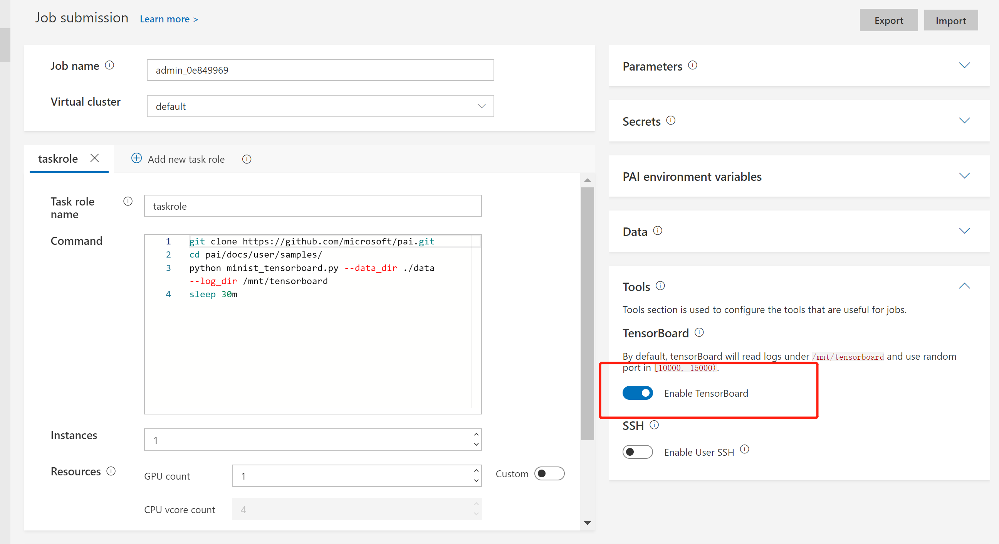

# How to Debug Jobs

This document describes how to use SSH and TensorBoard plugin to debug jobs. 

**Note:** These two plugins only work when the IP address is accessible from the customer environment (not cluster internal IP). So if PAI is deployed in some cloud environment such as Azure, these two plugins will not work.

## How to use SSH

OpenPAI provides an SSH plugin for you to connect to job containers.
With SSH keys, you can connect to job containers as root user.
To use SSH, you can either use your pre-saved keys for all the jobs or create an SSH key pair for a specific job.

- Check existing SSH keys on the user profile page, you can add public keys in the `SSH Public Keys` section.
The SSH keys saved here can be reused in all the jobs, so we recommend you to save your frequently-used SSH keys here to avoid generating keys and copy-pasting keys for different jobs ;
- When submitting jobs, open the `Tools` panel on the right and click `Enable User SSH`;
- If you have no pre-saved SSH public keys or you want to use a new SSH key pair for this job, click `Generator`, a pair of SSH keys will be generated.
Please download the SSH private key, then click the `Use Public Key` button to use this key pair in this job. You can also generate the SSH key pair by yourself and paste the public key here.
- You will be able to connect to the job containers with **all the SSH private keys which correspond to the public keys you have saved on the user profile page** and also **the private key you have generated for the job**.
- To check connecting information, click the `View SSH Info` button, 

   

   you will get the corresponding commands:
   ```bash
   1. Use your default SSH private key:

   ssh -p <ssh-port> root@<container-ip>

   2. Use a pre-downloaded SSH private key:

   On Windows:
   ssh -p <ssh-port> -i <your-private-key-file-path> root@<container-ip>

   On Unix-like System:
   chmod 400 <your-private-key-file-path> && ssh -p <ssh-port> -i <your-private-key-file-path> root@<container-ip>
   ```

## How to use TensorBoard Plugin

[TensorBoard](https://www.tensorflow.org/guide/summaries_and_tensorboard) is a suite of web applications for inspecting and understanding your TensorFlow runs and graphs.

Here we leverage an example to show you how to use TensorBoard in OpenPAI. First, open the job submission page, input the following commands in the `Command` box:

```bash
git clone https://github.com/microsoft/pai.git
cd pai
git reset --hard dd08930431d05ed490cf7ceeecd262e473c187cd
cd docs/user/samples/
python minist_tensorboard.py --data_dir ./data --log_dir /mnt/tensorboard
sleep 30m
```

Then, please select `TensorFlow 1.15.0 + Python 3.6 with GPU, CUDA 10.0` as your docker image. Last but not least, toggle the `Enable TensorBoard` button in the `Tools` section.

   

After submission, you will see a `Go to TensorBoard Page` button on the job detail page.

   

The button will bring you to the TensorBoard page. You might wait for a few minutes until the log is ready:

   

Generally speaking, to use the TensorBoard plugin, you should:

  1. Save your TensorFlow summary logs to `/mnt/tensorboard`.
  2. Make sure `tensorboard` is installed in the docker image you use.
  3. Use the `sleep` command to extend the job lifetime, if you want TensorBoard available after the job completes. 
