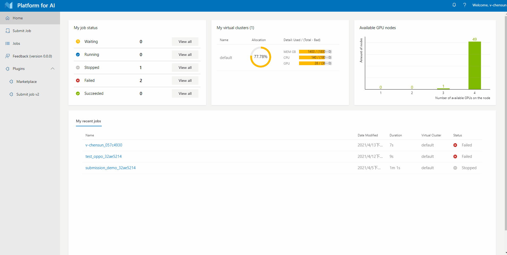
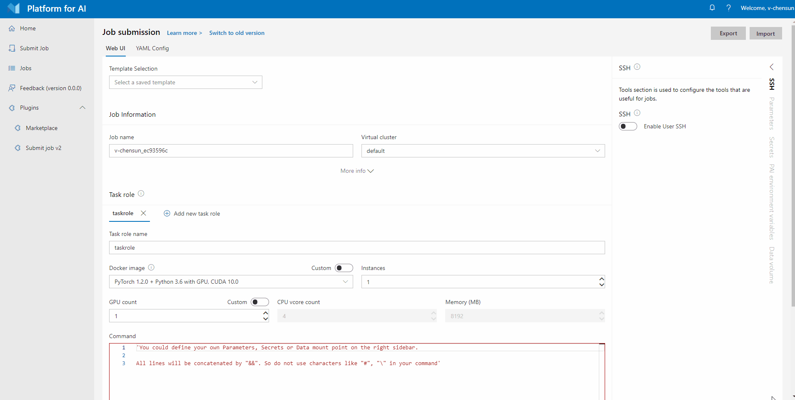
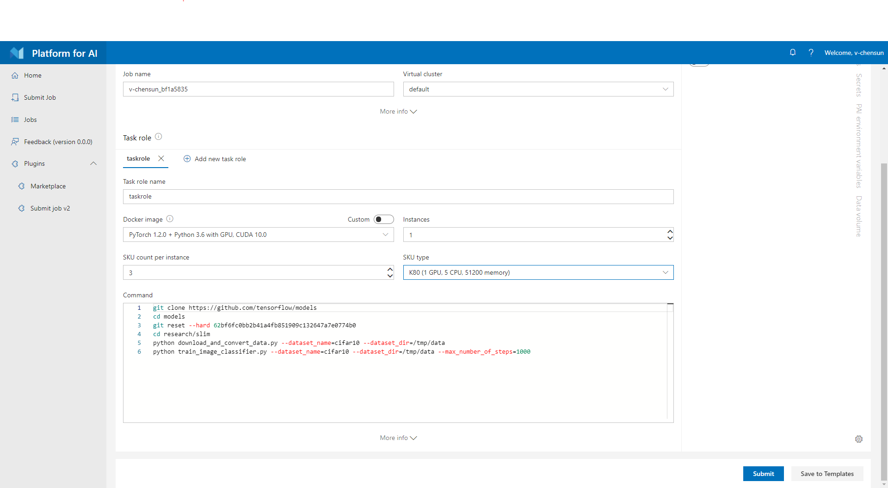
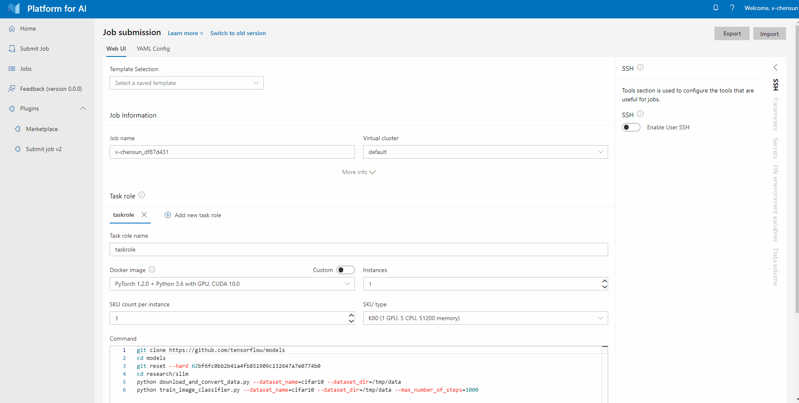
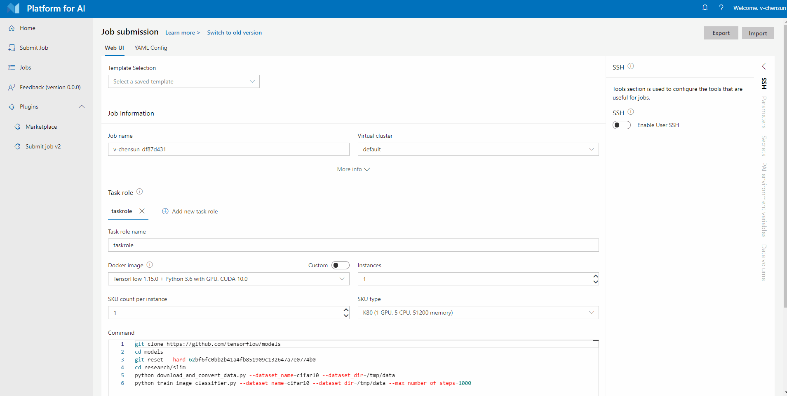
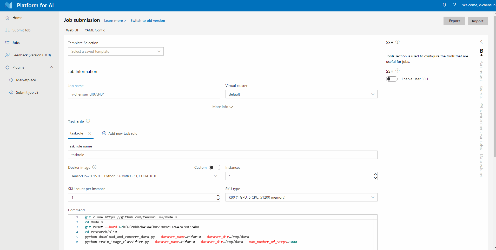
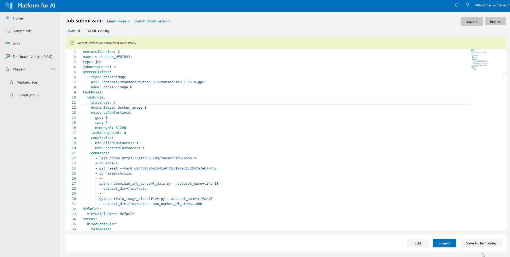

# How To Use New Submission page

## Submit the Hello World Job Step by Step

Instead of submitting the job in the old version, you can now switch to the new version to submit the hello world job. The following is a step-by-step guide:

**Step 1.** Login to OpenPAI webportal.

**Step 2.** Click **Submit Job** on the left pane, then click `Single` or `Distributed` to reach the old version page. Then click `Switch to new version` to reach the new version page.



**Step 3** Select your virtual cluster, and give a name for your job. Then copy the following commands into the command box.

```bash
git clone https://github.com/tensorflow/models
cd models
git reset --hard 62bf6fc0bb2b41a4fb851909c132647a7e0774b0
cd research/slim
python download_and_convert_data.py --dataset_name=cifar10 --dataset_dir=/tmp/data
python train_image_classifier.py --dataset_name=cifar10 --dataset_dir=/tmp/data --max_number_of_steps=1000
```


**Step 4** Specify the resources you need. If you use the default scheduler, OpenPAI allows you to quantify the three resources of GPU, CPU, and memory. When `custom` is selected, the three resources will be configured independently. If you use the hived scheduler, OpenPAI uses **resource SKU** to quantify the resource in one instance. For example, here 1 `DT` SKU means 1 GPU, 5 CPUs, and 53914 MB memory. If you specify one `DT` SKU, you will get a container with 1 GPU, 5 CPUs, and 53914 MB memory. If you specify two `DT` SKUs, you will get a container with 2 GPUs, 10 CPUs, and 107828 MB memory.





**Step 5.** Specify the Docker image. You can either use the listed docker images or take advantage of your own. Here we select `TensorFlow 1.15.0 + Python 3.6 with GPU, CUDA 10.0`, which is a pre-built image. We will introduce more about docker images in [Docker Images and Job Examples](./docker-images-and-job-examples.md).



**Step 6.** If you need to configure some additional properties, you can click `More info` to expand the additional properties configuration.



**Step 7.** Click **Submit** to submit the job.

## Submit the Hello World job in yaml editor

In the new version, you can switch between `Web UI` and `YAML Config` pages to achieve real-time synchronization.

**Step 1.** Click the `YAML Config` to reach the yaml editor page.



**Step 2.** In default case, the editor is in the read-only state. Then click the `Edit` to change into the write mode.

**Step 3.** If no error message in yaml content, click `save` to save it. Otherwise, it will prompt a warning `Error when saving the yaml page`



**Step 4.** Click **Submit** to submit the job.

## Compare the new version with the old version

**1.** The new version replaces `Advanced` with `More info` and places it under each section, which improves the user experience.

**2.** The new version places non-subject information in the sidebar, and can shrink the sidebar, greatly improving the visual range of the subject area.

**3.** The new version separates the yaml editor into a single page, which not only optimizes the user switching experience, but also facilitates the writing experience of users who mainly write yaml files.

**4.** The new version greatly improves the responsive design to optimize the experience of small and medium screens.

**5.** Tensorboard is not currently configured in the new version. If you need to use it, please use the old version.