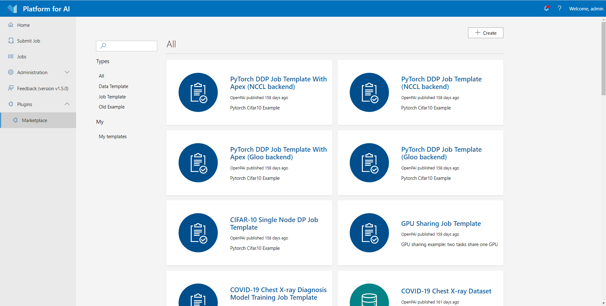
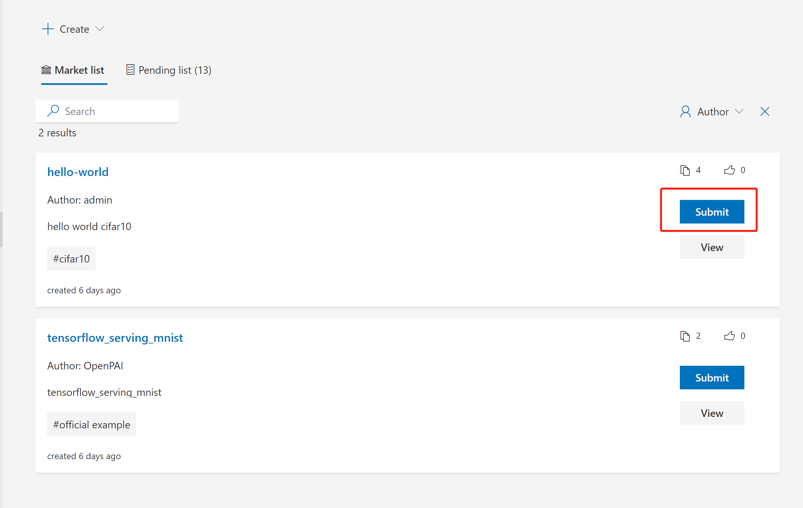
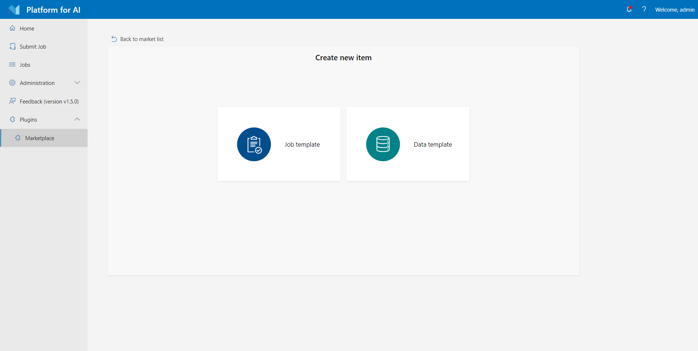

# Use Marketplace

1. [Quick Start](./quick-start.md)
2. [Docker Images and Job Examples](./docker-images-and-job-examples.md)
3. [How to Manage Data](./how-to-manage-data.md)
4. [How to Debug Jobs](./how-to-debug-jobs.md)
5. [Advanced Jobs](./advanced-jobs.md)
6. [Use Marketplace](./use-marketplace.md) (this document)
    - [Entrance](#entrance)
    - [Use Templates on Marketplace](#use-templates-on-marketplace)
    - [Create your Own Templates](#create-your-own-templates)
7. [Use VSCode Extension](./use-vscode-extension.md)
8. [Use Jupyter Notebook Extension](./use-jupyter-notebook-extension.md)

[OpenPAI Marketplace](https://github.com/microsoft/openpaimarketplace) can store job examples and templates. You can use marketplace to run-and-learn others' sharing jobs or share your own jobs.

## Entrance

If your administrator enables marketplace plugin, you will find a link in the `Plugin` section on webportal, like:

> If you are pai admin, you could check [deployment doc](https://github.com/microsoft/openpaimarketplace/blob/master/docs/deployment.md) to see how to deploy and enable marketplace plugin.

## Use Templates on Marketplace

The marketplace plugin has some official templates in market list by default, to use the templates on marketplace, you can click `Submit` directly, and it will bring you to the job submission page. Or you could click view button to view the information about this template.

## Create your Own Templates

To create a marketplace template, click the `Create` button on the page. As shown in the following picture, you could create the template from scratch with a config yaml file. You should fill in some necessary info like `name`, `introduction` and `description` etc. Another approach is creating from your existing job in pai platform. You can only create marketplace template from one `Succeeded` job. After creating, your templates will be awaiting for review by platform admin before you could see them in market list.

