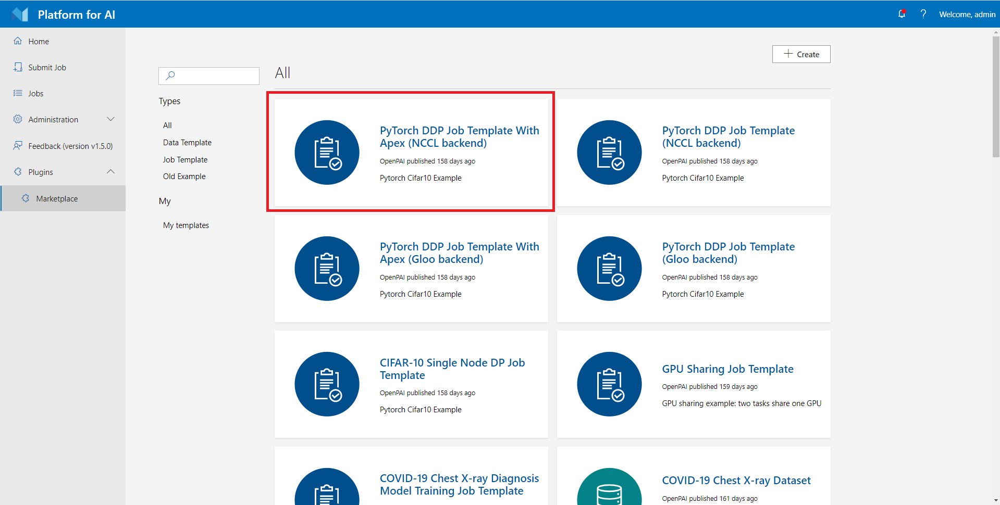
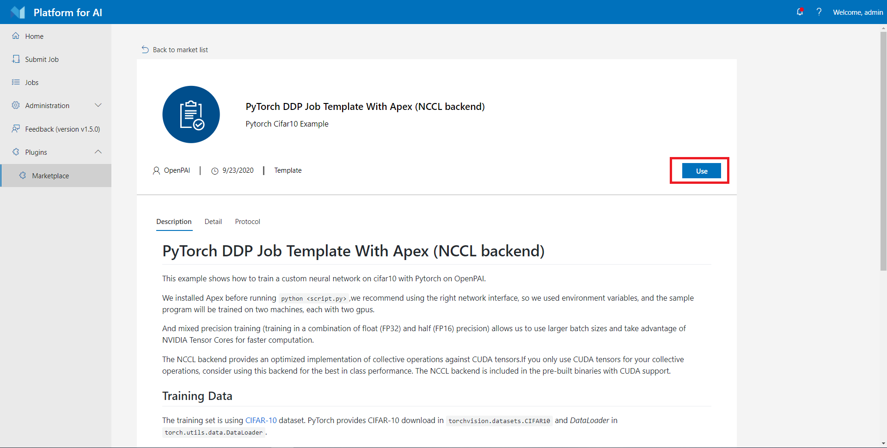

# Use Marketplace

[OpenPAI Marketplace](https://github.com/microsoft/openpaimarketplace) can store job examples and templates. You can use Marketplace to run-and-learn others' sharing jobs or share your jobs.

## Entrance

If your administrator enables marketplace plugin, you will find a link in the `Plugin` section on the webportal, like:

> If you are PAI admin, you could check [deployment doc](https://github.com/microsoft/openpaimarketplace/blob/master/docs/deployment.md) to see how to deploy and enable marketplace plugin.

## Use Templates on Marketplace

The marketplace plugin has some official templates in the market list by default, to use the templates on Marketplace, you could click the template item in the list to view the information about this template, you can click `use` button, and it will bring you to the job submission page.

## Create your Templates

To create a marketplace template, click the `Create` button on the page. As shown in the following picture, you can create Job Template and Data Template.

