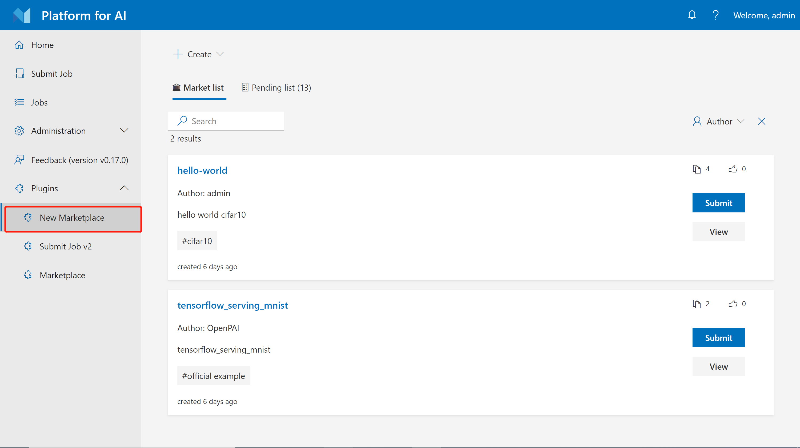

# 使用Marketplace

[OpenPAI Marketplace](https://github.com/microsoft/openpaimarketplace) 可以存储工作示例和模板。 您可以使用`Marketplace`来运行和学习其他人的共享工作或共享自己的工作。
## 入口

如果您的管理员启用了`Marketplace`插件，您将在Webportal的`Plugin`部分中找到一个链接，例如：

> 如果您是Pai管理员，则可以查看 [部署文件](https://github.com/microsoft/openpaimarketplace/blob/master/docs/deployment.md) 了解如何部署和启用`Marketplace`插件。

## 在Marketplace中使用模板

`Marketplace`插件默认情况下在`Marketplace`列表中有一些官方模板，要使用`Marketplace`上的模板，您可以直接单击`Submit` ，它将带您到工作提交页面。 或者，您可以单击查看按钮以查看有关此模板的信息。

## 创建模板

要创建`Marketplace`模板，请单击页面上的`Create`按钮。如下图所示，您可以使用`config yaml`文件从头开始创建模板。您应该填写一些必要的信息，例如`name`, `introduction` 和`description`等。另一种方法是从pai平台中的现有工作中创建。您只能从一项`Succeeded`的工作中创建市场模板。创建后，您的模板将等待平台管理员进行审核，然后您才能在`Marketplace`列表中看到它们。

