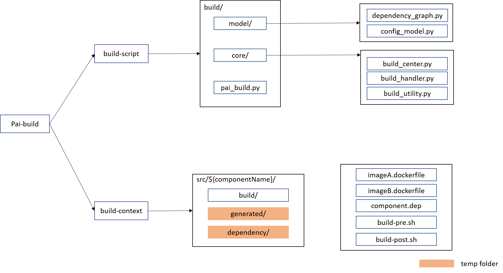
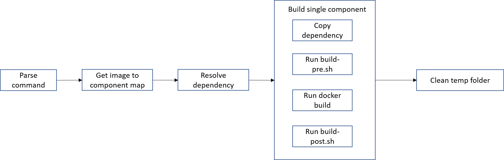

# Goal

Pai-build responsible for building all services and pushing images.

# Architecture

We have two parts of Pai-build: `build script` and `build context`.

- **build script:** responsible for build logic implementation all scripts are put under `build/`. It consists `pai_build.py`, `core` and `model`.
    - **pai_build.py**: entrance of build system.
    - **core**: all build logic implementation scripts are put under `build/core/` folder. ``build_center.py`` contains main execution process. ``build_handler.py`` is used to define single component build process. ``build_utility.py`` contains the utility methods like docker client.
    - **model**: ``dependency_graph.py`` and ``config_model.py`` are put under `build/model/` folder. ``dependency_graph.py`` defines **ServiceNode** and **ServiceGraph** to help construct component dependency graph. ``config_model.py`` defines build configuration model.
- **build context:** All components’ **source code**, **build context** and **deployment related code** will be put under ``src`` folder.
    - Each component's build context will bu put under ``src/${componentName}/build`` folder. Component owner should put corresponding ``dockerfiles`` here, and define its dependency in ``components.dep``. if component needs define customize actions before or after image build, he can prepare ``build-pre.sh`` and ``build-post.sh`` file.
        - **dockerfiles**: All public dockerfiles current component provides. Pai-build will execute *docker build* with all files which extension is **.dockerfile** and the image name will be same as filename.
        - **components.dep**: Dependency list to determine components build sequence. Dependency wrote in ``components.dep`` should just be component name and make sure it can be found under src folder. Pai-build will copy the item’s whole folder to ``src/${componentName}/dependency/``.
        - **build-pre.sh**: Define customize action before build.  If component needs to do preparation before image build, component owner can implement in ``build-pre.sh`` file.
        - **build-post.sh**: Define customize action after build. By default, we only build docker image, but for some service it may need to expose more than image. Component owner can implement in ``build-post.sh`` file.
    - **generated** and **dependency** folder are temp folder put under ``src/${componenName}/``, it will be cleaned automatically after each build round.
        - **generated/**: Temp folder to store all the generated things after build. If component needs to expose more than image, the owner should put all the exposed things under ``src/${componenName}/generated``.
        - **dependency/**: Temp folder to store all dependency the component needs. Pai-build will copy all dependencies component to ``src/${componenName}/dependency``.


# Build

Build image by using ```pai_build.py``` which put under ``build/``. for the configuration please refers to [`how-to-write-pai-configuration.`](../pai-management/doc/how-to-write-pai-configuration.md)
### Build infrastructure services <a name="Service_Build"></a>

```
python pai_build.py build -c /path/to/configuration-dir/ [ -s component-list ]
```

- Build the corresponding component.
- If the option `-n` is added, only the specified component will be built. By default will build all components under ``src/``

### Push infrastructure image(s) <a name="Image_Push"></a>

```
python pai_build.py push -c /path/to/configuration-dir/ [ -i image-list ]
```

- tag and push image to the docker registry which is configured in the ```cluster-configuration```.
- If the option `-i` is added, only the specified image will be pushed. By default will push all images which ``.dockerfile`` can be found under ``{src/${componentName}/build/``

# Current pai build process



- Parse command to figure out component lists which need to build.
- Flatten all components folder, then get image to component map.
- Resolve component dependency according to ``components.de`` and Dockerfile ``FROM`` statement to construct dependency graph then get topological build sequence.
- Build each single component accoding to toplogical sequence :
    - Copy dependencies into temp ``src/${componentName}/dependency``.
    - Run build-pre.sh if it exists.
    - Check whether ``*.dockerfile`` exists if so call “docker build” command to build docker image.
    - Run build-post.sh if it exists.
-  Clean all temp folders.

# Pay attention

- ``pai_build.py`` will be executed under pai root folder.
- ``*.dockerfile`` which put under ``src/${componentName}/build`` means it can become public, component owners should obey the principle.
- dockerfile build will be executed under ``src/${componentName}/``, please pay attention when writing dockerfile.
- All the dependencies will be copied to ``src/${componentName}/dependency/``, please pay attention when writing dockerfile.
- Dependency wrote in ```components.dep``` should just be component name and make sure it can be found under src folder.
- For the dependency wrote in components.dep, the dependency’s whole folder will be copied into current component dependency folder.


# How to add your own component build context

This chapter will teach you how to add your customized component to pai. After everything is done, pai_build will build component and push image to the target docker registry.

Assuming you want to add componentB which only depends on componentA, and its image build needs files from ``/test-build/``.

If your component image could be pulled from a public docker registry, you could skip this step.

#### Prepare compoenent folder ####

Create componentB folder under ``src``, then create ``build`` folder to store build context.

#### Prepare compoenent dockerfile ####

There is no special restrictions on how to write the dockerfile. If you a new developer of docker, please refer to [this tutorial](https://docs.docker.com/develop/develop-images/dockerfile_best-practices/) and learn how to dockerfile. The file should be named with *componentB.dockerfile*

```

FROM ubuntu:16.04

COPY dependency/componentA/ /usr/local/
COPY dependency/test-build/ /usr/local/
RUN chmod a+x /usr/local/test-build/start.sh

CMD ["/usr/local/test-build/start.sh"]

```

#### Prepare compoenent.dep ####

Create a component.dep file under ``src/componentB/build`` to define the dependency of other component.

```
componentA
```
#### Prepare build-pre.sh ####

Implement build-pre.sh to copy test-build.sh to ``src/componentB/dependency``.

```bash
#!/bin/bash

pushd $(dirname "$0") > /dev/null

testPath="/test-build/"

testDestDir="../dependency/"

if [[ ! -d ${testDestDir} ]]; then
    mkdir ${testDestDir}
fi

cp -arf ${testPath} ${testDestDir}

popd > /dev/null

```

#### Build and push image with paictl ####

```
./pai_build.py build -c /path/to/configuration-dir/ -s componentB

./pai_build.py push -c /path/to/configuration-dir/ -i componentB

```

# TO-DO

- Incremental build implementation.