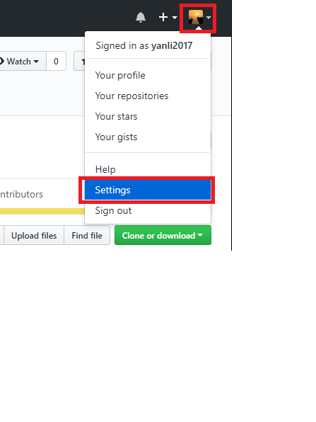
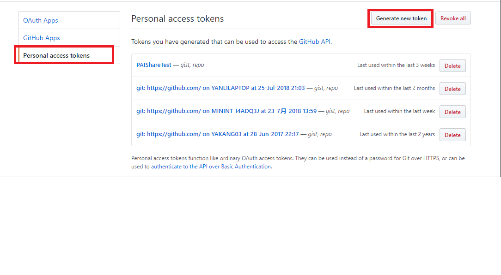
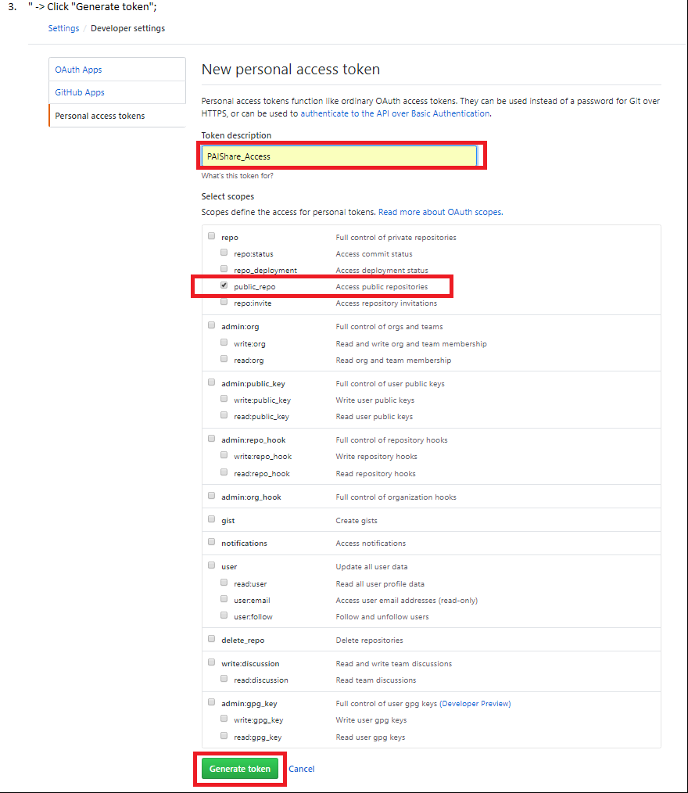
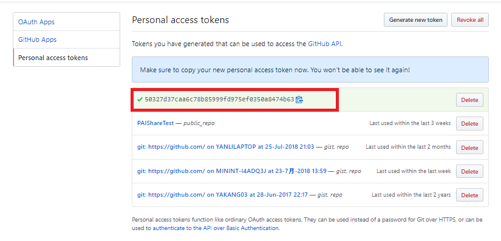
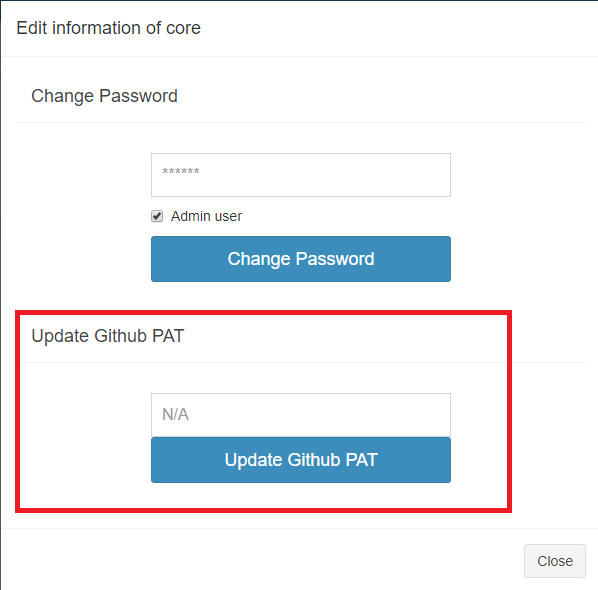

## How to Config GitHub PAT
1. Login your account at [GitHub](https://github.com/) -> Click portrait at uppper right -> Click "Settings";

    
2. Click "Developer settings"  -> Click "Personal access tokens" -> Click "Generate new token";

    
3. Input "Token description" -> Select scopes at least with "repo/public_repo" -> Click "Generate token";

    
4. Copy the new generated token;

    
5. Store GitHub PAT on PAI. Login PAI as admin -> Click "Administration" -> "User Management" -> "Edit" one user -> Paste token into Github PAT field -> Click "Update Github PAT" button;

    