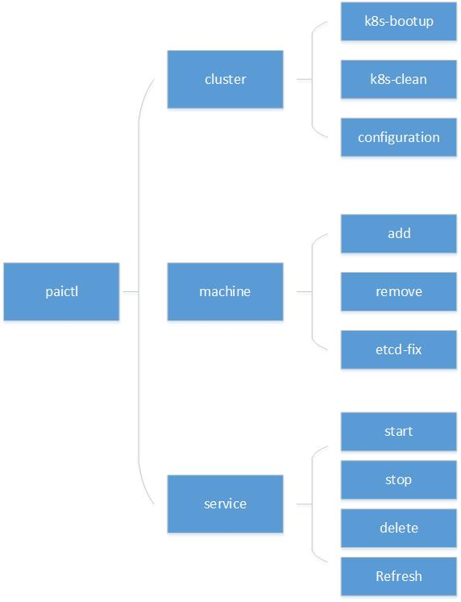

# paictl design


## Overview

<div  align="center">

</div>


## paictl cluster

- Besides generation the cluster-configuration from the machine-list, the main responsibilities are boot and clean kubernetes-cluster.

- k8s-bootup:
    - According to the different role of the node in kubernetes-cluster, paictl will prepare different package for remote working. The package content of different role is defined in the [deploy.yaml](../../deployment/k8sPaiLibrary/maintainconf/deploy.yaml)
    - paictl will send the package to each machine through paramiko, and execute corresponding script on the remote machine.
    - After the k8s cluster is bootup, paictl will install kubectl for you to manage the cluster.

<div  align="center">

</div>


- k8s-clean:
    - The same process as k8s-bootup.


## paictl config

- paictl config command is designed for cluster configuration management.
- With ```paictl config```, you could push the latest configuration from git or local to k8s-configmap.
- With ```paictl config```, you could get the cluster configuration from k8s-configmap
- With ```paictl config```, you could set the external storage type. And based on it, paictl could sync the latest data from the right place.  


## paictl machine

- paictl machine command is designed for daily maintenance, such as add and remove machine.
- Just like k8s-bootup, paictl machine will prepare package and send them to the remote machine through paramiko, then execute them.


## paictl service

- paictl will iterate all folder in the path ```pai/src```. If it contains the file ```service.yaml``` and corresponding operation script, paictl will call the script to handle the operator.


<div  align="center">

</div>


- paictl will solve the start order of the services according to the configuration in the service.yaml
