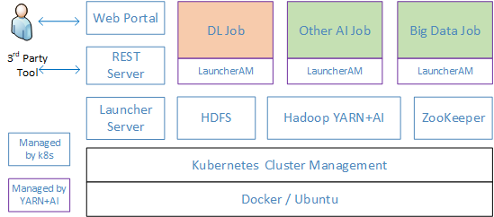

## System Architecture Before v0.15

The system architecture is illustrated above.
User submits jobs or monitors cluster status through the [Web Portal](webportal/README.md),
which calls APIs provided by the [REST server](rest-server/README.md).
Third party tools can also call REST server directly for job management.
Upon receiving API calls, the REST server coordinates with [FrameworkLauncher](frameworklauncher/README.md) (short for Launcher)
to perform job management.
The Launcher Server handles requests from the REST Server and submits jobs to Hadoop YARN.
The job, scheduled by YARN with [GPU enhancement](https://issues.apache.org/jira/browse/YARN-7481),
can leverage GPUs in the cluster for deep learning computation. Other type of CPU based AI workloads or traditional big data job
can also run in the platform, coexisted with those GPU-based jobs.
The platform leverages HDFS to store data. All jobs are assumed to support HDFS.
All the static services (blue-lined box) are managed by Kubernetes, while jobs (purple-lined box) are managed by Hadoop YARN.
