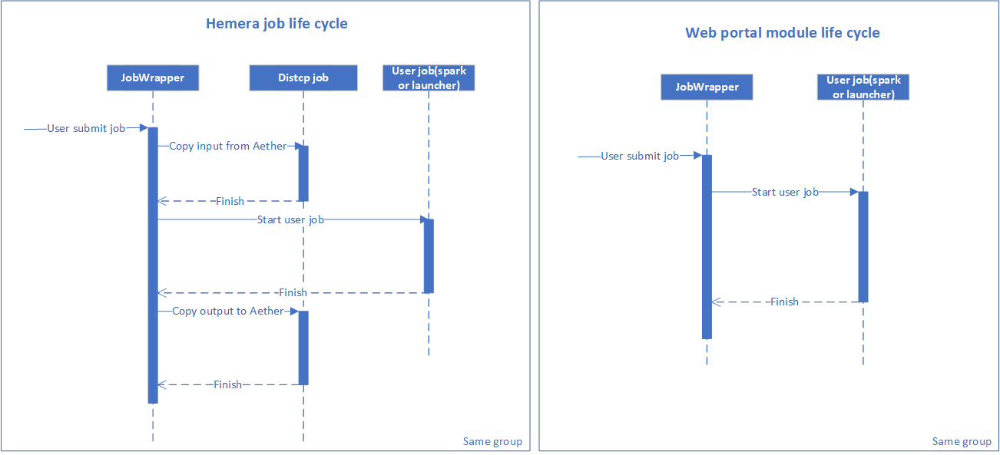

# How to monitor module job
*As module will trigger several jobs to finish the task, in this section, will introduce how to monitor these jobs in one module job. And we use job group to organise them.*

*Before read this part, please refer [API Gateway](../../../mtExternalService/Openresty/docs/APIGW_Api.md) to get right API gateway URL to call.*

## General life cycle


When user submit a new module job, we will start a job wrapper firstly, then job wrapper will submit user job after several preparing work. Until that time, your job get started.

## Monitor job by job group API
As it need some time before user job get started, use job status api will not get any status during this preparing time. So we suggest use job group API to monitor the job wrapper status until your job get started.


- 1.After your submit your job through rest api, you will get the groudId and frameworkname(your job name). Use the groudId to get job wrapper status by below API

```json
GET /api/v2/mp/groups/:groupId/apps?jobtype=JOBWRAPPER
Headers: {
  Authorization: "Bearer ${token}",
}
```

- 2.If job wrapper continue runnung, you can use below API to check if your job get started by job name. If you get several job with same name, pick the bigest application id job to get latest staus.
```json
GET /api/v2/mp/groups/:groupId/apps
Headers: {
   Authorization: "Bearer ${token}",
}
```
- 3.Job wrapper control the whole module life cycle, if job wrapper in failed status, and your job not start, you should consider your job failed. 
- 4.Kill the whole module job please use below API
```json
PUT /api/v2/mp/groups/:groupId/executionType
Headers: {
    Authorization: 'Bearer ${token}',
}
Body: {
    "value": "STOP"
}
```

- 5.More rest API info, please refer [JobAPIReadme](JobAPIReadme.md)

## How to leverage group id in module
For launcher job please add "{"GroupTag":"$Env:JOB_GROUP_TAG"}" to description field.
For Spark job please add $JobName = $Env:JOB_GROUP_TAG + '_' + $JobName in your job name;