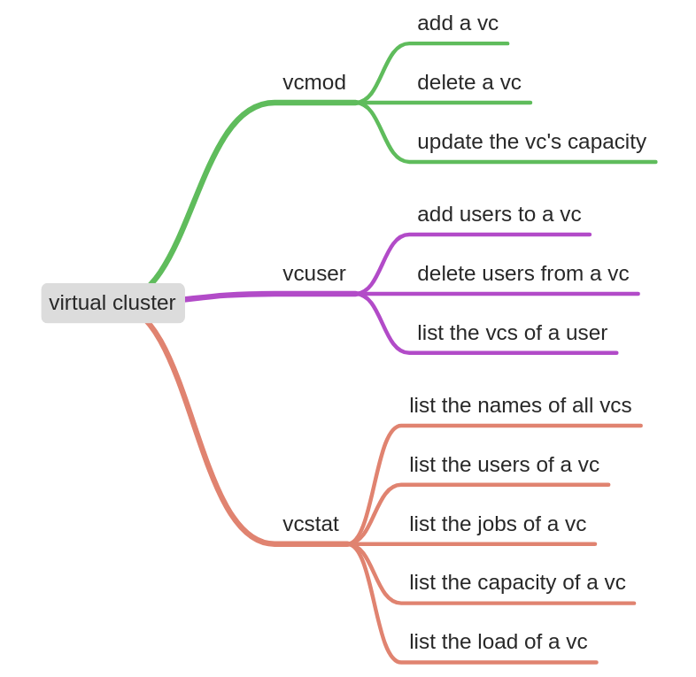
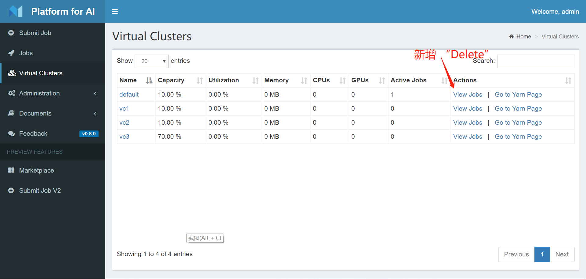

## 1. Overview

提供可供管理员操作的Virtual Cluster（以下简称vc）的交互界面，提供可供普通用户查询vc详情的交互界面

相关issue：[vc_update](https://github.com/Microsoft/pai/issues/1754)




## 2. Rest API

已有的相关API如下：

| 序号 | API                                     | 请求类型 | 说明               |
| ---- | --------------------------------------- | -------- | ------------------ |
| 1    | /api/v1/token                           | POST     | 获取token          |
| 2    | /api/v1/virtual-clusters                | GET      | 获取vc列表         |
| 3    | /api/v1/virtual-clusters/:vcName        | GET      | 获取vc详情         |
| 4    | /api/v1/virtual-clusters/:vcName        | PUT      | 新增或变更vc       |
| 5    | /api/v1/virtual-clusters/:vcName        | DELETE   | 删除vc             |
| 6    | /api/v1/virtual-clusters/:vcName/status | PUT      | 变更vc状态         |
| 7    | /api/v1/user                            | GET      | 获取账户详情       |
| 8    | /api/v1/user/:username/virtualClusters  | PUT      | 新增或变更用户的vc |


## 3. Implementation

### 3.1 add a vc（admin only）


（1）点击“Add“ 按钮，弹出对话框，在其中编辑拟添加vc的名称和容量值。支持在一个页面内填写多个vc。

（2）在弹出的对话框中，点击“Add”按钮，逐条添加VC。每次添加VC调用一次接口` PUT /api/v1/virtual-clusters/:vcName`，若更新成功则显示“succeed”，更新失败，醒目地显示失败原因。单次调用失败不影响后续过程。

### 3.2 delete a vc（admin only）



（1）点击“Delete”按钮，弹出提示框“是否确认要删除:vcName"，若否，则不做变更；若是，调用`DELETE /api/v1/virtual-clusters/:vcName`，并弹出消息框显示返回信息

（2）刷新本页面

### 3.3 update vc's capacity（admin only）


（1）点击"Edit"按钮，弹出对话框，提示可以设置新的vc capacity，并在合适的位置提示该值的取值范围为：0%~default capacity，点击“Update”按钮后，调用`PUT /api/v1/virtual-clusters/:vcName`，并弹出消息框显示返回信息

（2）注：default vc的Edit按钮不可用，鼠标悬浮提示“default vc can not be set capacity”

（3）刷新本页面

### 3.4 add users to a vc（admin only）


（1）点击“Users”按钮，弹出对话框，以如“User Manangement”的方式显示用户列表（调用接口`GET /api/v1/user`，每个条目前增加“复选框”（该复选框的check与否代表用户是否拥有该vc的权限），将拥有该vc权限的用户显示在列表前。管理员可以勾选/取消勾选某个用户来实现新增/新增用户的vc访问权限

（2）列表记录了管理员的变更条目，逐条调用变更的条目，若成功则在页面提示”succeed“，失败则醒目显示”失败原因“。单次调用失败不影响后续过程。

### 3.5 delete users from a vc（admin only）

合并到3.4

### 3.6 list the vcs of a user


（1）变更 Virtual Cluster 页面，对于普通用户特殊处理，若该vc是用户不具有的权限，将所在行置灰

（2）目前还不具备这个能力，缺少REST API支持，拟增加接口`GET /api/v1/user/:username/virtualClusters`返回用户本身所拥有的vc。

（3）需要变动处：

routes/uesr.js  增加

```javascript
router.route('/:username/virtualClusters')
    .get(token.check,  userController.getUserVc);
// 这里的token只能校验用户具有某种token，并不能证明他是:username的token，如果想这么做，还需要进一步优化：
// 在middlewares/token.js 中增加checkWithUsername
```
controllers/user.js 增加
```javascript
const getUserVc = (req, res, next) => {...}
```
models/user.js 增加
```javascript
const getUserVc = (username, virtualCluster, callback) => {
  ...
  db.get(etcdConfig.userVirtualClusterPath(username), null, (err, res) => {
  ...
}
```


### 3.7 list the names of all vcs

现在已支持

### 3.8 list the users of a vc

合并到3.4

### 3.9 list the jobs of a vc

现在已支持

### 3.10 list the capacity of a vc

现在已支持

### 3.11 list the load of a vc

现在已支持


