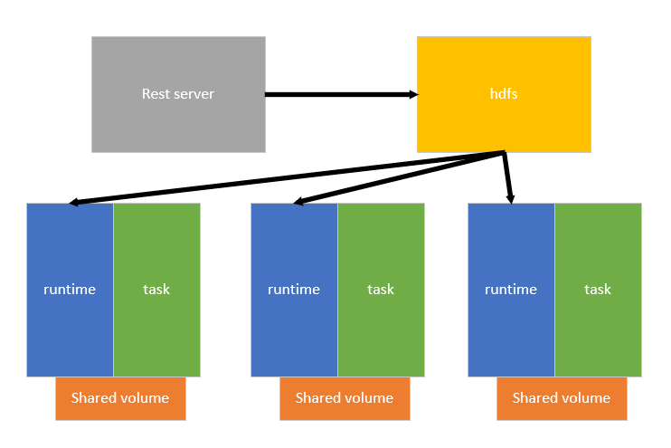

# Pai runtime proposal

In this document I will show you how current pai is implemented, why I want to
define a runtime, and how runtime definition is also useful for advanced users.

## Background

In the process of defining unified job interface for pai and
[pai-lite](https://github.com/Microsoft/frameworkcontroller)(kube-launcher),
I found pai's runtime and core functionality are often intertwined with each other.
It is hard for pai-lite to reuse pai's runtime implementation. Below is current
implementation:



Current implementation is not as clear as above graph, we have yarnScript to do
runtime's job, but they also have core's job like setup gpu isolation, download task
image and kick start it.

Below are summary of current implementation in three components:

Rest-server:
* Generate output dir if user didn’t provide
* Replace `$PAI_DEFAULT_FS_URI` and `$PAI_JOB_NAME` and `$PAI_USERNAME` to real value
* Check user's vc
* Prepare job context:
  * Create output dir in hdfs
  * Create log and tmp dir in hdfs
  * Create all `YarnContainerScripts` files
  * Create all `DockerContainerScripts` files
  * Write job config to hdfs
  * Write framework description
  * Generate ssh key and put into keyFiles
* Generate request to yarn launcher

[YarnContainerScripts](../../src/rest-server/src/templates/yarnContainerScript.mustache):
* Parse gpu argument `$CONTAINER_GPUS` to generate --device args to docker
* Login docker using file provided in hdfs authFile
* Generate environment variables(involves communicate with hdfs to get other task status)
* Download `DockerContainerScripts` as `docker_bootstrap.sh`
* Download `code_dir` from hdfs
* Prepare docker container debug log
* Pull user's image
* Kick docker container to run `docker_bootstrap.sh`(will mount script dir into docker container)

[DockerContainerScripts](../../src/rest-server/src/templates/dockerContainerScript.mustache):
* Set up exit handler
* Also set up a process that checks yarn container's liveness
* Start ssh in container:
  * Download ssh key files from hdfs
  * Generate ssh connection info
* Run user's command

Without a clear runtime definition and implementation, it's hard for pai-lite to
reuse runtime code and achieve same environment for user's job.

## Separation of core & runtime

I define core functionality including:
* allocate cluster resources to job
* check for task's failure and restart accordingly
* schedule task to nodes
* implement inter-job priority management
* task preemption
* resources isolation

runtime functionality including:
* generate task's environment variable
* setup external systems(hdfs) for task
* coordinate tasks to run concurrently
* download data as needed
* setup a sshd server to facilitate task debug

The core part is what currently most stable part, users rarely need customization.
But they often need to customize runtime, so we can separate these two parts, and
evolve them individually, we can even upgrade runtime part without upgrade core part.

So I simply define a runtime interface as following for demo's purpose:
* runtime should be in form of docker image so both pai & pai-lite can use it
* runtime container will be started to finish before starting task container
* pai core will mount an empty path into both runtime container & task container under the same path `/usr/local/pai`
* the start command for task container will be `/usr/local/pai/run` with no argument
* it is the runtime's responsibility to generate an executable script in path `/usr/local/pai/run`
* pai core will pass user's command as environment variables to runtime container

In this way, runtime can:
* control the start time of task container(can implement task synchronization)
* write/download data in /usr/local/pai, so user container can consume
* set environment variables as needed
* run a daemon process along with task(maybe sshd or fluentd to collect task log)
* process user's command(do some expansion)

With this definition, pai & pai-lite can share code. But how this definition also
useful to advanced user? I will demo a example.

## Demo

This demo only reflect what runtime can implement, not necessarily what we are going
to implement. The runtime interface also needed to be discussed in more detail.

I will use kube-launcher as example, since it uses concept in k8s that many people are
already familiarized with. I expect the same concept can be implemented in pai as
well.

Suppose I want user of my runtime can focus on writing tensorflow graph, without
worrying about how to create a distributed session.

I customized a runtime to facilitate tensorflow template. The Dockerfile for my
runtime image is
```
FROM bash

COPY runtime.sh /usr/local/bin/

ENTRYPOINT /usr/local/bin/runtime.sh
```

the `runtime.sh` has content:
```bash
#!/usr/local/bin/bash

TARGET=/usr/local/pai/run

cat > $TARGET << EOF
#!/usr/bin/env python
import tensorflow as tf

sess = tf.Session() # create distributed session here, for demo purpose I only created a local session

$USER_CMD
EOF

chmod +x $TARGET
```

The runtime.sh will generate `/usr/local/pai/run` script, and write `USER_CMD` into
script template.

Then user may submit a job into pai, the job spec is
```json
{
  "jobName": "tf-runtime-demo",
  "image": "tensorflow/tensorflow",
  "virtualCluster": "default",
  "retryCount": 0,
  "taskRoles": [
    {
      "name": "worker",
      "taskNumber": 1,
      "cpuNumber": 2,
      "memoryMB": 4096,
      "minSucceededTaskCount": 1,
      "command": "from tensorflow.examples.tutorials.mnist import input_data\nxxx"
    }
  ]
}
```

The kube-launcher received this job and will create a spec:
```yaml
apiVersion: v1
kind: Pod
metadata:
  name: pai-interface-demo
spec:
  containers:
    - name: user-job
      image: tensorflow/tensorflow
      command: ["/usr/local/pai/run"]
      volumeMounts:
      - mountPath: /usr/local/pai
        name: exchange-space
  initContainers:
    - name: pai-runtime
      image: xudifsd/tf-runtime
      env:
        - name: USER_CMD
          value: |
                from tensorflow.examples.tutorials.mnist import input_data

                mnist = input_data.read_data_sets("MNIST_data/", one_hot=True)

                x = tf.placeholder(tf.float32, [None, 784])
                W = tf.Variable(tf.zeros([784,10]))
                b = tf.Variable(tf.zeros([10]))
                y = tf.nn.softmax(tf.matmul(x,W) + b)
                y_ = tf.placeholder("float", [None,10])
                cross_entropy = -tf.reduce_sum(y_*tf.log(y))
                train_step = tf.train.GradientDescentOptimizer(0.01).minimize(cross_entropy)
                init = tf.initialize_all_variables()
                sess.run(init)
                for i in range(1000):
                  batch_xs, batch_ys = mnist.train.next_batch(100)
                  sess.run(train_step, feed_dict={x: batch_xs, y_: batch_ys})
                  correct_prediction = tf.equal(tf.argmax(y,1), tf.argmax(y_,1))
                  accuracy = tf.reduce_mean(tf.cast(correct_prediction, "float"))
                  print i, sess.run(accuracy, feed_dict={x: mnist.test.images, y_: mnist.test.labels})
      volumeMounts:
      - mountPath: /usr/local/pai
        name: exchange-space
  volumes:
  - name: exchange-space
    emptyDir: {}
  hostNetwork: true
```

Here is what will going on, kube-launcher(the same will apply to yarn-launcher) will
create a initContainer which is based on our runtime image, and pass in `USER_CMD`
environment variable. Our runtime will init a tensorflow runtime and paste user code
blow setting, user code can use already initialized session directly.

As you can see, advanced user can also use this definition to achieve some more
advanced feature without touching pai/pai-lite's core functionality.

## Roadmap

1. I will try to create a detailed interface spec and call for a meeting which will involve advanced user.
2. Let kube-lite implement this runtime spec to be able to use pai's runtime
2. Implment current default runtime, and will test in both platform.
