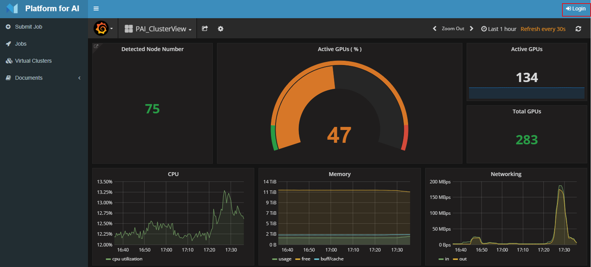
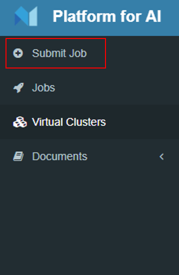
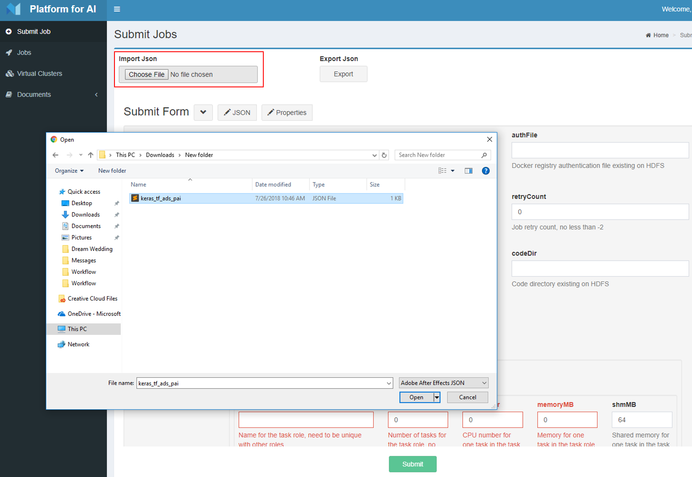
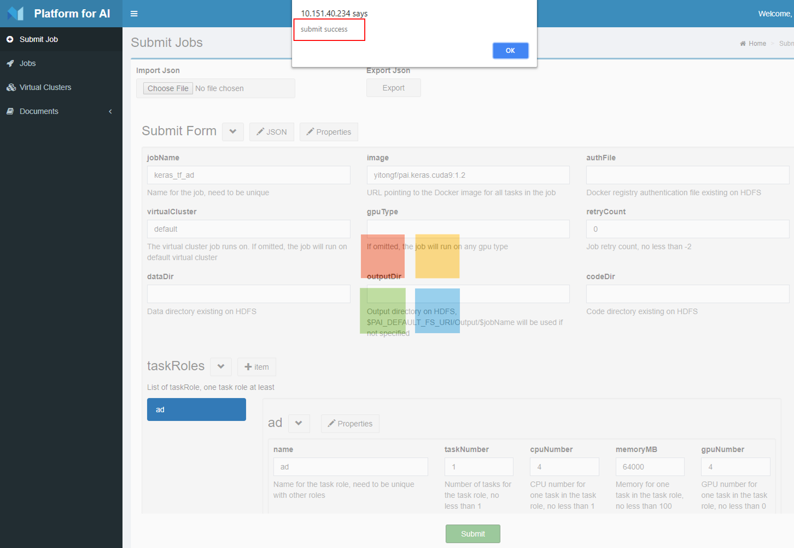

# Submit a job in web portal

1. At PAI home page, click the top right corner to login:

2. At the left sidebar, click "Submit Job":

3. You can import your job configuration json file, or you can fill the job configurations in the webportal's table online. How to write the configuration please refer to [write job from scratch](./job_tutorial.md#json-config-file-for-job-submission), 

4. Then click "Submit" button at the bottom, if your job configuration is right you will see a success message:

