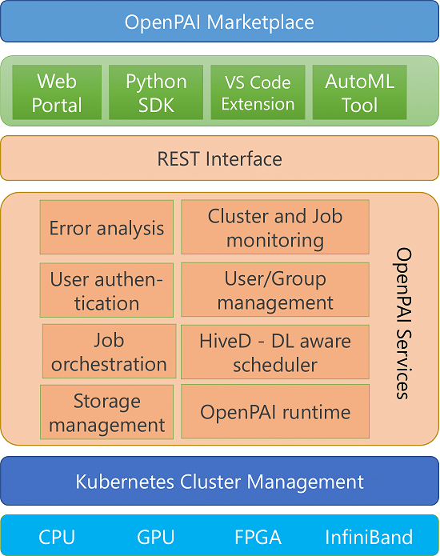

## System Architecture

The figure above provides an overview of OpenPAI. 
OpenPAI is managede by [Kubernetes](https://kubernetes.io/),
it assumes Kubernetes has already been deployed to the cluster by third-party tools like [Azure Kubernetes Service (AKS)](https://azure.microsoft.com/en-us/services/kubernetes-service/) or [Kubespray](https://github.com/kubernetes-sigs/kubespray).
OpenPAI provides [paictl](./paictl/paictl-manual.md), a tool to help user deploy OpenPAI services to the k8s cluster.

One key design goal of OpenPAI is to facilitate the sharing and reproducing of AI innovations. To this end, OpenPAI introduces [marketplace](../contrib/marketplace/README.md), where people can share their workloads and data within a private group or publically.

The workloads and data in the marketplace are described by [OpenPAI protocol](./pai-job-protocol.yaml), a specification that describes the hardware and software requirement of a workload or dataset. 
The hardware and software requirements include GPU/CPU/Memory resource requirement, docker images, data/code location, the training method (gang scheduling or elastic), job completion policy, etc.
OpenPAI protocol facilitates platform interoperability and job portability, a job described by the protocol can run on differnt clusters managed by OpenPAI, as long as the clusters can meet the specification. 
The OpenPAI protocol also enables great flexibility, any AI workload, being it Tensorflow, PyTorch, or your proprietory deep learning workload, can be described by the protocol.

Job orchestrator and OpenPAI runtime are two key components that understand and execute the workload specified by the OpenPAI protocol. Job orechestrator is implemented by leveraging [FrameworkController](https://github.com/Microsoft/frameworkcontroller), a general purpose k8s controller that orchestrates k8s Pods supporting all kinds of AI workloads. The [OpenPAI runtime](../src/kube-runtime) provides runtime support to the workload and implement [OpenPAI runtime parameters/variables](./job_tutorial.md) that are necessary to support the OpenPAI protocol. 
OpenPAI runtime also prebuilds with [failure analysis](../src/k8s-job-exit-spec/config/user-manual.md) rules that can detect typical runtime failure patterns. OpenPAI might take some actions against the detected failure pattens. For example, if OpenPAI finds the job failure is due to Python syntax error, it will not retry the job regardless of the job retry behavior specified by user to prevent from unnecessary retry and the corresponding waste of cluster resource.
The failure rules can be updated on-the-fly by the cluster operaters. Wheneven new failure patterns discovered, the cluster operator can build them into the OpenPAI runtime.

OpenPAI provides comprehensive [monitoring tools](./grafana/README.md) to users and cluster admins for job and cluster monitoring. OpenPAI also monitors the status of key OpenPAI components in the cluster and is able to send [alerts](./alerting/README.md) (e.g., as in email) if pre-configed conditions have been triggered.

OpenPAI is a modular platform, which is designed to enable various innovations. With the standard k8s scheduling API, OpenPAI introduces [HiveD](../subprojects/hivedscheduler/README.md), an optional but recommended scheduler designed for deep learning workloads in a multi-tenant GPU cluster. HiveD provides various advantages over standard k8s scheduler. For example, it introduces a notion of "virtual cluster", which allows a team of users to run workload in the virtual cluster as if they reserve a private, dedicated (smaller) GPU cluster.
HiveD's virtual cluster reserves GPU resource not only in terms of quota (i.e., number of GPU), but also in terms of **topology**. For example, with HiveD a virtual cluster can reserve a GPU node, or a rack of GPU nodes within the same InfiniBand domain, instead of a set of GPUs randomly scatters across the cluster. This is important to preserve the training speed for jobs within the virtual cluster.
With HiveD, OpenPAI also provides better topology-aware gang scheduling with no [resource starvation](https://en.wikipedia.org/wiki/Starvation_(computer_science)). HiveD also supports multi-priority jobs and job preemption.

#### Older System Architecture
For users running OpenPAI older than v0.15, please refer to [here](./previous_system_architecture.md) for the older system architecture.