# PowerBI Metrics integration

- PowerBI is a business analytics service that provides insight to enable quick, informed decisions.Convert data into stunning visual objects and share them with colleagues on any device.Visually browse and analyze local and cloud data in one view.Collaborate and share custom dashboards and interactive reports.Scaling across the organization through built-in controls and security.

## Tasks that PowerBI Desktop can do
- Access data from hundreds of supported local and cloud-based sources.Make sure it is always kept up to date through an automatic incremental refresh.
- Save even more time with the self-service Power Query experience familiar to millions of Excel users.Introduce, transform, integrate, and augment data in Power BI.
- Enterprise users can take advantage of Power BI's capabilities of fast magnitude, grouping, prediction, and clustering to dig deep into the data to find patterns they may have missed.Power users can take full control of their models using the powerful DAX formula language.
- Use interactive data visualization to create stunning reports.Use drag-and-drop canvases and hundreds of new data visuals from Microsoft and partners.

## Download

- Please refer to the following website for download PowerBI Desktop:   [PowerBI Desktop](https://powerbi.microsoft.com/zh-cn/desktop/). choose Advanced download options to change the language which PowerBI use. After the installation is completed, open the software and create the report.

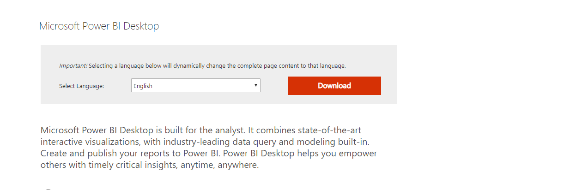

## Connect to the data source to get report data.
- In this metric we use the website data source on port 198, Click to Get Data as shown in the screenshot, and continue to click web.

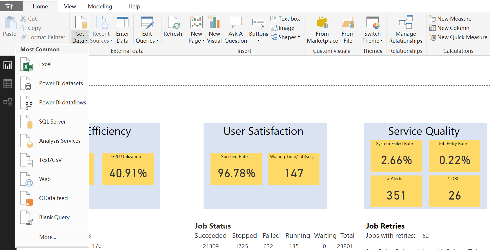

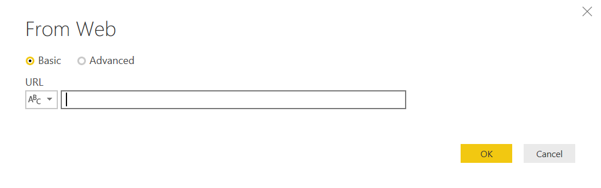

- Enter here the address to get the data source, The addresses of all web data sources are listed below:

-  [day job](http://111.11.12.13/raw_job?span=day)
-  [week job](http://111.11.12.13/raw_job?span=day)
-  [month job](http://111.11.12.13/raw_job?span=day)
-  [day gpu](http://111.11.12.13/raw_job?span=day)
-  [week gpu](http://111.11.12.13/raw_job?span=day)
-  [month gpu](http://111.11.12.13/raw_job?span=day)
-  [day alert](http://111.11.12.13/raw_job?span=day)
-  [week alert](http://111.11.12.13/raw_job?span=day)
-  [month alert](http://111.11.12.13/raw_job?span=day)

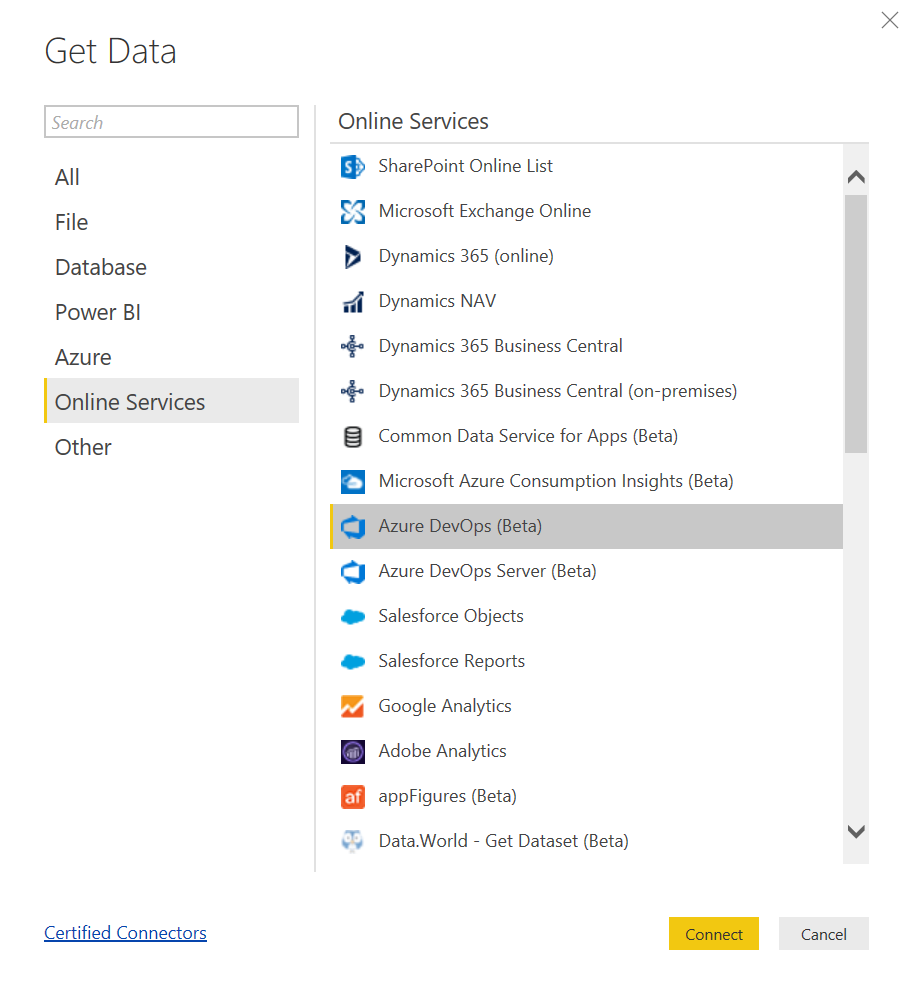

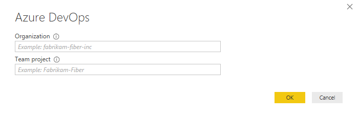

- EX: The organization for [https://fabrikam-fiber-inc.visualstudio.com](https://fabrikam-fiber-inc.visualstudio.com) is fabrikam-fiber-inc.
The project name for [https://fabrikam-fiber-inc.visualstudio.com/Fabrikam-Fiber](https://fabrikam-fiber-inc.visualstudio.com/Fabrikam-Fiber)
is Fabrikam-Fiber.

- After completing the above steps, the connected data source is displayed on the right side.

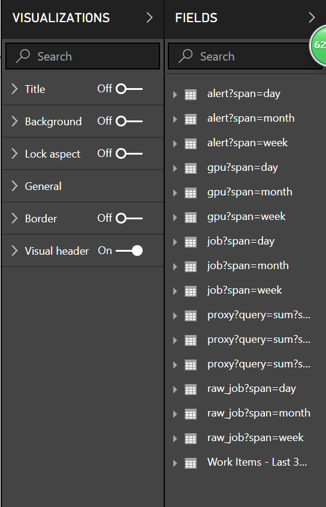

## Data processing optimization

- The data is formatted as a json string, which we need to tabulate. Some data columns may need to be evaluated, so you also need to change the data type.
- After connecting to the data is the following list of record types.

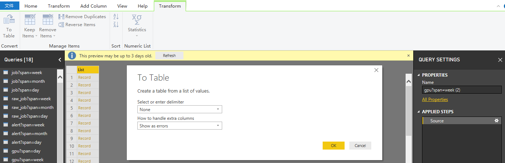

- Click on the Transform>To Table>OK. And then click the bidirectional arrow to the right of Column1.

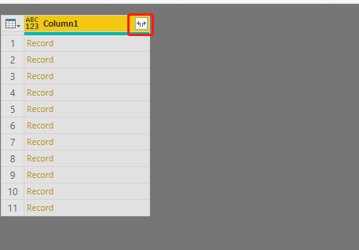

- Uncheck the Use original column name as prefix option if you won't use original column name as prefix. and OK.

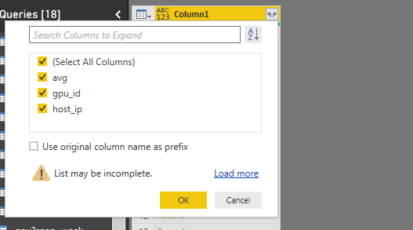

- Click Home>Close and apply>Close & Apply or Apply or Close, If you don't want to use this change, you can also choose Close.

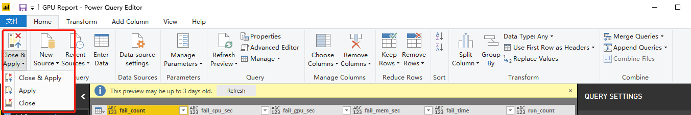

- If you need to make changes to the data and so on, you can click Edit Queries > Edit Queries.Right-click on each column of data to make the change.

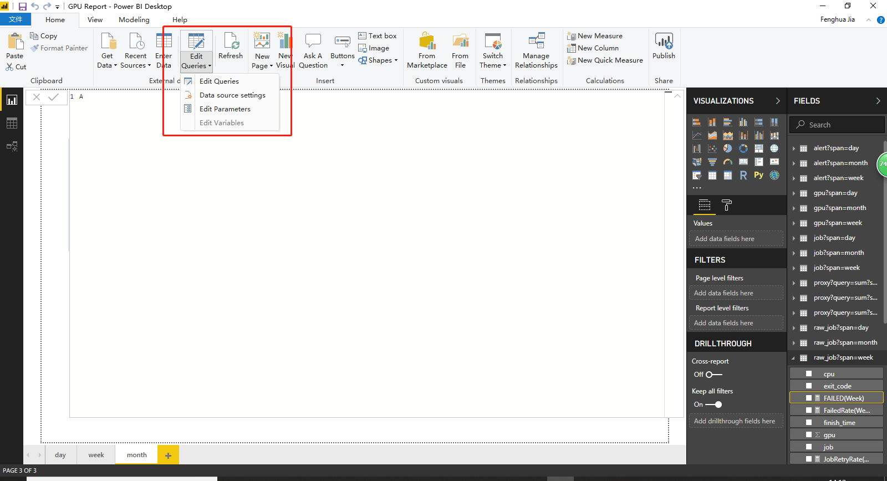

## Create a visual object that displays the data on the view

- Here are some visual objects, text boxes, Image, shape to choose from to complete the report rendering you need.

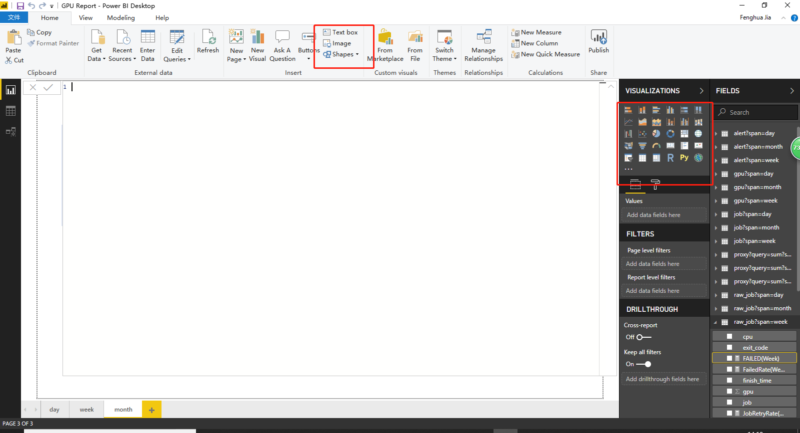

- Field: Data information in the visual object, drag the desired data column into the data box below the field,Drag the filter criteria column into the filter box under visual object filter.

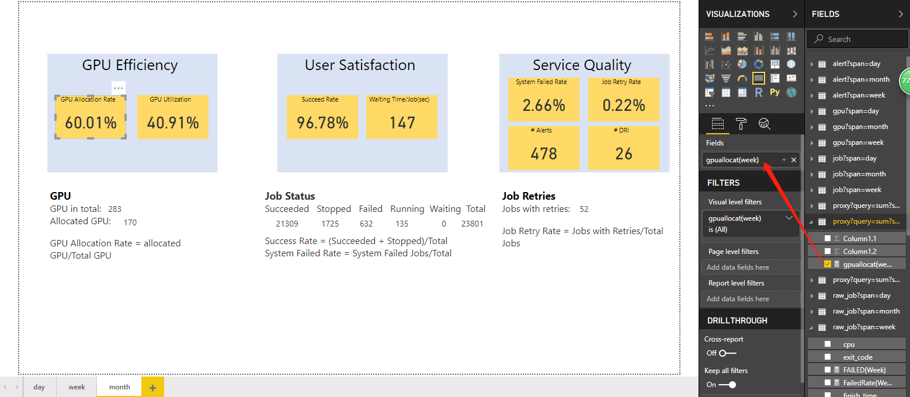

- Click triangle or right click > New quick measure ,The data can be calculated accordingly.

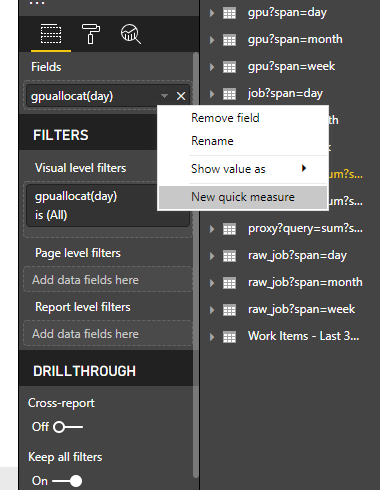

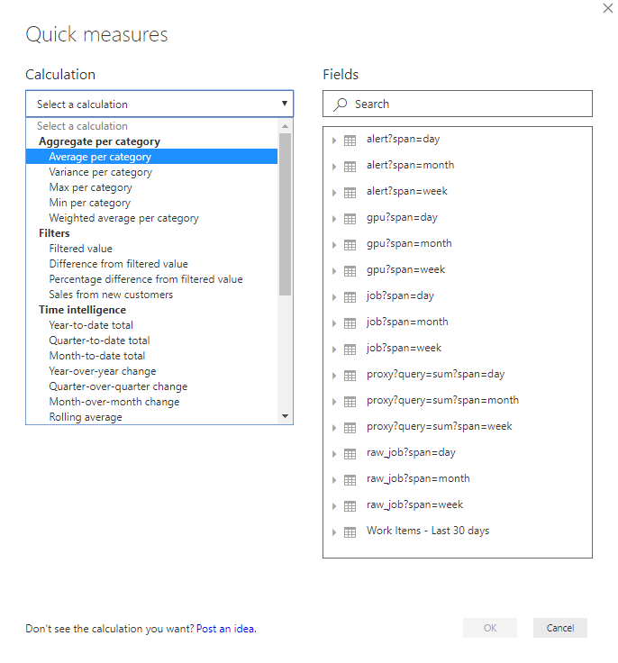

- Format: adjusts information about visual object variants, colors, borders, text, etc.

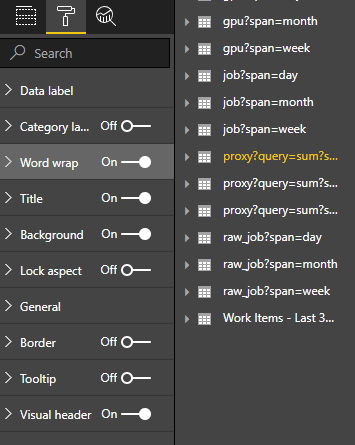

## Release and Shared report

- After completing the report design, click Publish ,Select the workspace you want to publish.

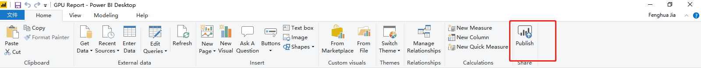

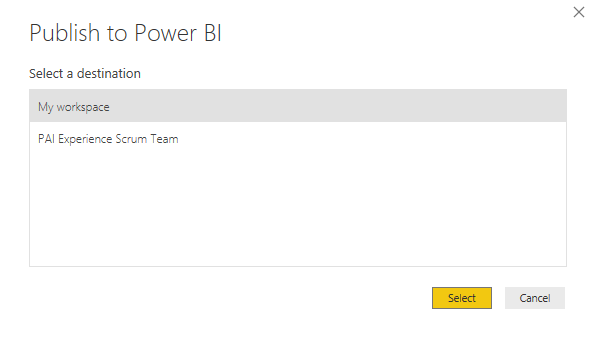

- Then go to your own PowerBI Online [PowerBI Online](https://msit.powerbi.com/home). You can then see your reports in your published workspace, everyone in this workspace can share your reports. You can also click the share button to share your report to anyone you want.

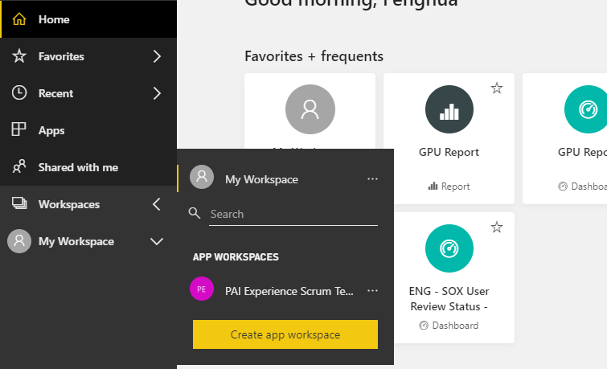

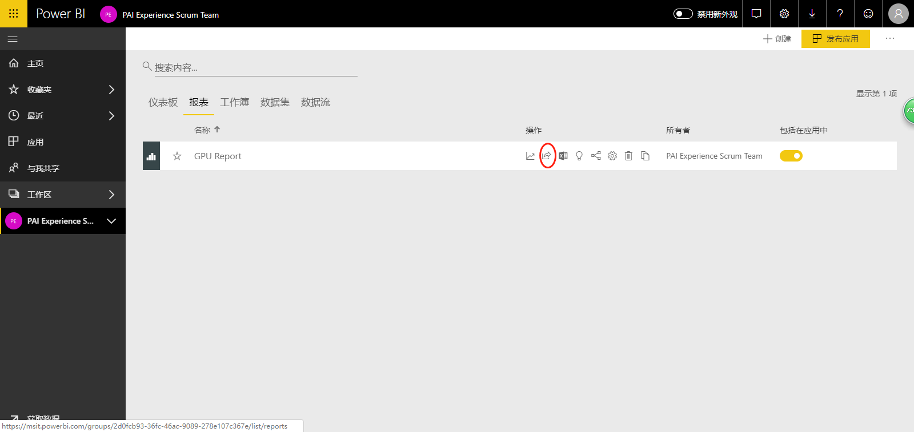

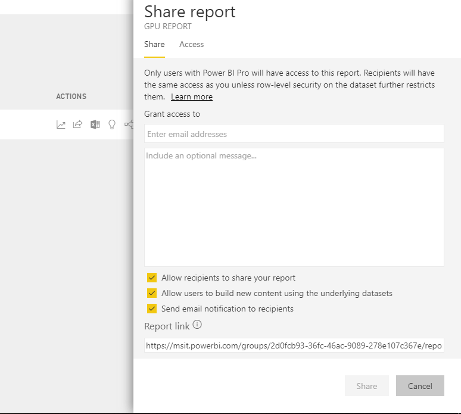

## Report data refresh

- PowerBI Online default to refresh at zero every day, You can also click on the dataset to refresh immediately or customize it.

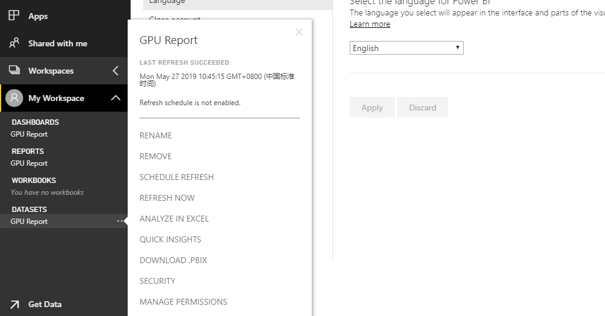

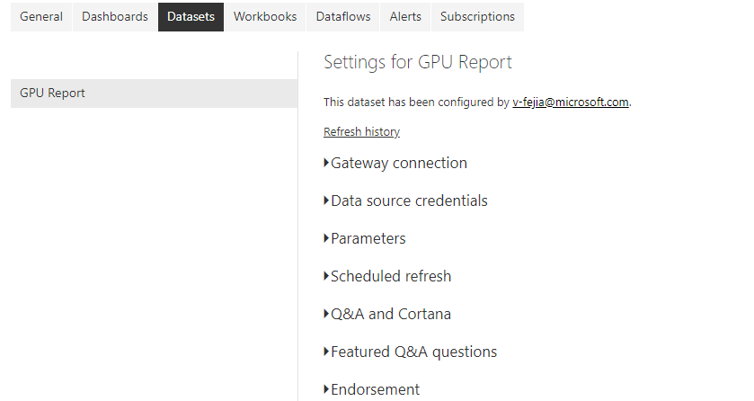
