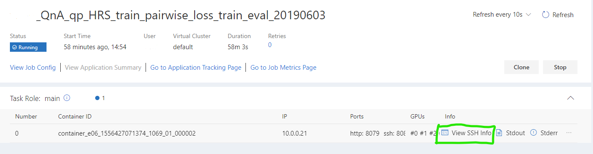
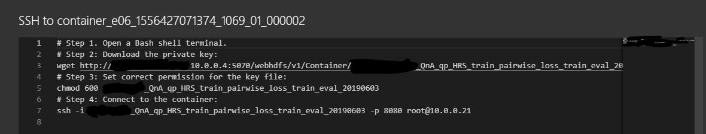
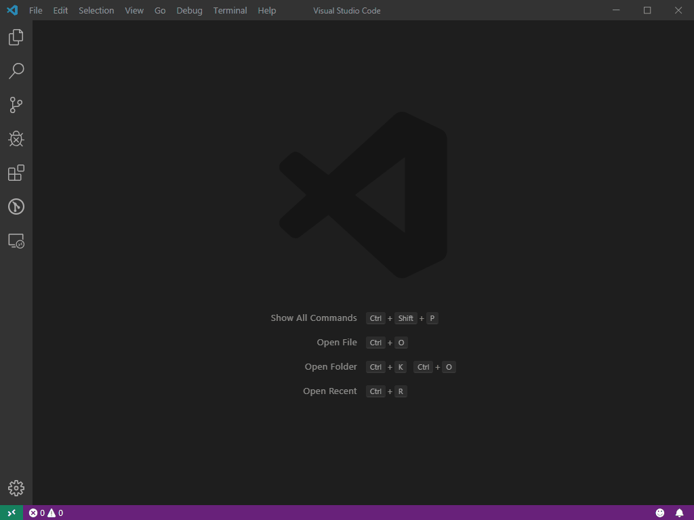

# Remote Development and Debugging

- [Remote Development and Debugging](#Remote-Development-and-Debugging)
  - [Overview](#Overview)
  - [Prepare Code](#Prepare-Code)
    - [External Storage](#External-Storage)
      - [NFS](#NFS)
      - [SMB](#SMB)
    - [Git](#Git)
      - [Github](#Github)
      - [Azure DevOps](#Azure-DevOps)
  - [Submit jobs](#Submit-jobs)
  - [Get SSH info](#Get-SSH-info)
  - [Configure local editors or IDEs](#Configure-local-editors-or-IDEs)
    - [CLI](#CLI)
    - [Visual Studio Code](#Visual-Studio-Code)
    - [PyCharm Professional](#PyCharm-Professional)
  - [Others](#Useful-Tools)


## Overview

**Remote development and debugging** allow users to develop and debug locally with PAI's resources.

The main processes include:
- Prepare code
- Submit jobs
- Get SSH info
- Configure local editors or IDEs

## Prepare Code

For remote development or debugging, users should prepare code properly. PAI recommends that users use external storage or git to store code. Users can get the code using the following commands. These commands can be added to the job YAML or run directly via ssh.

### External Storage

#### NFS

Users can use following commands to mount NFS storage.

```sh
apt update && apt install -y nfs-common
mount -t [nfs|nfs4] <nfs_server_ip>:<sharepath> <mountpoint>
```

#### SMB

Users can use following commands to mount SMB storage.

```sh
apt update && apt install -y cifs-utils
mount -t cifs //<smb_server_ip>/<sharename> <mountpoint> -o vers=<smbversion>,username=<username>,password=<password>,domain=<domain>
```

### Git

Users can use `git clone` to get code from Github or Azure DevOps.

#### Github

If users use public repos, they can easily get their code with:

```sh
git clone https://github.com/<user>/<repo>.git
```

If users use private repos, they should generate an access token from Github and use this token to bypass the authorization.

```sh
git clone https://<token>@github.com/<user>/<repo>.git
```

#### Azure DevOps

If users are using Azure DevOps, they should also generate an access token and use this token to bypass the authorization.

```sh
git clone https://<user>:<token>@dev.azure.com/<org>/<project>/_git/<repo>
```

## Submit jobs

This part has been described in [submit-a-hello-world-job](https://github.com/microsoft/pai/blob/master/docs/user/job_submission.md#submit-a-hello-world-job).


## Get SSH info

After your job started, you can get SSH info from WebPortal.





You can get **SSH ip, port and key** from the above page.

Tips: If you are using windows, you can just copy the url after `wget` and paste it in your web browser, then you will download the SSH key.

## Configure local editors or IDEs

PAI supported the following IDEs or editors:
- CLI
- Visual Studio Code
- PyCharm Professional

## CLI

For CLI usage, just SSH into your container and users can do anything they want.

## Visual Studio Code

For VS Code usage, users can install a plugin named `Remote Development` and configure it according to the following animation.



For more details, please refer to [VS code Remote Development](https://www.jetbrains.com/help/pycharm/remote-debugging-with-product.html).

## PyCharm Professional

This can only work in PyCharm Professional, users can configure PyCharm `Deployment` and `Project Interpreter` according to the following animation.


For more details, please refer to [PyCharm Remote Development](https://www.jetbrains.com/help/pycharm/remote-debugging-with-product.html).

## Others

### PDB

This tool contains two debug modes:
- Trailing remote debugging when job task starts -
- Inject the breakpoint in source code and start debugging when hit the breakpoint.

For more details, please refer to [PDB](https://github.com/microsoft/pai/blob/master/contrib/debug-tools/docs/remote-debug-pai-job.md).

### Remote-dev-tool

For users who want to share a local folder and mount it in PAI's container, we prepared a tool named remote-dev-tool which supports Ubuntu and Windows.

For more details, please refer to [remote-dev-tool](https://github.com/microsoft/pai/tree/master/contrib/remote-dev-tool).
