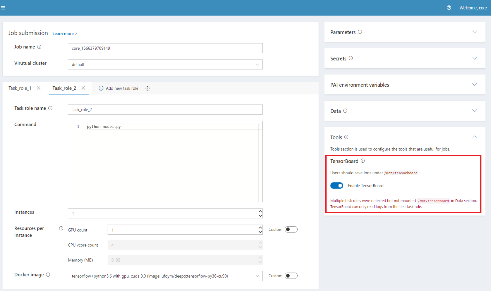
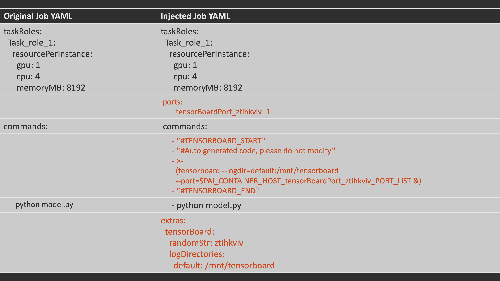
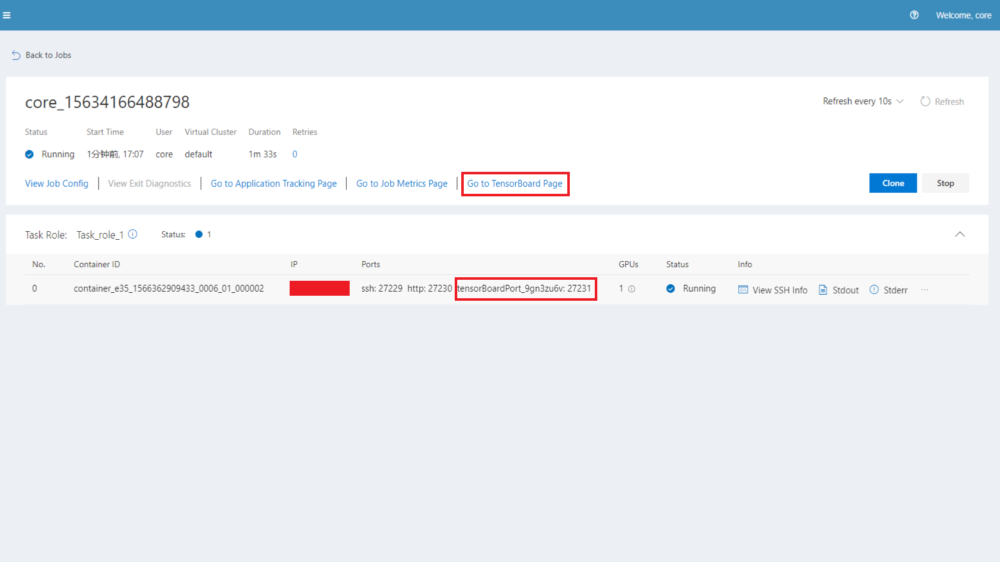
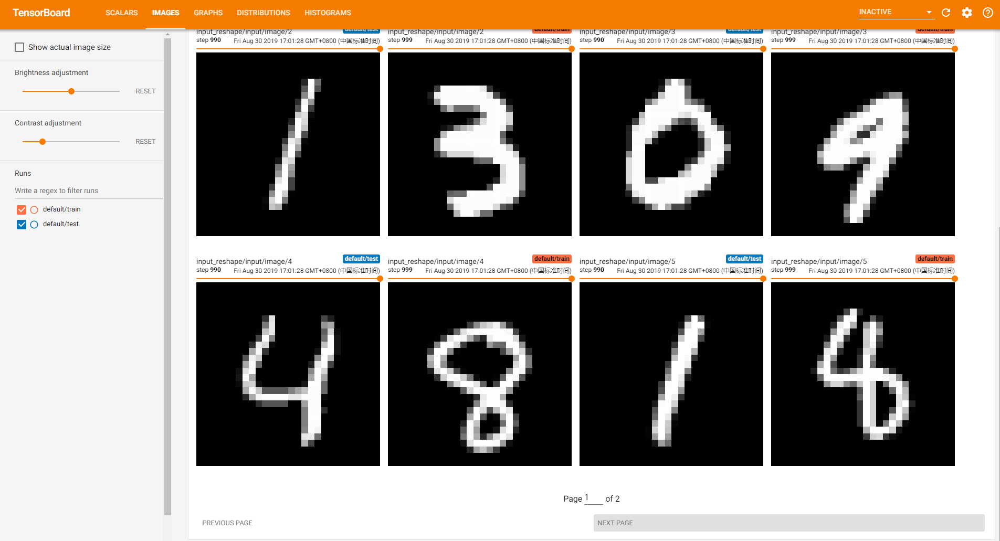

# Use TensorBoard in PAI

## 1. Overview

TensorBoard is a suite of web applications for inspecting and understanding your TensorFlow runs and graphs, which can:

- Tracking and visualizing metrics such as loss and accuracy;
- Visualizing the model graph;
- Viewing histograms of weights, biases, or other tensors as they change over time.

For more details about TensorBoard, please refer to [official docs](https://www.tensorflow.org/guide/summaries_and_tensorboard).

## 2. Usage

Users can easily enable TensorBoard in the `Tools` section of PAI's web portal.



If users enable TensorBoard, there will be an injection in the first task role of the job.
The injection includes a `TensorBoard Port`, `TensorBoard commands` and `TensorBoard Extras` which shows as follows.



Users should store the logs in `/mnt/tensorboard`. Since TensorBoard should read logs from different task roles, a warning will be issued if there are multiple task roles but `/mnt/tensorboard` is not mounted in the `Data` section.

The job will finish when training is done, so you can add `sleep ***` in job commands to see the TensorBoard page after training.

After submitting the job, you can go to the TensorBoard page in the job detail page.



## 3. Advance

User can also edit the `logDirectories` in `TensorBoard Extras` to customize the log path, such as:

```yaml
extras:
  tensorBoard:
    randomStr: ztihkviv
    logDirectories:
      model1: /mnt/tensorboard/model1
      model2: /mnt/tensorboard/model2
```

And TensorBoard injection commands will update automatically.

## 4. Sample

We prepared a sample job to show how to use TensorBoard.

You can import this [tensorboard_sample.yaml](./samples/tensorboard_sample.yaml) and upload [minist_tensorboard.py](./samples/minist_tensorboard.py) to `/pai_data/test/` in PAI's webportal.

If the sample job runs well, you can see the TensorBoard page like this:



