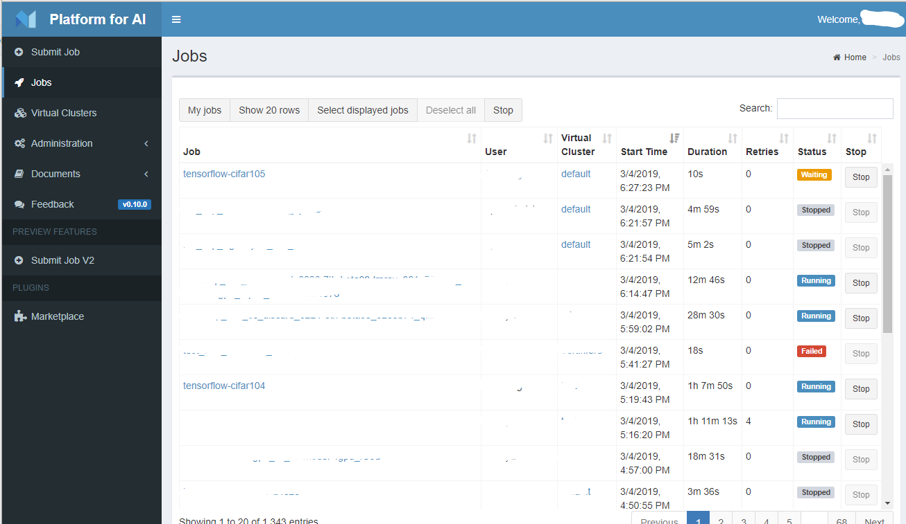
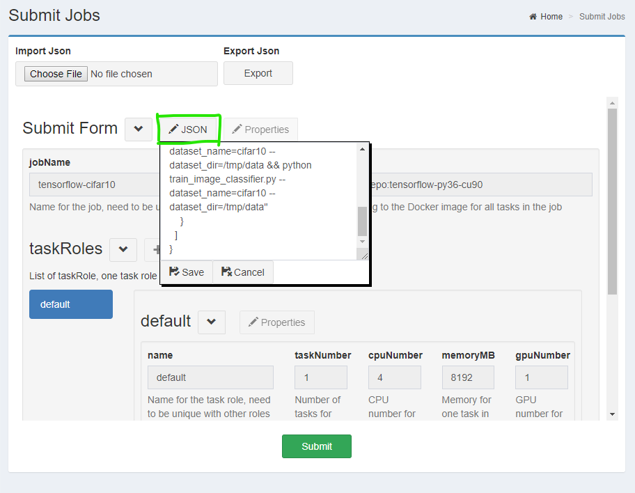

<!--
  Copyright (c) Microsoft Corporation
  All rights reserved.

  MIT License

  Permission is hereby granted, free of charge, to any person obtaining a copy of this software and associated
  documentation files (the "Software"), to deal in the Software without restriction, including without limitation
  the rights to use, copy, modify, merge, publish, distribute, sublicense, and/or sell copies of the Software, and
  to permit persons to whom the Software is furnished to do so, subject to the following conditions:
  The above copyright notice and this permission notice shall be included in all copies or substantial portions of the Software.

  THE SOFTWARE IS PROVIDED *AS IS*, WITHOUT WARRANTY OF ANY KIND, EXPRESS OR IMPLIED, INCLUDING
  BUT NOT LIMITED TO THE WARRANTIES OF MERCHANTABILITY, FITNESS FOR A PARTICULAR PURPOSE AND
  NONINFRINGEMENT. IN NO EVENT SHALL THE AUTHORS OR COPYRIGHT HOLDERS BE LIABLE FOR ANY CLAIM,
  DAMAGES OR OTHER LIABILITY, WHETHER IN AN ACTION OF CONTRACT, TORT OR OTHERWISE, ARISING FROM,
  OUT OF OR IN CONNECTION WITH THE SOFTWARE OR THE USE OR OTHER DEALINGS IN THE SOFTWARE.
-->

# Train models on OpenPAI

- [Train models on OpenPAI](#train-models-on-openpai)
  - [Submit a hello-world job](#submit-a-hello-world-job)
  - [Understand job](#understand-job)
    - [Learn hello-world job](#learn-hello-world-job)
    - [Transfer files in/out](#transfer-files-inout)
    - [Job workflow](#job-workflow)
  - [Reference](#reference)

This document is for new users of OpenPAI. It provides the must to know knowledge to train models or execute other kinds of commands.

Before learning this document, make sure you have IP address or domain name and an account of an OpenPAI cluster already. If there isn't an OpenPAI cluster yet, refer to [here](../../README.md#deploy-openpai) to deploy one.

## Submit a hello-world job

The **job** of OpenPAI defines how to execute command(s) in specified environment(s). A job can be model training, other kinds of commands, or distributed on multiple servers.

Follow to submit a very simple job like hello-world during learning a program language. It trains a model, which is implemented by TensorFlow on CIFAR-10 dataset. It downloads data and code from internet and doesn't copy model out. It helps getting started with OpenPAI. Next sections include more details to help on submitting real jobs.

**Note**, web portal is one of ways to submit jobs. It's the simplest way to begin, but's not most efficient way to submit and manage jobs. [OpenPAI VS Code Client](../../contrib/pai_vscode/VSCodeExt.md) is recommended, as it provides best experience.

1. Navigate to OpenPAI web portal. Input IP address or domain name of OpenPAI, which is from administrator of the OpenPAI cluster. Click *sign in* and input username, password, once login page shows.

   After that, OpenPAI will show job list as below.

   

2. Click **Submit Job** on the left pane and reach this page.

   

3. Click **JSON** button. Clear existing content and paste below content in the popped text box, then click save.

   The content is introduced in next sections.

   ```json
   {
   "jobName": "tensorflow-cifar10",
   "image": "tensorflow/tensorflow:1.12.0-gpu-py3",
   "taskRoles": [
       {
       "name": "default",
       "taskNumber": 1,
       "cpuNumber": 4,
       "memoryMB": 8192,
       "gpuNumber": 1,
       "command": "apt update && apt install -y git && git clone https://github.com/tensorflow/models && cd models/research/slim && python download_and_convert_data.py --dataset_name=cifar10 --dataset_dir=/tmp/data && python train_image_classifier.py --dataset_name=cifar10 --dataset_dir=/tmp/data --max_number_of_steps=1000"
       }
   ]
   }
   ```

   

4. Then click **Submit** button to submit the job to OpenPAI.

   

5. After submitted, the page redirects to job list, and the submitted job is in list as **Waiting** status. Click **Jobs** on left pane can also reach this page.

   

6. Click job name to view details. Job status will be changed to *Running*, and IP address is assigned in below pane of task role once it starts to run. There are more details and actions, like status, tracking log and so on.

   

## Understand job

This section introduces more knowledge about job, so that you can write your own job configuration easily.

### Learn hello-world job

The **job configuration** is a JSON file, which is submitted to OpenPAI. The hello-world job configuration includes below required key fields.

There are two levels of fields in the JSON file. The top level is shared information of the job, including job name, Docker image, task roles, and so on. The second level is taskRoles, it's an array and each item describe a command and its environment.

Below is required fields and [full spec of job configuration](../job_tutorial.md) is here.

- **jobName** is the name of current job. It must be unique in each user account. A meaningful name helps managing jobs well.

- **image**

  [Docker](https://www.docker.com/why-docker) is a popular technology to provide virtual environments on a server. OpenPAI uses Docker to provide consistent and clean environments. With Docker, OpenPAI can serve multiple resource requests on the same server.

  The **image** field is the identity of a Docker image, which is installed customized Python and system packages.

  The hub.docker.com is a public Docker repository with a lot of Docker images. The [ufoym/deepo](https://hub.docker.com/r/ufoym/deepo) on hub.docker.com is recommended for deep learning. In the hello-world example, it uses a TensorFlow image, *ufoym/deepo:tensorflow-py36-cu90*, in ufoym/deepo. Administrator may set a private Docker repository.

  If an appropriate Docker image isn't found, it's easy to [build a Docker image](../job_docker_env.md).

  Note, if a Docker image doesn't include *openssh-server* and *curl* packages, it cannot use SSH feature of OpenPAI. If SSH is needed, a new Docker image can be built and includes *openssh-server* and *curl* on top of the existing Docker image.

- **taskRoles** defines different roles in a job.

  For single server jobs, there is only one role in taskRoles.

  For distributed jobs, there may be multiple roles in taskRoles. For example, when TensorFlow is used to running distributed job, it has two roles, including parameter server and worker. There are two task roles in the corresponding job configuration, refer to [the example](../job_tutorial.md#a-complete-example) for details.

- **taskRoles/name** is the name of task role and it's used in environment variables in distributed jobs.

- **taskRoles/taskNumber** is number of instances of this task role. In single server jobs, it should be 1. In distributed jobs, it depends on how many instances are needed for a task role. For example, if it's 8 in a worker role of TensorFlow. It means there should be 8 Docker containers for the worker role.

- **taskRoles/cpuNumber**, **taskRoles/memoryMB**, **taskRoles/gpuNumber** are easy to understand. They specify corresponding hardware resources including the number of CPU core, MB of memory, and number of GPU.

- **taskRoles/command** is the command to run in this task role. It can be multiple commands, and joint by `&&` like in terminal. For example, in the hello-world job, the command clones code from GitHub, downloads data and then executes the training progress.

  Like the hello-world job, user needs to construct command(s) to get code, data and trigger executing.

### Transfer files in/out

Most model training and other kinds of jobs need to transfer files between running environments and outside. Files include dataset, code, scripts, trained model, and so on.

OpenPAI manages computing resources, but it doesn't manage persistent storage. The [how to use storage](storage.md) is prepared for OpenPAI users.

It's better to check with administrator of the OpenPAI cluster about how to transfer files, since they may choose most suitable approaches and examples for you.

### Job workflow

Once job configuration is ready, next step is to submit it to OpenPAI. To submit a job, it's recommended to use [Visual Studio Code Client](../../contrib/pai_vscode/VSCodeExt.md). 

Note, both web UI and the Visual Studio Code Client through [RESTful API](../rest-server/API.md) to access OpenPAI. The RESTful API can be used to customize the client experience.

After received job configuration, OpenPAI processes it as below steps.

1. Wait for resource allocated. OpenPAI waits enough resources including CPU, memory, and GPU are allocated. If there is enough resource, the job starts very soon. If there is not enough resource, job is queued and wait on previous jobs completing and releasing resource.

2. Initialize Docker container. OpenPAI pulls the Docker image, which is specified in configuration, if the image doesn't exist locally. After that OpenPAI will initialize the Docker container.

3. run the command in configuration. During the command is executing, OpenPAI outputs [stdout and stderr](troubleshooting_job.md) near real-time. Some metrices can be used to [monitor workload](troubleshooting_job.md#how-to-check-job-log).

4. Finish job. Once the command is completed, OpenPAI use latest exit code as signal to decide the job is success or not. 0 means success, others mean failure. Then OpenPAI recycles resources for next jobs.

When a job is submitted to OpenPAI, the job's status changes from waiting, to running, then succeeded or failed. The status may display as stopped if the job is interrupted by user or system.

## Reference

- [Full spec of job configuration](../job_tutorial.md)
- [Examples](../../examples)
- [Troubleshooting job failure](troubleshooting_job.md)
- [How to use storage](storage.md)
