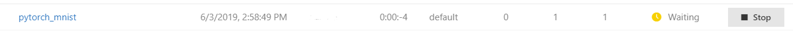
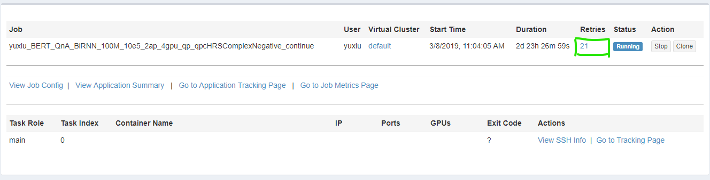
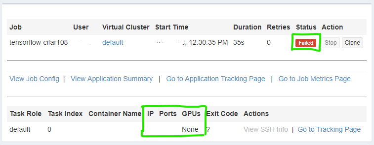
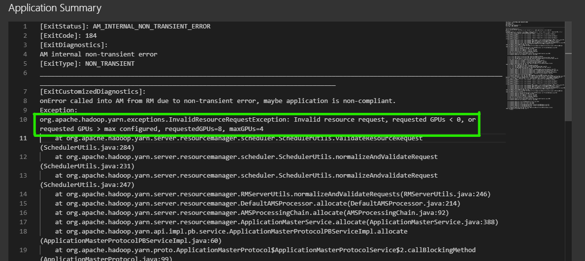
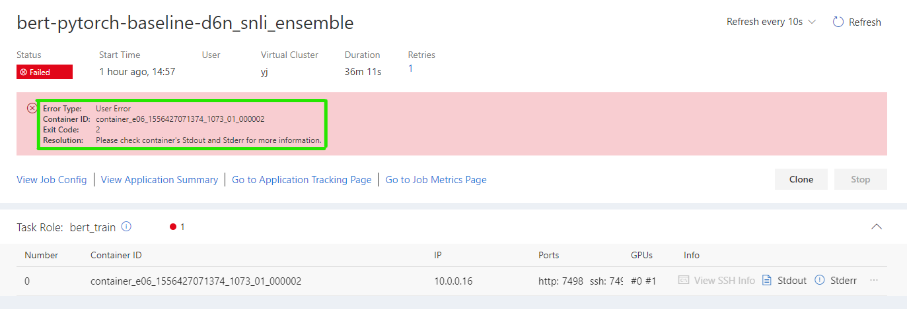
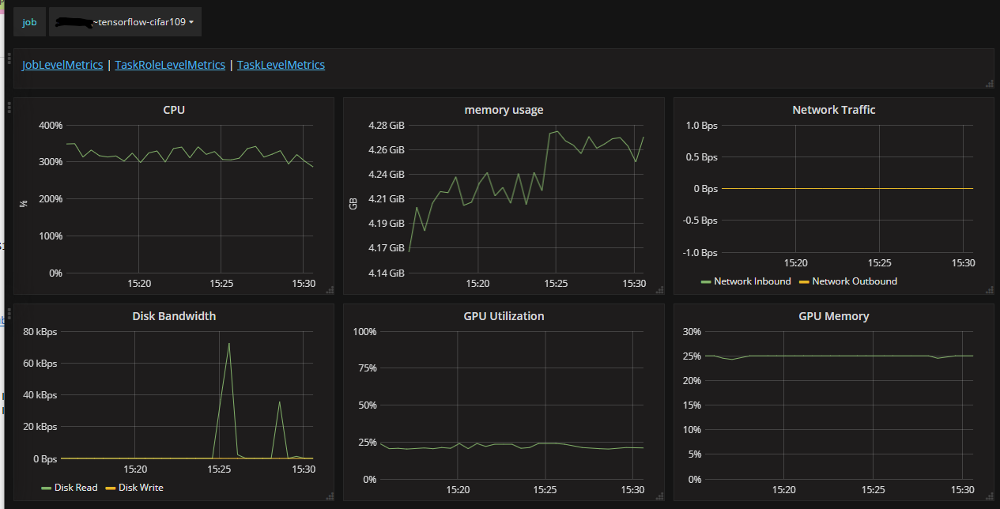
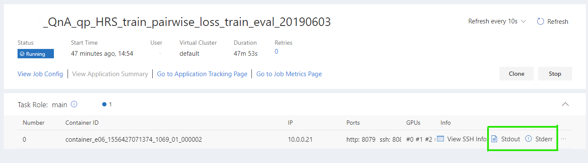
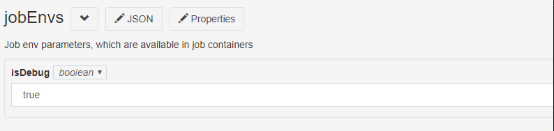

<!--
  Copyright (c) Microsoft Corporation
  All rights reserved.

  MIT License

  Permission is hereby granted, free of charge, to any person obtaining a copy of this software and associated
  documentation files (the "Software"), to deal in the Software without restriction, including without limitation
  the rights to use, copy, modify, merge, publish, distribute, sublicense, and/or sell copies of the Software, and
  to permit persons to whom the Software is furnished to do so, subject to the following conditions:
  The above copyright notice and this permission notice shall be included in all copies or substantial portions of the Software.

  THE SOFTWARE IS PROVIDED *AS IS*, WITHOUT WARRANTY OF ANY KIND, EXPRESS OR IMPLIED, INCLUDING
  BUT NOT LIMITED TO THE WARRANTIES OF MERCHANTABILITY, FITNESS FOR A PARTICULAR PURPOSE AND
  NONINFRINGEMENT. IN NO EVENT SHALL THE AUTHORS OR COPYRIGHT HOLDERS BE LIABLE FOR ANY CLAIM,
  DAMAGES OR OTHER LIABILITY, WHETHER IN AN ACTION OF CONTRACT, TORT OR OTHERWISE, ARISING FROM,
  OUT OF OR IN CONNECTION WITH THE SOFTWARE OR THE USE OR OTHER DEALINGS IN THE SOFTWARE.
-->

# Troubleshoot jobs

Like other remote platforms, job failures in OpenPAI need more effort to find and fix than local. This document helps troubleshooting issues on OpenPAI.

- [Troubleshoot jobs](#troubleshoot-jobs)
  - [Best practice](#best-practice)
    - [Fix issues locally](#fix-issues-locally)
    - [Write log easy to understand](#write-log-easy-to-understand)
    - [Validate job with local simulator](#validate-job-with-local-simulator)
    - [Know resource bottleneck well](#know-resource-bottleneck-well)
  - [Diagnostic issues](#diagnostic-issues)
    - [Job is waiting for hours](#job-is-waiting-for-hours)
    - [Job is running but retried many times](#job-is-running-but-retried-many-times)
    - [Job runs slowly](#job-runs-slowly)
    - [Job is failed](#job-is-failed)
  - [Guideline](#guideline)
    - [How to view job metrics](#how-to-view-job-metrics)
    - [How to check job log](#how-to-check-job-log)
    - [Connect to running environments with SSH](#connect-to-running-environments-with-ssh)
    - [Reserve failed docker for debugging](#reserve-failed-docker-for-debugging)
    - [Ask helps](#ask-helps)

## Best practice

With best practice, many issues could be addressed earlier, and some tough issues can be resolved easily.

### Fix issues locally

Troubleshooting issues remotely is hard, so consider fixing an issue at local, instead of investigating it at remote server.

- If some error happens in remote environment, reproduce it at local firstly, and then try to fix it. It may spend more time on reproducing, but it can be fixed easily in most case.
- Minimize difference of code logic between local and remote. It makes more logic issue can be found locally.
- Some issues may be caused by difference between local and remote environments, so that it's not possible to reproduce locally. Try to narrow down the scope where it happens. For example, to write a very small code snippet to reproduce it.

### Write log easy to understand

Debug is very useful at local development, but it's hard to debug remotely, and impossible in production environment mostly. Log can provide lots of information and works well in every environment.

To improve log quality,

1. Use log more. In development phase, look log more and avoid debugging or printing output for one-time use. The log should be improved if it doesn't have enough information.
2. Reduce duplicated log. The duplicated or repeated log is easy to bury useful information. So, duplicated log should be merged or disabled.
3. Not only dump variables but tell story in log. People, who looks at log, may never see, or forget the code. Besides dump variables' value, the log needs to explain what variables mean in business logic. For example, the log should include why a value is considered as abnormal, how it's critical, how to fix it.
4. Associate related log with context. In parallel cases, log is dumped by concurrent threads, processes, or servers in same time. A context id is necessary to associate log together. And time synchronization is needed for distributed servers.
5. What should be logged? It's answered above partially. If something is helpful for troubleshooting, or further analyzing, it should be logged. For example, full error with call stack, and so on.

### Validate job with local simulator

Some bugs may happen within OpenPAI jobs only, so the code may work well at local, but failed remotely. With local simulator, more environment issues can be found locally.

OpenPAI Visual Studio Code Client can parse OpenPAI job configuration file and run it in Docker container locally. This simulation can find problems that related to configuration, like mismatched docker image with code dependencies, command line errors, environment variables and so on.

This simulation can cover most situations at remote, but still limited.  For example,

- The resource specification in configuration is ignored, as in most case, the local computer is not powerful like a GPU server.
- When code is simulating locally, it may be much slower, or out of memory. The code or command should be modified to avoid this kind of issues and reduce training times to disclose more potential issues quickly.

Before using the simulator, [Docker](https://www.docker.com/get-started) needs to be installed. Refer to learn how to [install Visual Studio Code Client](../../contrib/pai_vscode/VSCodeExt.md) and [simulate job running](../../contrib/pai_vscode/README.md#local-simulation).

Note, as Docker on Windows doesn't support GPU, so TensorFlow needs a docker image with TensorFlow CPU edition for local simulation.

### Know resource bottleneck well

When using OpenPAI, user needs to specify needed resource, including CPU, GPU and memory. If requested resource is low, the job may be much slower than expected or out of memory. But if a job is assigned too much resource, it's waste also. So, to be aware and understand resource bottleneck is important.

OpenPAI provides metrics of CPU, memory, and GPU, and it can be used to understand runtime utilization of resource. Learn [how to view job metrics](#how-to-view-job-metrics) for details.

## Diagnostic issues

### Job is waiting for hours

In general, jobs of OpenPAI stays in waiting status less than 1 minute. But if there is not enough resource, a job may stay in waiting status longer. When other jobs complete, waiting jobs have a chance getting resource.

One way to reduce waiting time, is to reduce requested resources.

Note, there may display more free resources in the dashboard of web portal, but resources are distributed on different servers. One server may not meet all resources requirements including CPU, memory, and GPU. So, the job needs to still wait resources under this situation.

### Job is running but retried many times

If a job fails by system problems, OpenPAI will try to run the job again, for example, system is upgraded during job running. If a job retries many times and not this case, administrators of OpenPAI may needs to check what happens.

### Job runs slowly

The running speed of job is subjective, so it needs data to measure, before trying to 'fix' something. Below are several reasons that may make job slowly in OpenPAI.

1. GPU is not used. Some frameworks, like TensorFlow, need to install GPU edition to enable GPU computing. In most case, the log of framework shows if GPU is in use. Some frameworks, like PyTorch, need to write code explicitly to use GPU. Learn [how to check job log](#how-to-check-job-log) to confirm it in log.

2. Resource bottleneck. Computing resource is not only the potential bottleneck, sometime IO and memory capacity are also bottleneck. Metrics can be used to analyze bottleneck. Refer to [how to view job metrics](#how-to-view-job-metrics) for more information.

### Job is failed

Job failures can be caused by many reasons. In general, it can be categorized to two types due to it happens in different phases.

1. **Failures before running**, for example requested resources exceeded capacity. If a job requests resources over what the cluster can provide, the job fails soon. For example, if the servers have only 24 cores of CPU, but user requests 48 cores in a job configuration, it causes job failure.

   For this kind of system failures, the error type is *System Error*.

   

   Click *application summary* can see error details as below. It explains which resource is exceeded.

   

2. **Failures during job running**. If the error type is *User Error*, stdout and stderr provide details of failure. Learn [how to check job log](#how-to-check-job-log) to get failure details.

   Note, OpenPAI determines job success or not by returned exit code of task instance. The exit code is from command in job configuration usually, which is written by user. But the exit code of failure may be caused by OpenPAI occasionally.

   The meaning of error code depends on the failed command. For Linux system commands, there is [a specification of exit codes](http://www.tldp.org/LDP/abs/html/exitcodes.html).

   

## Guideline

### How to view job metrics

- Click *Go to Job Metrics Page* in job details page.

- A new page is opened and show metrics of this job.

- The *memory usage*, and *disk bandwidth* uses absolute value. The value is easy to understand.
- *network traffic* shouldn't be regarded as an accurate value, as the collection approach is optimized for performance. If a data connection is alive for a short time, it may not be counted.
- 100% of *CPU*, it means 100% usage of one virtual core. So, the value may be more than 100%. For example, 300% means 3 virtual cores are occupied fully.
- *GPU Utilization* and *GPU memory* are total number, so it's different with *CPU*. For example, if 4 GPU cards are assigned to an environment, 50% usage means average usage of those cards.
- For distributed jobs, the value is average of all task instances. If a task role has multiple instances, it's average also.

The UI is implemented by [Grafana](https://grafana.com/), check its web site for more details.

### How to check job log

- Click *stdout* or *stderr* in job details page.

  

- It shows log content like below and contains latest 4096 bytes. It refreshes every 10 seconds automatically.

  If it needs to view full log, click button *View Full Log*.

  

  The *stderr* and *stdout* is screen output of the task instance. All content, which prints to screen, displays there near real-time. Most errors during job running can be found in the two files.

Note, if a task instance has no resource assigned, there is no log file.

### Connect to running environments with SSH

With SSH, any command can be run in an environment, and it provides familiar ways for terminal users.

For a running task instance, if it supports SSH connection, Click the link *View SSH Info*.

It pops up information as below. Following steps can connect to the running docker container.

For distributed jobs, it's easy to connect from one to another container by environment variables. For example, `ssh $PAI_CURRENT_TASK_ROLE_NAME-$PAI_CURRENT_TASK_ROLE_CURRENT_TASK_INDEX` is parsed to `ssh worker-0` in a docker container.

Note, the **SSH cannot be used in below cases**,

- The task instance isn't running or ready.
- The task instance is completed, and environment is recycled. From v0.11.0, the task instance can be reserved for debugging, refer to [reserve failed docker for debugging](#reserve-failed-docker-for-debugging).
- The docker image doesn't support SSH connection. To support SSH connection, *openssh-server* and *curl* must be installed in the docker image.

### Reserve failed docker for debugging (deprecated)

**Important** This approch is depreacted and removed in new job submission page (since v0.14.0). To debug the job, please refer to [remote development](./remote_development.md) section

To reserve failed docker container for debugging, it needs to set the following property in the jobEnv field. If the job is failed by user's command, the container is kept for 1 week by default. The period may be configured by administrators. If the job is success, the container won't be reserved.

Refer to [here](../job_tutorial.md) to enable isDebug in job configuration file.

**Note**, with debugging is enabled for a job, the resource of this job is reserved also. To save resources, this feature should be limited used, and shouldn't be enabled by default. And once debug is completed, the job should be stopped manually to release resources.

### Ask helps

Administrators of the OpenPAI cluster may be able to fix issues if this document doesn't work unfortunately.

If it isn't fixed by administrators, or you are administrator, you are welcome to [ask questions or submit issues](../../README.md#get-involved) to us.
