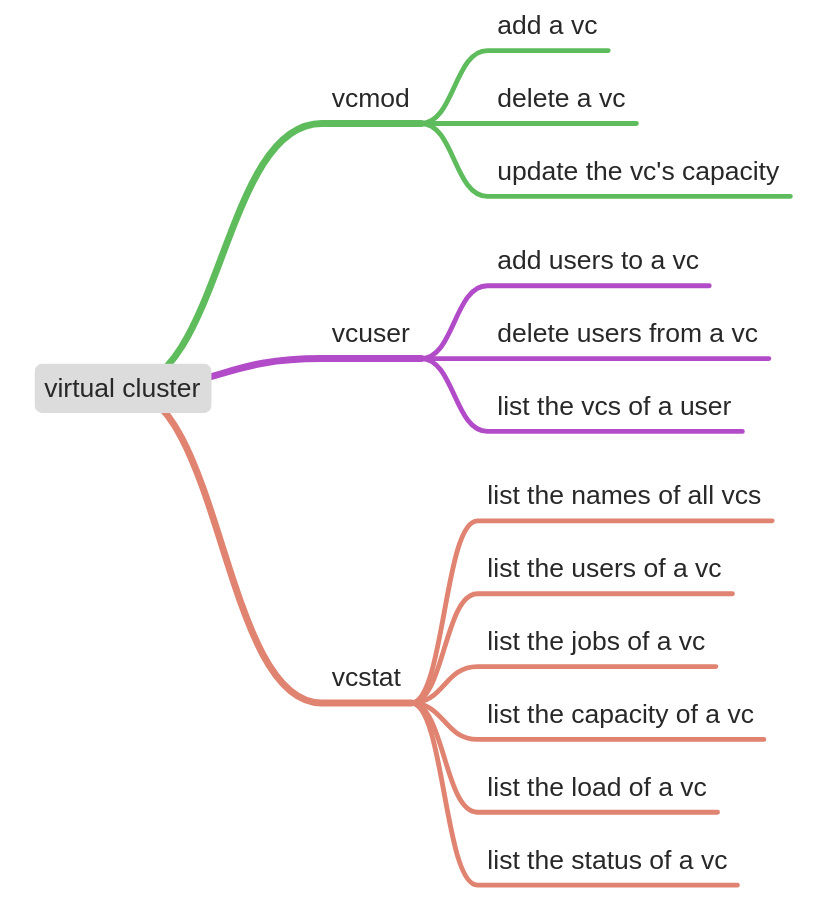
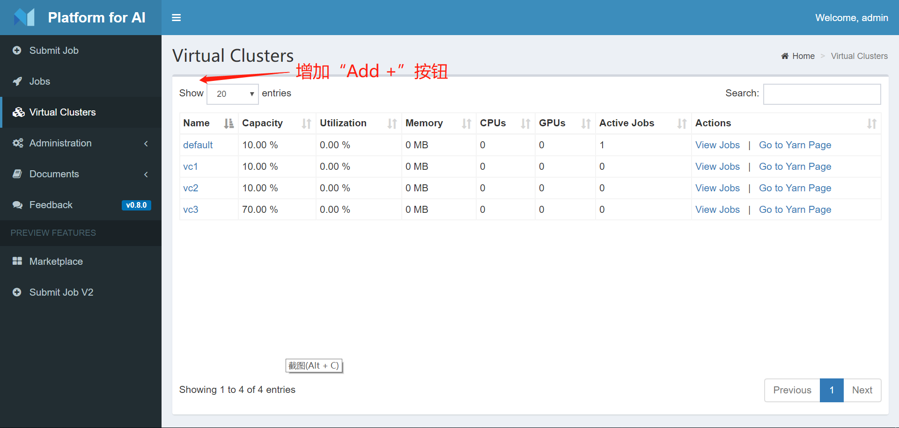
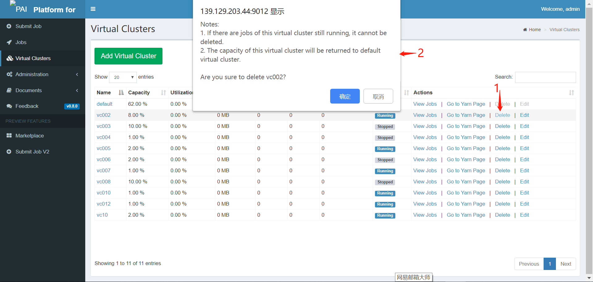
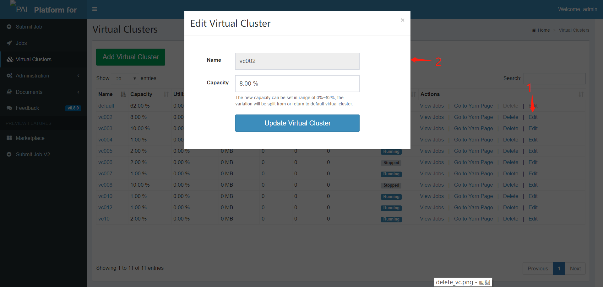
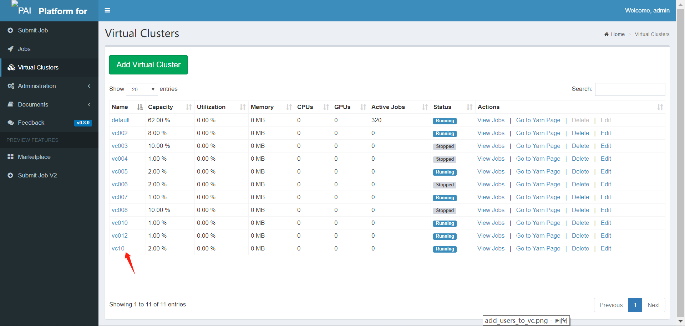
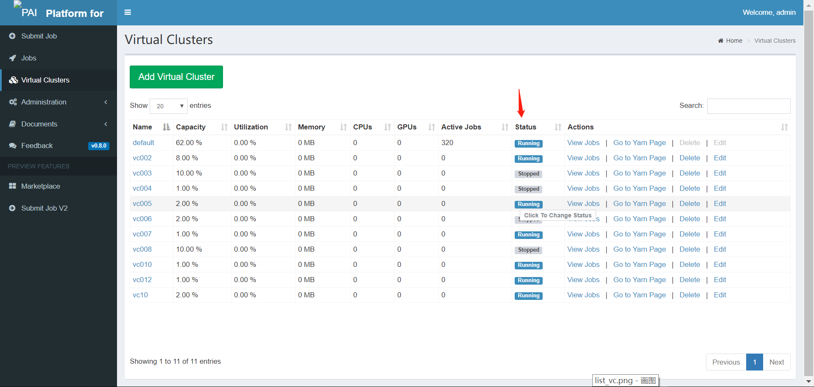

## 1. Overview

Provide  user interface  of **Virtual Cluster** (vc) for administrators to manage vcs. Provide user interface for ordinary users to query vc details. 

Related issues：[vc_update](https://github.com/Microsoft/pai/issues/1754)




## 2. Rest API

The following table shows some related APIs in rest-server.

| No   | API                                     | Request Type | Remark                             |
| ---- | --------------------------------------- | ------------ | ---------------------------------- |
| 1    | /api/v1/token                           | POST         | Get a token                        |
| 2    | /api/v1/virtual-clusters                | GET          | Get vc list                        |
| 3    | /api/v1/virtual-clusters/:vcName        | GET          | Get *vcName*'s detail              |
| 4    | /api/v1/virtual-clusters/:vcName        | PUT          | Add or update *vcName*             |
| 5    | /api/v1/virtual-clusters/:vcName        | DELETE       | Delete *vcName*                    |
| 6    | /api/v1/virtual-clusters/:vcName/status | PUT          | Update *vcName*'s status           |
| 7    | /api/v1/user                            | GET          | Get user's detail                  |
| 8    | /api/v1/user/:username/virtualClusters  | PUT          | Add or update *username*'s vc list |


## 3. Implementation

### 3.1 Add a vc（admin only）



（1）A new button "Add Virtual Cluster" will be added. It can only be visible for admin.

（2）In the pop-up dialog box, admin can set the new vc's configuration. Web front page will invoke the api `PUT /api/v1/virtual-clusters/:vcName`. The response will be shown in message box. 

### 3.2 Delete a vc（admin only）



（1）A new button "Delete" will be added. It can only be visible for admin. The "default" vc's "Delete" can not be clicked. After clicking "Delete", a confirm box will be pop-up. Web front page will invoke the api `DELETE /api/v1/virtual-clusters/:vcName`. The response will be shown in message box. 

（2）If changed, the page will be refreshed automatically. 

### 3.3 Update vc's capacity（admin only）



（1）A new button "Edit" will be added. It can only be visible for admin. The "default" vc's "Edit" can not be clicked. In the pop-up dialog box, admin can set the vc's capacity.  Web front page will invoke the api `PUT /api/v1/virtual-clusters/:vcName`. The response will be shown in message box. 

（2）If changed, the page will be refreshed automatically.

### 3.4 Add users to a vc（admin only）


（1）A new button "Users" will be added. It can only be visible for admin. The "default" vc's "Users" can not be clicked. In the pop-up dialog box, admin can set the vc's users.  Web front page will firstly invoke the api `GET /api/v1/user` , and list all users in a pop-up dialog box. Every item represent a user, and has checkbox to show if this user has the priveledge of the vc. Admin can select/deselect the checkbox to add/remove a user's priveledge . 

（2）Admin can update multiple items one time. Web front page will invoke the api `PUT api/v1/user` to add/remove user to/from the vc. 

### 3.5 Delete users from a vc（admin only）

Merged in 3.4.

### 3.6 List the vcs of a user



（1）The item of vc's appearance will be changed. If a user does not have priveledge of vc, the relative item will be set unavailable. 

（2）Now the REST API does not support this feature. An API like `GET /api/v1/user/:username/virtualClusters` will be added to list the vcs belong to *username*。

（3）To add this API, it needs to do some changes：

routes/uesr.js  Add

```javascript
router.route('/:username/virtualClusters')
    .get(token.check,  userController.getUserVc);
// The token here can only verify that the user has a token of some kind, but it does not prove that he/she is the token's owner. If want to do so, further optimization is needed:
// in middlewares/token.js add some function like checkWithUsername
```
controllers/user.js Add
```javascript
const getUserVc = (req, res, next) => {...}
```
models/user.js Add
```javascript
const getUserVc = (username, virtualCluster, callback) => {
  ...
  db.get(etcdConfig.userVirtualClusterPath(username), null, (err, res) => {
  ...
}
```


### 3.7 List the names of all vcs

Now supported. 

### 3.8 List the users of a vc

Merged in 3.4.

### 3.9 List the jobs of a vc

Now supported. 

### 3.10 List the capacity of a vc

Now supported. 

### 3.11 List the load of a vc

Now supported. 

### 3.12 List the status of a vc



（1）Add a new column "Status", showing the status(Running or Stopped) of vc. 

（2）For admin, the "Running" or "Stopped" label can be click to change status. 

（3）If changed, the page will be refreshed automatically. 

## 4. Steps

The features will be separated in two steps.

1. Basical features (add, delete, edit) will be implementation firstly. 
2. Additional features (3.4 and 3.6) will be implementation secondly. 


