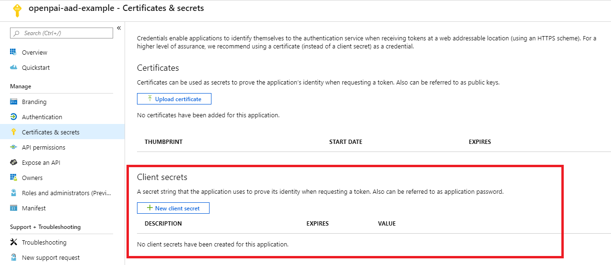
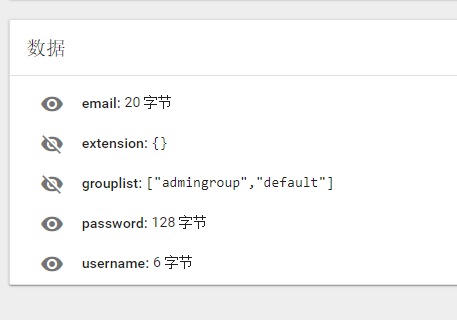
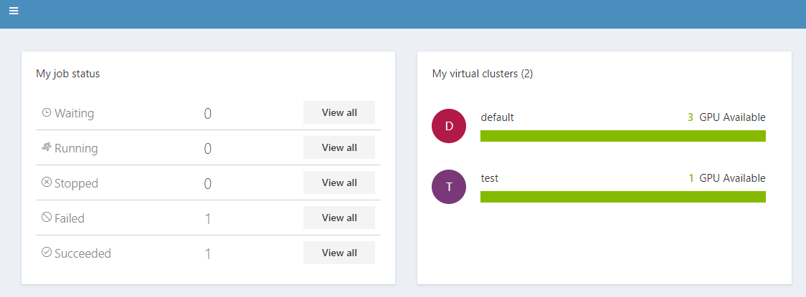

### Integrate Azure Active Directory (AAD) with OpenPAI

Start from version 0.15 OpenPAI can be configured to use Azure Active Directory (AAD) for user authentication. In this configuration, you can sign in to an OpenPAI cluster by using your AAD authentication token.

This document will cover how to set up the integration step by step.

#### Note

Previous user data in webportal is required to be mapping/migrate to AAD. Once the integration is enabled, Instead of using built-n user managed webportal, OpenPAI will switch to use (and only use) AAD as user authentication mechanism.

#### [Pylon] Prepare your certificate for https, self-sign cert as an example

##### 1. Store your domain name (pylon address) into a linux env

```bash
DOMAIN={pylon address}
```

##### 2. Generate RSA private key with openssl

```bash
openssl genrsa -des3 -out $DOMAIN.key 1024
```

In this steps, passoword will be asked. You can just skip it with an empty value (Type enter button).

##### 3. Generate certificate request

```bash
SUBJECT="/C=US/ST=Washington/CN=$DOMAIN"
openssl req -new -subj $SUBJECT -key $DOMAIN.key -out $DOMAIN.csr
```

##### 4. Generate certificate

```bash
mv $DOMAIN.key $DOMAIN.origin.key
openssl rsa -in $DOMAIN.origin.key -out $DOMAIN.key
openssl x509 -req -days 3650 -in $DOMAIN.csr -signkey $DOMAIN.key -out $DOMAIN.crt
```

##### 5. Final result

You should get the following 4 files in your current path

<div  align="center">

</div>

##### 6. Configure pylon

    pylon:
        port: 80
        uri: "http://master_ip:80"
        ssl:
          # self-sign
          crt_name: xxxxxx
          crt_path: /path/to/xxxxxx
          key_name: yyyyyy
          key_path: /path/to/yyyyyy
    

#### [Rest-server] Configuration AAD

##### 1. Create Azure Active Directory

- Login into the Azure Web portal
- Azure Acive Directory -> App registrations -> New registration

<div  align="center">

</div>

- Set a name for your APP, and then finish the registration

<div  align="center">

</div>

- Find the app registered just now

<div  align="center">

</div>

- Open the app -> Authentication, and then configure the redirect URIs for OpenPAI. The redirect URIs should be ```https://pylon_address/rest-server/api/v1/authn/oidc/return```

<div  align="center">

</div>

- open the app -> Certificates & secrets, and then create a new client secret. Mark the secret value as ```${secret_value}``` 

<div  align="center">

</div>

<div  align="center">

</div>

<div  align="center">

</div>

- open the app -> API permissions, pls add the permission in the picture following. If the azure active directly is created by yourself and you will manage the group and user info by yourself, you could grant the permission by yourself. Or you should apply the permission through your aad's admin.

<div  align="center">

</div>

- open the app -> quickstart, then get the following value: 
    - Application (client) ID, mark it as ```${app_id}```
    - Directory (tenant) ID, mark it as ```${tenant_id}```
    - In the endpoints' view, you will find the OpenID Connect metadata document and mark it as ```${well_known}```

<div  align="center">

</div>

##### Configure authentication part in service-configuration.yaml

```yaml
authentication:
  OIDC: true
  OIDC-type: AAD
  AAD:
   wellKnownURL: ${well_known}
   tenantID: ${tenant_id}
   clientID: ${app_id}
   clientSecret: ${secret_value}
   nonceLifetime: null
   nonceMaxAmount: 10
   clockSkew: null

  group-manager:
    group-data-source: ms-graph

    # Admin group name and its user list
    admin-group:
      # The group named showed in OpenPAI system.
      groupname: admingroup
      description: "admin's group"
      # The group alias (groupname) in Azure Active directory
      externalName: "team_alias_a"

    # Group for default vc.
    # For yarn default queue hack.
    default-group:
      # The group named showed in OpenPAI system.
      groupname: default
      description: "group for default vc"
      # The group alias (groupname) in Azure Active directory
      externalName: "team_alias_b"

    # If you cluster you have configured several yarn vc, except default vc (it has been created in the default-group), you should configure group for each vc in the following list
    grouplist:
    # The group named showed in OpenPAI system.

    - groupname: forexample1
      description: forexample1
    # The group alias (groupname) in Azure Active directory
      externalName: "team_alias_c"
    # The group named showed in OpenPAI system.
    - groupname: forexample2
      description: forexample2
    # The group alias (groupname) in Azure Active directory
      externalName: "team_alias_d"    
```

##### Optinal. Migrate restserver from basic mode to azure active directory.

- Please clean all user's data. Because in this mode, user's permission will be managed by azure active directory. The local data is useless. 
    -     sudo ./paictl.py service delete -n rest-server

- If server vc has been configured in yarn, pls remember configure them in grouplist in authentication.

##### After all the steps above, you could following our tutorial to start openpai.

#### Test

##### Start Service stage

After start rest-server, please ensure that the following task is successfully executed.

- namespace named ```pai-group``` and ```pai-user-v2```are created

<div  align="center">

</div>

- The group in your configuration is created, in the secret of ```pai-group``` namespace.

<div  align="center">

</div>

- Every group have an `acls` in extension field.

<div  align="center">
   
</div>

- Please Login through OpenPAI's webportal, then pls check whether your user's data is created in the secret of ```pai-user-v2``` namespace.

<div  align="center">

</div>

- please check the created user data. There should be an empty extension and a non-empty grouplist. 

<div  align="center">

</div>

- please submit a test job in default vc, and then submit the same job to another vc.

- please check whether admin user can access to the administration tab.

<div  align="center">

</div>

- please create a vc, then check whether a corresponding group is created.

<div  align="center">

</div>

<div  align="center">

</div>

- After creating the new vc, pls check whether the new vc is available for admin at home page.

<div  align="center">

</div>

- Delete the test vc, then pls check whether the corresponding group is deleted.

<div  align="center">

</div>

- After deleting the vc, pls check whether the group is removed from `pai-group` secrets.

<div  align="center">

</div>

##### If test failed

Pls try to delete the rest-server, and then try to deploy it again. If fail again, pls provide detail infomation and create issue ticket in github.